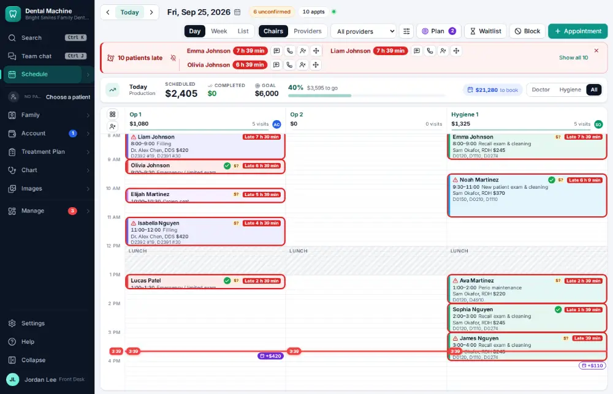

# How do I look at today's schedule?

**Who:** front desk, dentist, hygienist, assistant, office manager · **Where:** Schedule — G then S · **How often:** All day long · ⌨ keyboard only

The schedule shows every visit for the day, one column per chair. Use it to see who is coming, who has arrived and where the gaps are. It opens on today.

## Steps

1. Press G then S: today’s schedule opens  
   Keys: <kbd>G</kbd> <kbd>S</kbd>

   

## With the mouse

Click Schedule at the top of the menu on the left.

## Tips

- ← and → go to the previous or next day; T comes back to today. D, W and A switch between the day, week and agenda (list) views.
- F jumps to the visit happening now; then use the arrow keys to move from visit to visit and Enter to open one.
- Press ? on the schedule to see every key it knows.

## Related

- [How do I switch the schedule between chairs, providers or one provider?](A009-switch-the-schedule-between-chairs-providers-or-one-provider.md)
- [How do I book an appointment for an existing patient?](A020-book-an-appointment-for-an-existing-patient.md)
- [How do I check a patient in?](A010-check-a-patient-in.md)
- [How do I confirm an appointment?](A016-confirm-an-appointment.md)
- [How do I seat a patient?](A012-seat-a-patient.md)

---
[All how-tos](README.md) · Action A001 · screenshots from the robot run of 2026-09-25
