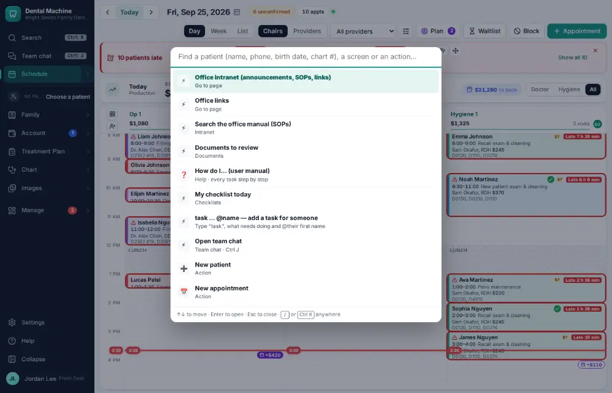
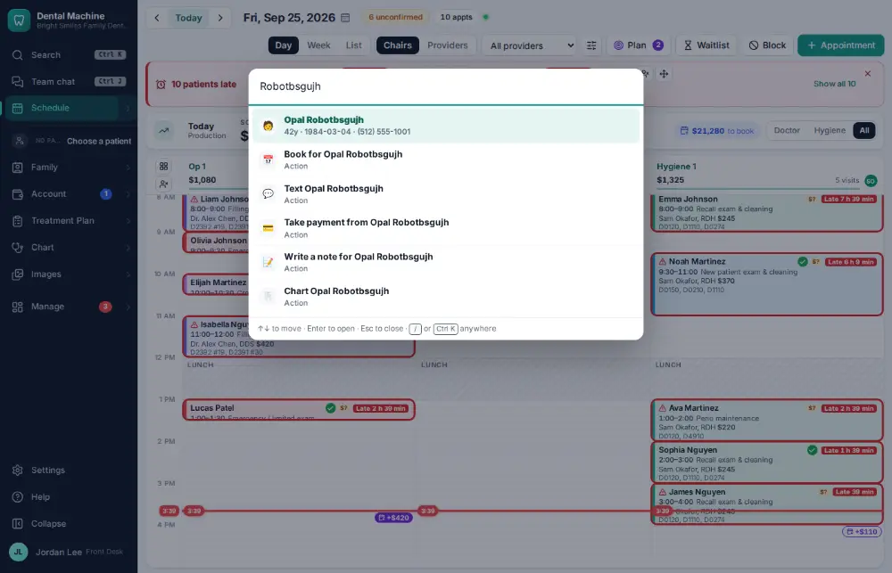
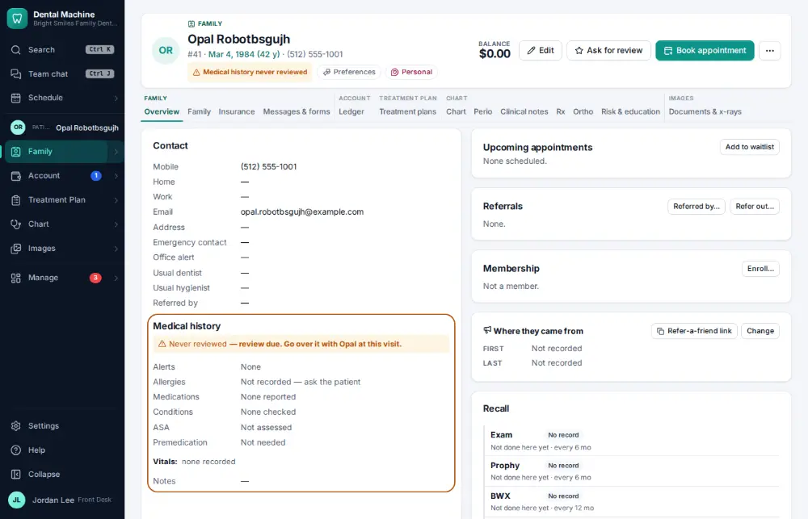

# How do I find and open a patient's chart?

**Who:** everyone · **Where:** Command bar Ctrl/⌘K from any screen → chart · **How often:** All day long · ⌨ keyboard only

The command bar finds any patient from any screen by name, phone number, birth date or chart number. Opening them makes them the active patient, so every other screen already knows who you are working on.

## Steps

1. Press Ctrl/⌘K: the command bar opens  
   Keys: <kbd>Ctrl/⌘ K</kbd>

   

2. Type the last name: they are the first match

   

3. Press Enter: the chart opens  
   Keys: <kbd>Enter</kbd>

   

## With the mouse

Click Search at the top of the menu (it shows Ctrl K), type the name, and click the patient.

## Tips

- You can also press / (when you’re not typing in a box) to open the command bar.
- Before you type anything, the command bar lists the patients you opened recently.
- Type a verb first to go straight to a job: “book jane”, “pay smith”, “text 555-0100”, “perio doe”.

## If something goes wrong

- **“No patients match …”** — Check the spelling, or try the phone number or birth date instead. Inactive patients are found too.

## Related

- [How do I see a patient’s alerts, balance, insurance and next visit at a glance?](A003-see-a-patient-s-alerts-balance-insurance-and-next-visit-at-a.md)
- [How do I set up a new patient?](A055-set-up-a-new-patient.md)
- [How do I update a phone number or email?](A043-update-a-phone-number-or-email.md)
- [How do I send forms to a patient before the visit?](A040-send-forms-to-a-patient-before-the-visit.md)
- [How do I print the route slip / walkout for a visit?](A044-print-the-route-slip-walkout-for-a-visit.md)

---
[All how-tos](README.md) · Action A002 · screenshots from the robot run of 2026-09-25
