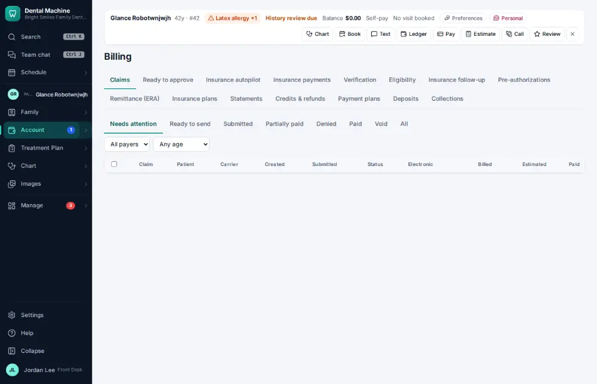
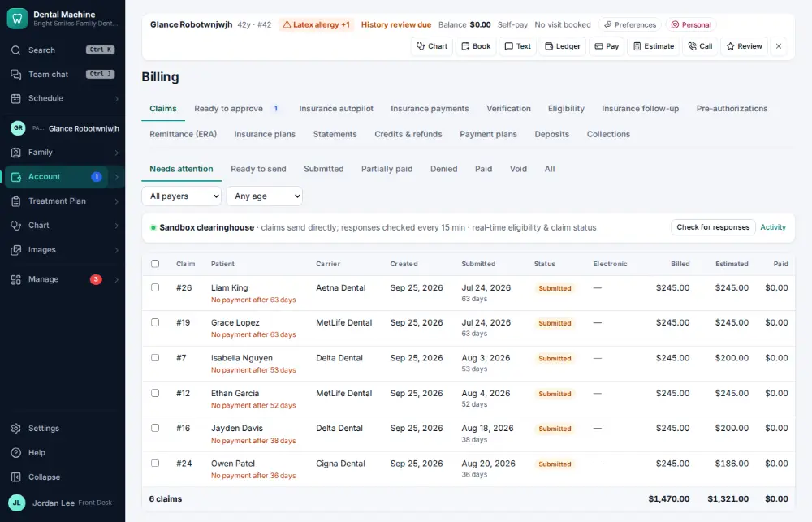

# How do I see a patient’s alerts, balance, insurance and next visit at a glance?

**Who:** everyone · **Where:** Patient bar on every screen (active patient) · **How often:** All day long · ⌨ keyboard only

Once a patient is the active patient, the patient bar across the top of every screen shows their medical and office alerts, what they owe, their insurance and their next visit. You don’t have to open anything.

## Where to start

## Steps

1. On any screen the patient bar shows alerts, balance, insurance and the next visit — nothing to click

   

## Tips

- The buttons on the patient bar (Chart, Note, Book, Text, Ledger, Pay, Estimate…) each have an Alt shortcut, shown when you hover.
- Alt+X clears the active patient when you’re done with them.

## Related

- [How do I find and open a patient's chart?](A002-find-and-open-a-patient-s-chart.md)
- [How do I explain a balance (show the ledger)?](A024-explain-a-balance-show-the-ledger.md)
- [How do I look up how much insurance benefit is left?](A035-look-up-how-much-insurance-benefit-is-left.md)
- [How do I send forms to a patient before the visit?](A040-send-forms-to-a-patient-before-the-visit.md)
- [How do I update a phone number or email?](A043-update-a-phone-number-or-email.md)

---
[All how-tos](README.md) · Action A003 · screenshots from the robot run of 2026-09-25
