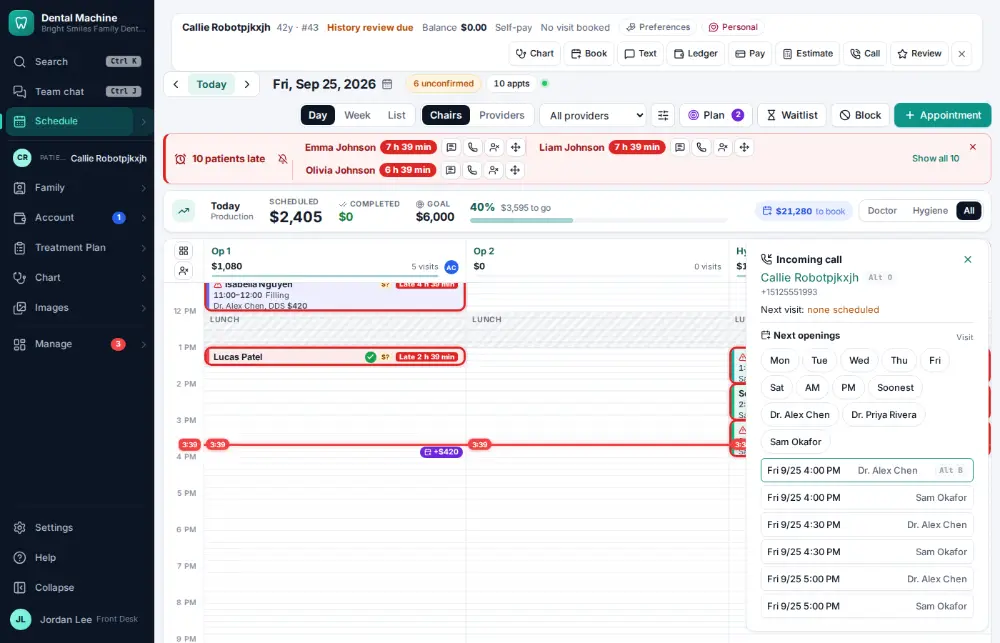
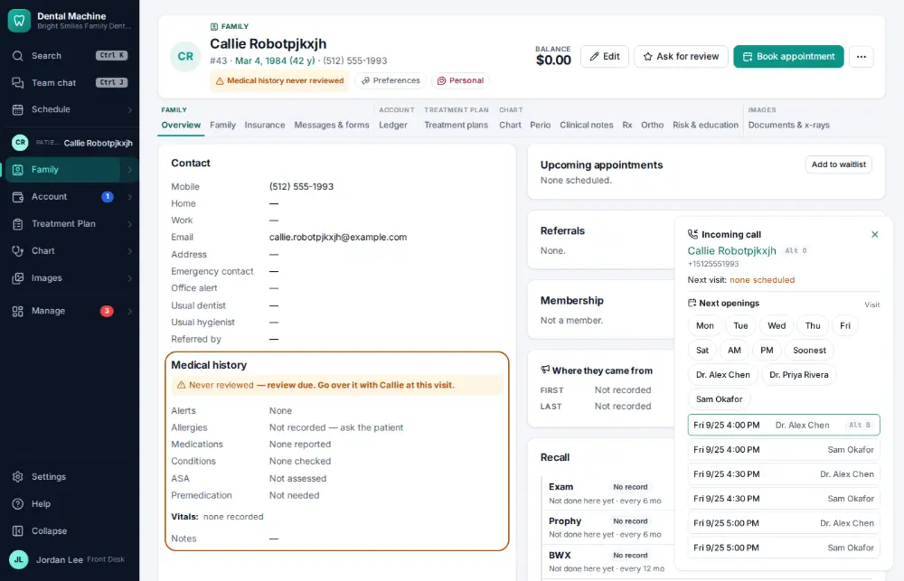

# How do I answer a call and open the caller's chart?

**Who:** front desk · **Where:** Call pop-up (live) → Alt+O · **How often:** All day long · ⌨ keyboard only

When the office phone rings, a pop-up shows who is calling and makes them the active patient, so their chart is one key away before you pick up.

## Where to start

## Steps

1. The phone rings: a pop-up shows who is calling and makes them the active patient (no action)

   

2. Press Alt+O: their chart opens  
   Keys: <kbd>Alt O</kbd>

   

## With the mouse

Click the caller’s name on the call pop-up.

## Tips

- Missed callers are texted back automatically if that’s turned on in Settings → Phone line.
- Unknown numbers get their own buttons: Text back, Attach to a patient, or New patient.

## If something goes wrong

- **No pop-up appears** — The phone line has to be connected in Settings → Phone line, and your computer must be signed in. Calls still show under Manage → Calls.

## Related

- [How do I text back an unknown caller?](A066-text-back-an-unknown-caller.md)
- [How do I log a phone call with a patient?](A053-log-a-phone-call-with-a-patient.md)
- [How do I find and open a patient's chart?](A002-find-and-open-a-patient-s-chart.md)
- [How do I reply to a patient's text?](A005-reply-to-a-patient-s-text.md)
- [How do I text a patient?](A008-text-a-patient.md)

---
[All how-tos](README.md) · Action A004 · screenshots from the robot run of 2026-09-25
