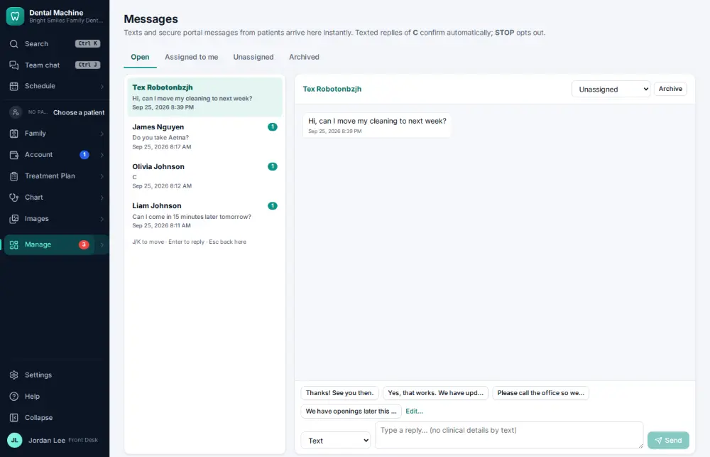
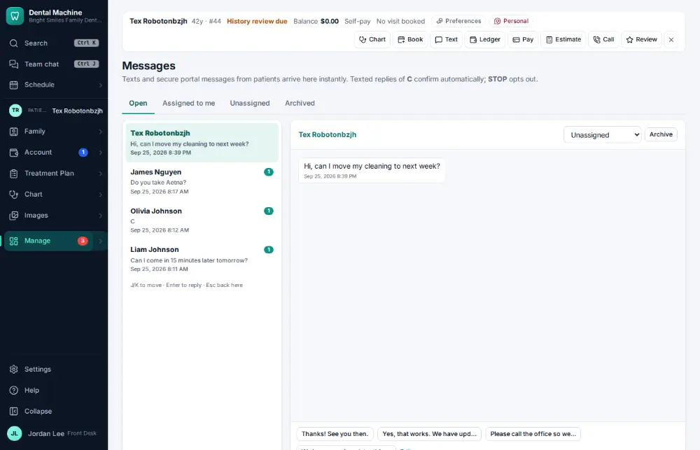
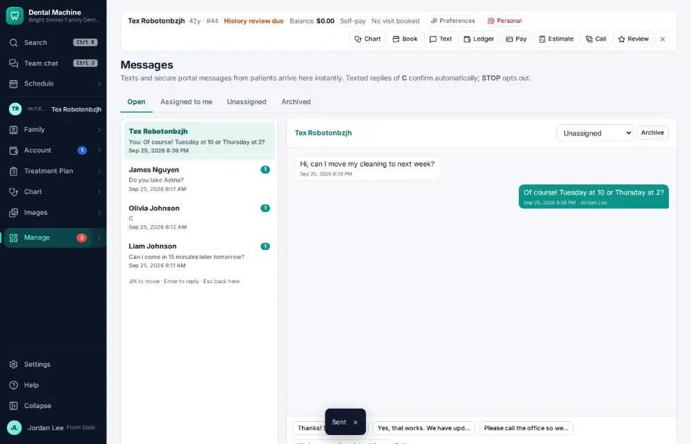

# How do I reply to a patient's text?

**Who:** front desk · **Where:** Messages — J/K, Enter, type, Enter · **How often:** Many times a day · ⌨ keyboard only

Messages holds every text conversation with patients, newest first. Replying takes a few keys and the text goes out from the office number.

## Where to start

## Steps

1. Messages: the newest conversation is highlighted at the top

   

2. Press Enter: the conversation opens with the cursor in the reply box  
   Keys: <kbd>Enter</kbd>

   

3. Type the reply and press Enter: sent  
   Keys: <kbd>Enter</kbd>

   

## With the mouse

Open Manage ▾ → Messages, click the conversation, type in the reply box and click Send.

## Tips

- J and K move down and up the list; Esc goes back to the list.
- A patient who replied STOP can’t be texted until they text START back.

## If something goes wrong

- **“This number replied STOP to our texts…”** — The patient opted out. Call them instead, or ask them to text START to the office number.

## Related

- [How do I text a patient?](A008-text-a-patient.md)
- [How do I send a message in staff chat?](A036-send-a-message-in-staff-chat.md)
- [How do I text a reminder to everyone unconfirmed?](A094-text-a-reminder-to-everyone-unconfirmed.md)
- [How do I answer a call and open the caller's chart?](A004-answer-a-call-and-open-the-caller-s-chart.md)
- [How do I log a phone call with a patient?](A053-log-a-phone-call-with-a-patient.md)

---
[All how-tos](README.md) · Action A005 · screenshots from the robot run of 2026-09-25
