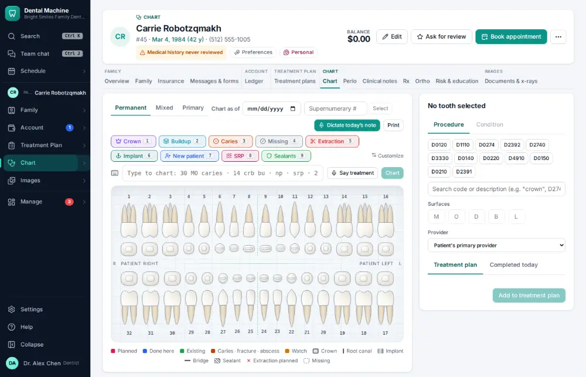
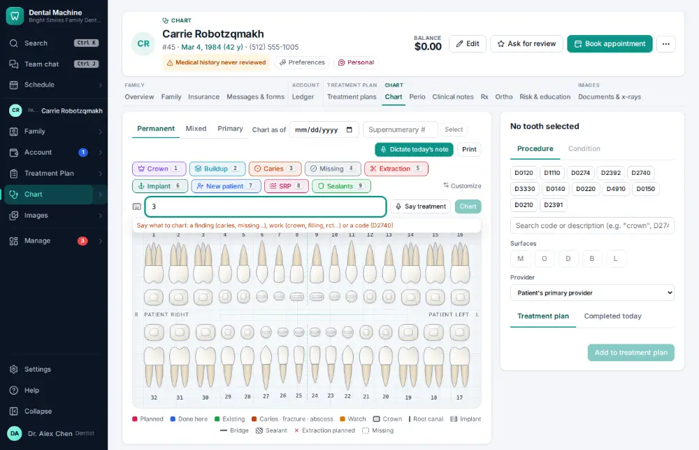
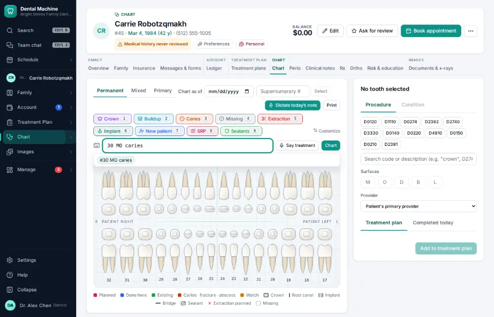
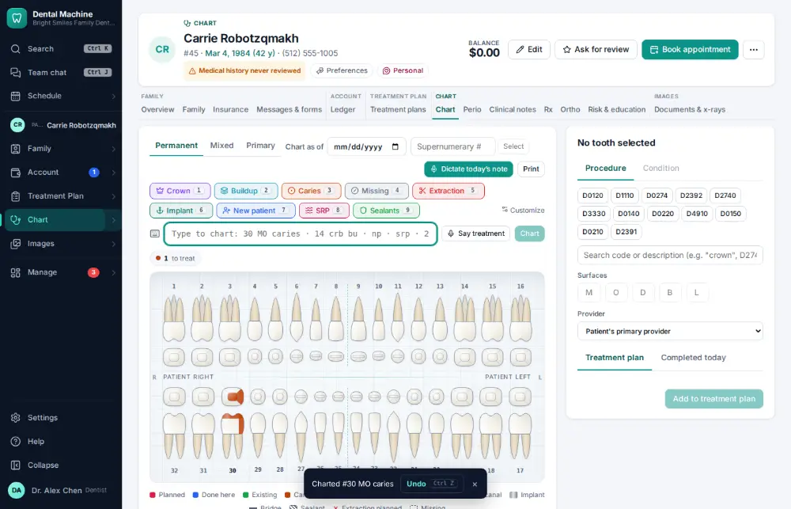

# How do I chart a finding on a tooth?

**Who:** dentist, hygienist · **Where:** Chart tab — type the finding · **How often:** Many times a day · ⌨ keyboard only

On the Chart tab you chart by typing, the way you would say it: the tooth, the surfaces and the finding. It shows what it will chart before you press Enter.

## Where to start

## Steps

1. On the chart, type 3: an entry box opens  
   Keys: <kbd>3</kbd>

   

2. Type "0 MO caries": the finding is shown as it will be charted

   

3. Press Enter: charted on the drawing (Undo shows)  
   Keys: <kbd>Enter</kbd>

   

## Tips

- Undo on the notice (or Ctrl/⌘ Z) takes the finding back for a few seconds.
- Primary teeth are letters A–T.

## If something goes wrong

- **“tooth must be 1-32, A-T…”** — The tooth number isn’t a real tooth. Check it and type it again.
- **“… requires surfaces”** — That code needs surfaces: add them, e.g. “30 MO caries”.

## Related

- [How do I chart planned treatment?](A021-chart-planned-treatment.md)
- [How do I chart perio?](A045-chart-perio.md)
- [How do I set today’s procedures complete (post the charges)?](A015-set-today-s-procedures-complete-post-the-charges.md)
- [How do I write a clinical note?](A011-write-a-clinical-note.md)
- [How do I review medical history — no changes?](A014-review-medical-history-no-changes.md)

---
[All how-tos](README.md) · Action A006 · screenshots from the robot run of 2026-09-25
