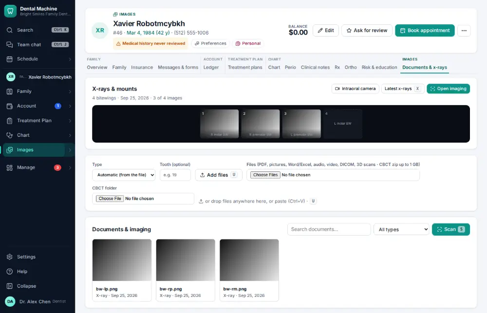
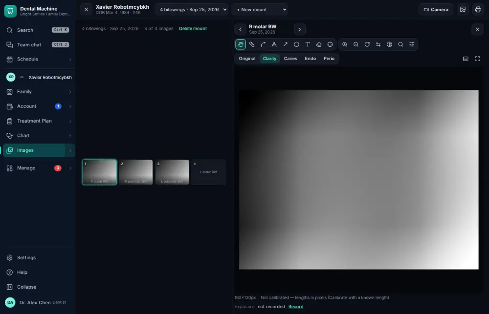
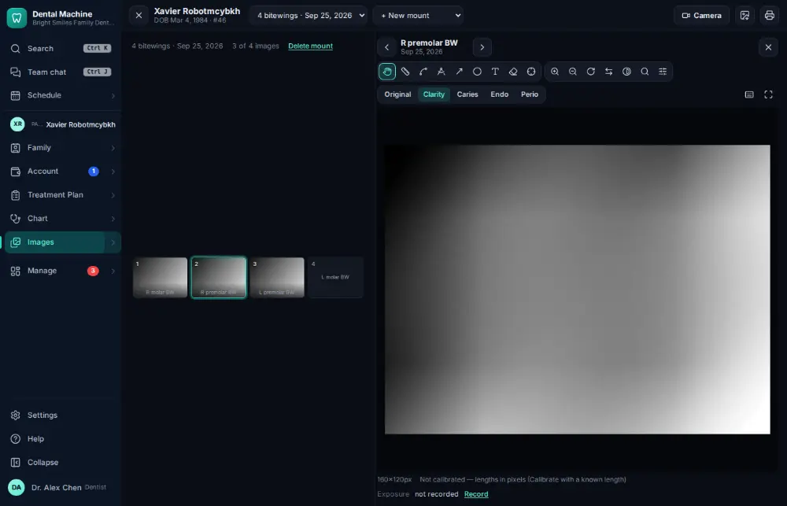

# How do I open a patient's x-rays?

**Who:** dentist, hygienist, assistant · **Where:** Documents & x-rays tab — X · **How often:** Many times a day · ⌨ keyboard only

X opens the patient’s newest x-ray set on its first image. The arrow keys step through the images.

## Where to start

## Steps

1. Press X: the newest x-ray set opens on its first image  
   Keys: <kbd>X</kbd>

   

2. Press →: the next image  
   Keys: <kbd>→</kbd>

   

## With the mouse

Open the Images module (or the Documents & x-rays tab) and click the x-ray set.

## Tips

- In the viewer you can compare a spot with earlier visits, measure, and adjust brightness.
- Esc closes the viewer.

## Related

- [How do I add x-rays or photos to the chart?](A031-add-x-rays-or-photos-to-the-chart.md)
- [How do I review x-ray AI findings?](A078-review-x-ray-ai-findings.md)
- [How do I attach x-rays to a claim?](A056-attach-x-rays-to-a-claim.md)
- [How do I take x-rays with the sensor?](A030-take-x-rays-with-the-sensor.md)
- [How do I take intraoral photos with the camera?](A050-take-intraoral-photos-with-the-camera.md)

---
[All how-tos](README.md) · Action A007 · screenshots from the robot run of 2026-09-25
