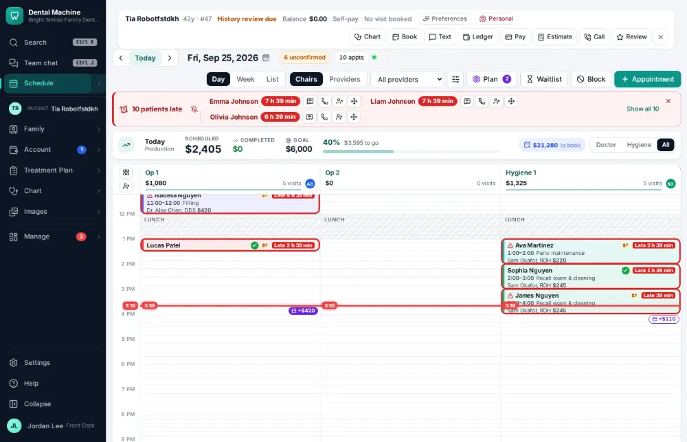
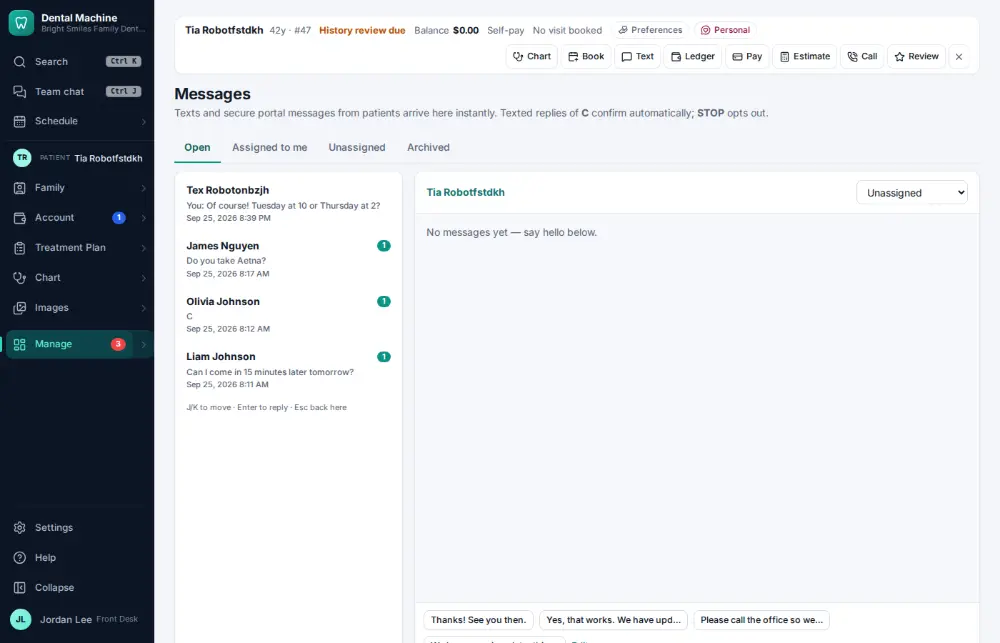
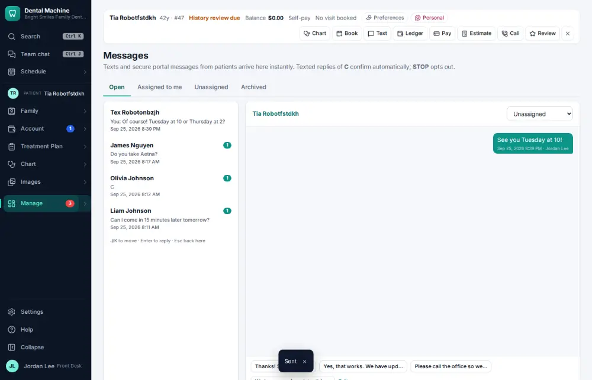

# How do I text a patient?

**Who:** front desk · **Where:** Alt+T from any screen (active patient) · **How often:** Many times a day · ⌨ keyboard only

Alt+T opens a text conversation with the active patient from any screen, with the cursor ready to type.

## Where to start

## Steps

1. Press Alt+T: their conversation opens with the cursor in the reply box  
   Keys: <kbd>Alt T</kbd>

   

2. Type the text and press Enter: sent  
   Keys: <kbd>Enter</kbd>

   

## With the mouse

Click Text on the patient bar, type the message and click Send.

## Tips

- Every text is kept on the patient’s Messages & forms tab.

## If something goes wrong

- **“Patient has no reachable phone or email (or has opted out)”** — Add a mobile number on the chart ([A043](A043-update-a-phone-number-or-email.md)), or call them.

## Related

- [How do I reply to a patient's text?](A005-reply-to-a-patient-s-text.md)
- [How do I log a phone call with a patient?](A053-log-a-phone-call-with-a-patient.md)
- [How do I ask a patient for a review?](A065-ask-a-patient-for-a-review.md)
- [How do I answer a call and open the caller's chart?](A004-answer-a-call-and-open-the-caller-s-chart.md)
- [How do I text back an unknown caller?](A066-text-back-an-unknown-caller.md)

---
[All how-tos](README.md) · Action A008 · screenshots from the robot run of 2026-09-25
