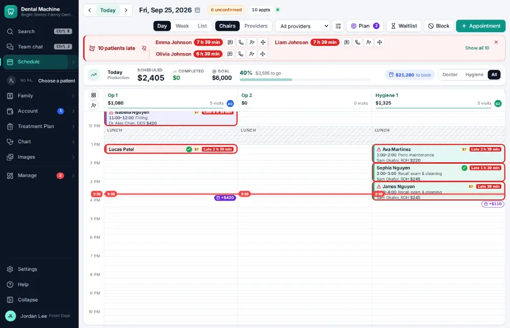
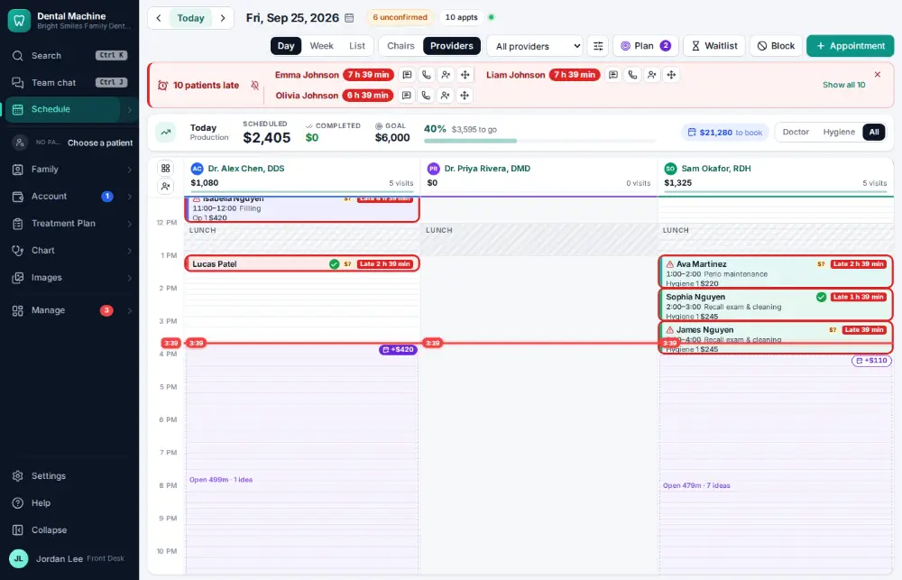
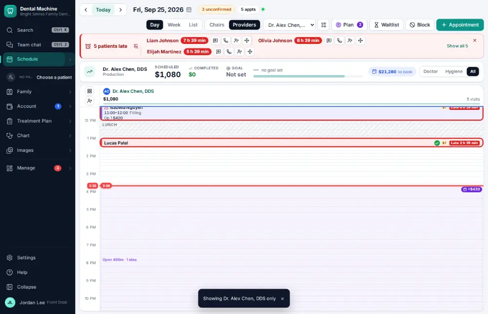
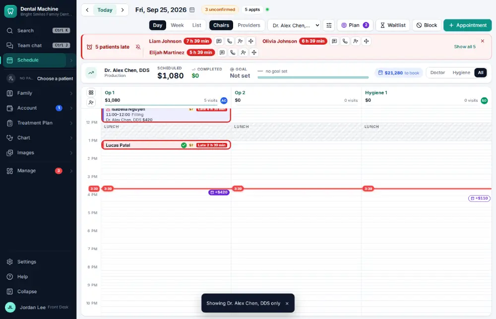

# How do I switch the schedule between chairs, providers or one provider?

**Who:** front desk, dentist, hygienist · **Where:** Schedule — C / P / V keys · **How often:** Many times a day · ⌨ keyboard only

The schedule can show one column per chair, one column per provider, or just one provider’s day.

## Where to start

## Steps

1. Press P: one column per provider  
   Keys: <kbd>P</kbd>

   

2. Press V: just one provider  
   Keys: <kbd>V</kbd>

   

3. Press C: back to one column per chair  
   Keys: <kbd>C</kbd>

   

## With the mouse

In the command bar type “Schedule:” and pick Chairs view, Providers view or “show only …”.

## Tips

- V again shows the next provider, then everyone. Shift+V always shows everyone.
- $ shows the day’s production (all, doctor, hygiene) when you’re allowed to see it.

## Related

- [How do I look at today's schedule?](A001-look-at-today-s-schedule.md)
- [How do I book an appointment for an existing patient?](A020-book-an-appointment-for-an-existing-patient.md)
- [How do I check a patient in?](A010-check-a-patient-in.md)
- [How do I seat a patient?](A012-seat-a-patient.md)
- [How do I mark a visit finished?](A013-mark-a-visit-finished.md)

---
[All how-tos](README.md) · Action A009 · screenshots from the robot run of 2026-09-25
