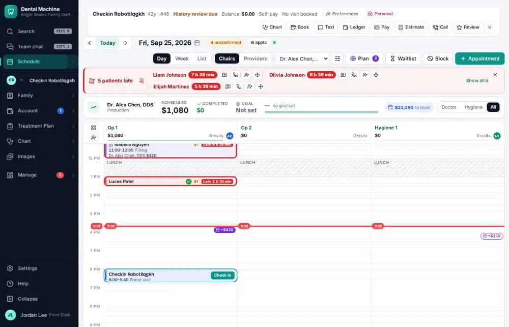
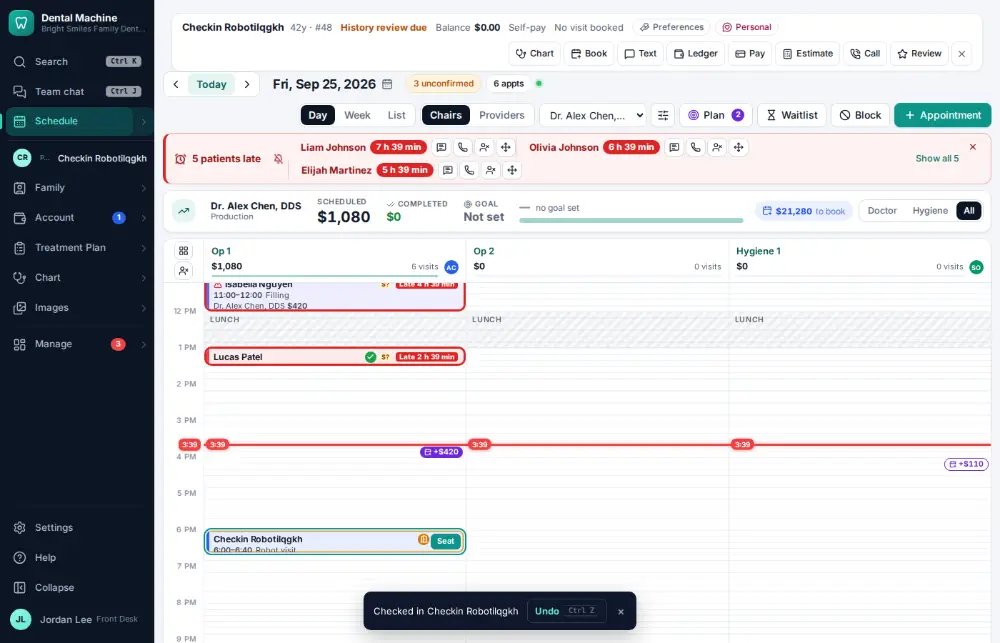

# How do I check a patient in?

**Who:** front desk · **Where:** Schedule — focus the visit, I (or the card's next-step button) · **How often:** Many times a day · ⌨ keyboard only

Checking a patient in tells the back office they have arrived. The visit’s card changes colour for everyone.

## Where to start

Select the visit on the schedule first (click it once, or press F and use the arrow keys).

## Steps

1. With the visit focused, press I: the patient is checked in  
   Keys: <kbd>I</kbd>

   

## With the mouse

Click the visit’s next-step button on its card (“Check in”), or open the visit and click Check in.

## Tips

- Patients can also check themselves in by texting HERE or scanning the QR poster (Settings → Mobile check-in).
- The steps after this are S (seat), R (ready for the doctor) and O (out).

## If something goes wrong

- **“… is already past check-in”** — The visit was already checked in, seated or finished.

## Related

- [How do I seat a patient?](A012-seat-a-patient.md)
- [How do I mark a patient ready for the doctor?](A018-mark-a-patient-ready-for-the-doctor.md)
- [How do I mark a visit finished?](A013-mark-a-visit-finished.md)
- [How do I confirm an appointment?](A016-confirm-an-appointment.md)
- [How do I switch the schedule between chairs, providers or one provider?](A009-switch-the-schedule-between-chairs-providers-or-one-provider.md)

---
[All how-tos](README.md) · Action A010 · screenshots from the robot run of 2026-09-25
