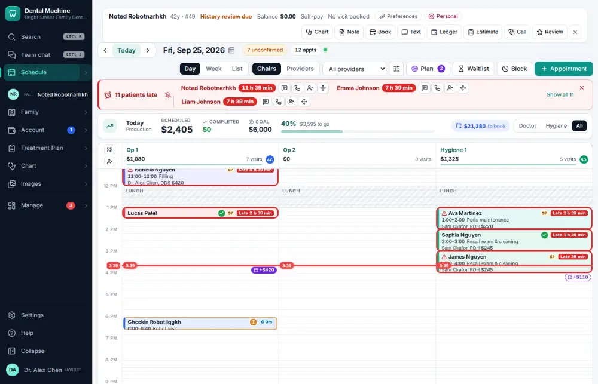
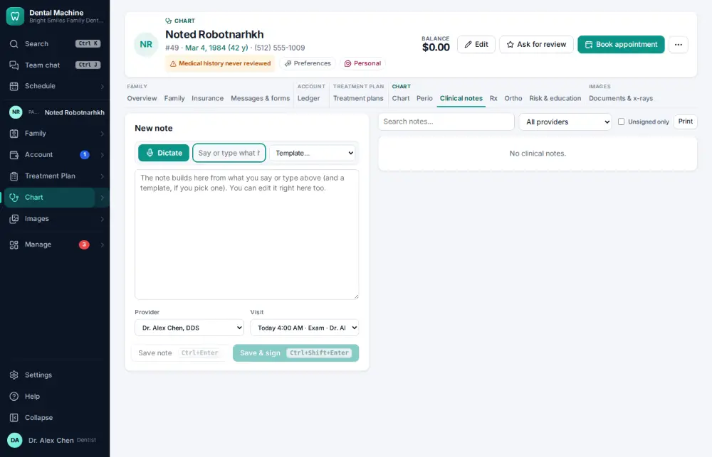
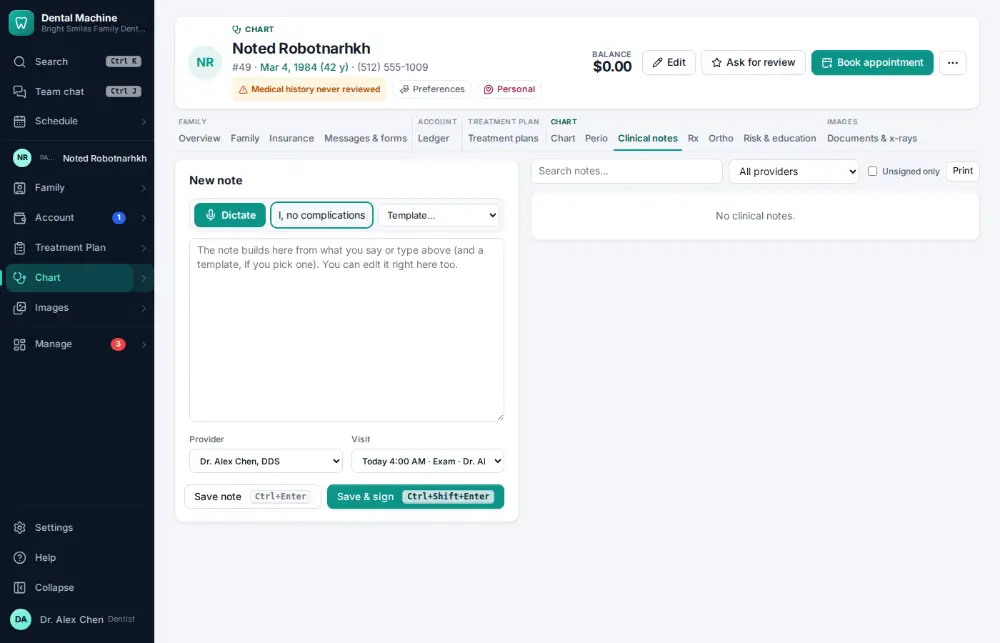
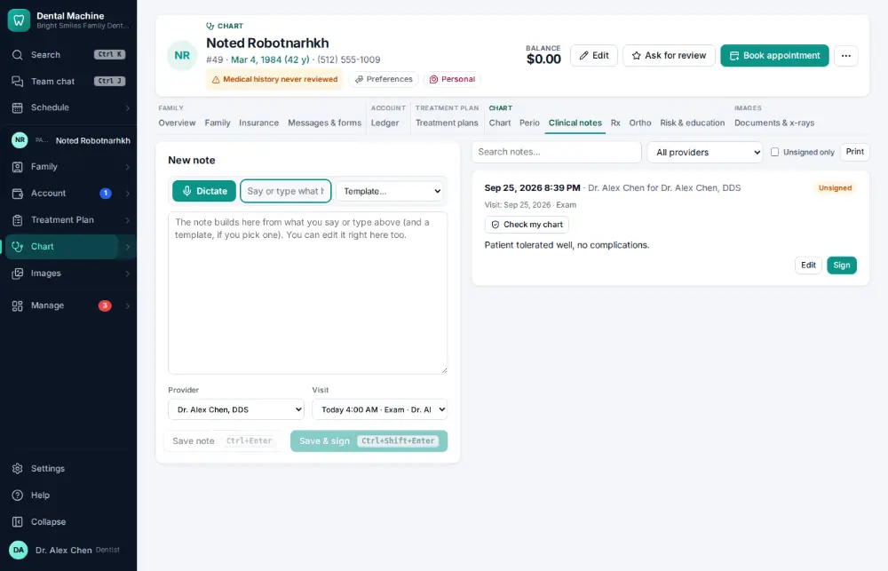

# How do I write a clinical note?

**Who:** dentist, hygienist, assistant · **Where:** Alt+N → Clinical notes tab, drafted from the visit · **How often:** Many times a day · ⌨ keyboard only

Alt+N opens today’s clinical note for the active patient, already drafted from the visit (the procedures and your template). Add what happened and save.

## Where to start

## Steps

1. Press Alt+N: the note opens drafted from today’s visit, cursor in the box  
   Keys: <kbd>Alt N</kbd>

   

2. Type what happened

   

3. Press Ctrl/⌘+Enter: saved and linked to the visit  
   Keys: <kbd>Ctrl/⌘ Enter</kbd>

   

## With the mouse

Click Note on the patient bar, type, and click Save.

## Tips

- Ctrl/⌘ Shift Enter saves and signs in one go (if you are allowed to sign).
- Alt+M starts dictation if your computer has a microphone ([A052](A052-dictate-a-note-by-voice.md)).

## If something goes wrong

- **“Signed notes cannot be edited; add an addendum instead”** — Once signed, a note is locked. Add an addendum to it.
- **“A note can be at most 20,000 characters…”** — Split it, or add an addendum.

## Related

- [How do I sign a clinical note?](A023-sign-a-clinical-note.md)
- [How do I dictate a note by voice?](A052-dictate-a-note-by-voice.md)
- [How do I fix unsigned or incomplete notes?](A095-fix-unsigned-or-incomplete-notes.md)
- [How do I review medical history — no changes?](A014-review-medical-history-no-changes.md)
- [How do I set today’s procedures complete (post the charges)?](A015-set-today-s-procedures-complete-post-the-charges.md)

---
[All how-tos](README.md) · Action A011 · screenshots from the robot run of 2026-09-25
