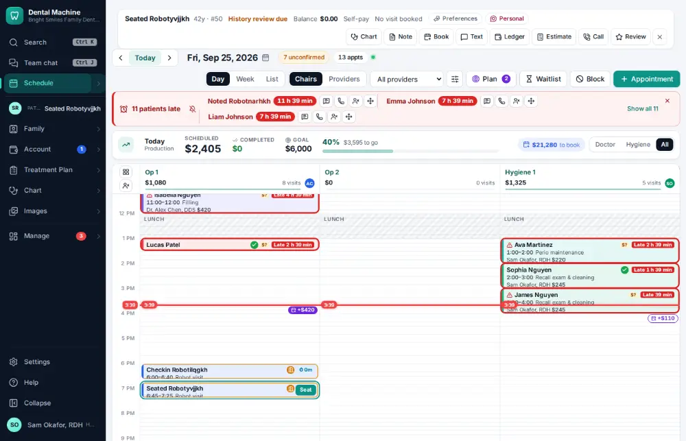
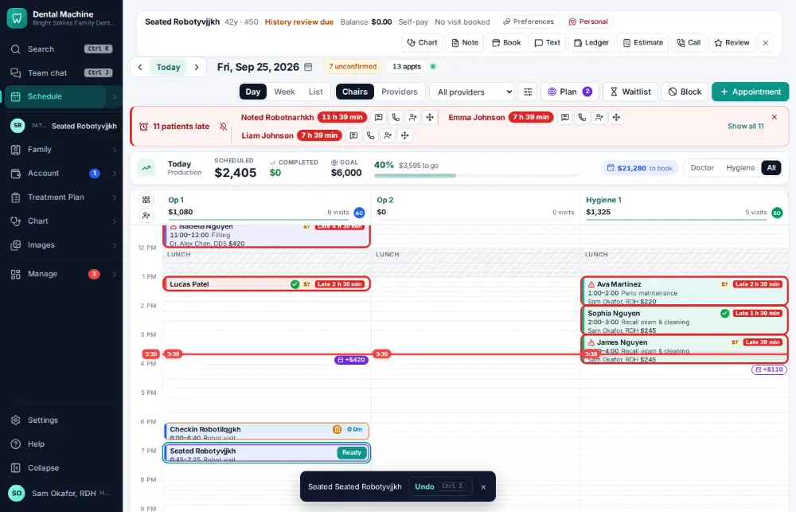

# How do I seat a patient?

**Who:** assistant, hygienist · **Where:** Schedule — S on the focused visit · **How often:** Many times a day · ⌨ keyboard only

Seating the patient shows everyone that they are in the chair.

## Where to start

Select the visit on the schedule first.

## Steps

1. Press S: the patient is seated  
   Keys: <kbd>S</kbd>

   

## With the mouse

Click the card’s next-step button (“Seat”), or open the visit and click Seat.

## If something goes wrong

- **“… is already seated” / “… can’t be seated now”** — The visit is already in the chair or finished.

## Related

- [How do I check a patient in?](A010-check-a-patient-in.md)
- [How do I mark a patient ready for the doctor?](A018-mark-a-patient-ready-for-the-doctor.md)
- [How do I mark a visit finished?](A013-mark-a-visit-finished.md)
- [How do I confirm an appointment?](A016-confirm-an-appointment.md)
- [How do I switch the schedule between chairs, providers or one provider?](A009-switch-the-schedule-between-chairs-providers-or-one-provider.md)

---
[All how-tos](README.md) · Action A012 · screenshots from the robot run of 2026-09-25
