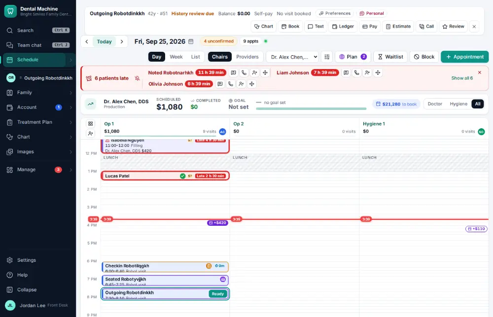
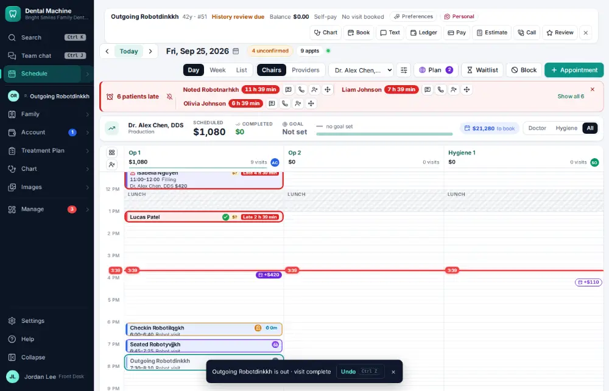

# How do I mark a visit finished?

**Who:** assistant, front desk · **Where:** Schedule — O on the focused visit (Shift+O is today's plan) · **How often:** Many times a day · ⌨ keyboard only

Marking a visit “out” records that the patient is done in the chair. On a visit that is already finished, O opens its checkout instead.

## Where to start

Select the seated patient’s visit on the schedule first.

## Steps

1. Press O: the visit is marked out (visit complete)  
   Keys: <kbd>O</kbd>

   

## With the mouse

Open the visit and click “Out · visit complete”.

## Tips

- If the visit has planned procedures, the visit panel offers to complete them and post the charges — that is a deliberate click, because posted charges can’t be undone from the notice.
- Shift+R marks “ready for checkout” instead, if the front desk should come and get them.

## If something goes wrong

- **“Seat … first”** — Only a seated patient can be marked out. Press S first.

## Related

- [How do I check a patient out?](A017-check-a-patient-out.md)
- [How do I set today’s procedures complete (post the charges)?](A015-set-today-s-procedures-complete-post-the-charges.md)
- [How do I seat a patient?](A012-seat-a-patient.md)
- [How do I confirm an appointment?](A016-confirm-an-appointment.md)
- [How do I check a patient in?](A010-check-a-patient-in.md)

---
[All how-tos](README.md) · Action A013 · screenshots from the robot run of 2026-09-25
