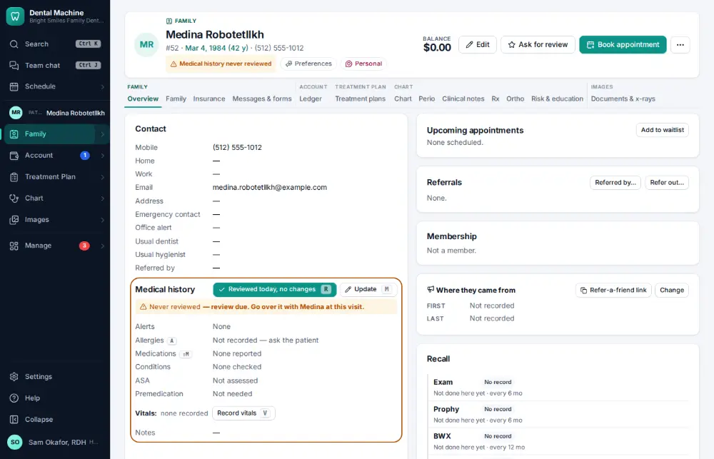
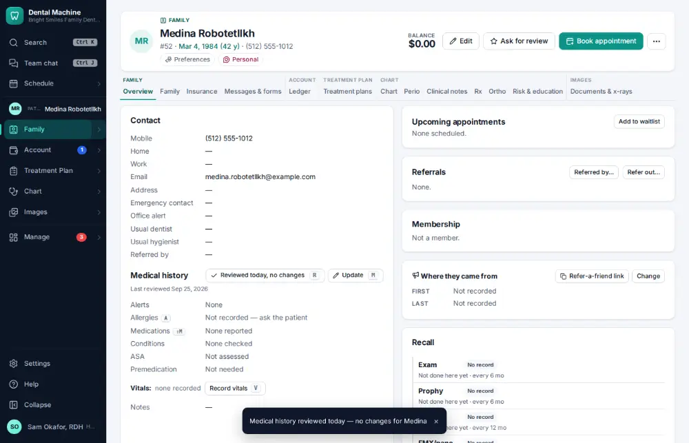

# How do I review medical history — no changes?

**Who:** hygienist, assistant · **Where:** Chart overview — R · **How often:** Many times a day · ⌨ keyboard only

At each visit someone confirms the medical history. When nothing has changed, one key records “reviewed today, no changes” with your name.

## Where to start

Open the patient’s chart overview (the Family module).

## Steps

1. Press R: "reviewed today, no changes" is recorded  
   Keys: <kbd>R</kbd>

   

## With the mouse

Click “Reviewed today, no changes” in the medical history.

## Related

- [How do I update medical history?](A032-update-medical-history.md)
- [How do I record blood pressure and pulse?](A033-record-blood-pressure-and-pulse.md)
- [How do I write a clinical note?](A011-write-a-clinical-note.md)
- [How do I set today’s procedures complete (post the charges)?](A015-set-today-s-procedures-complete-post-the-charges.md)
- [How do I chart a finding on a tooth?](A006-chart-a-finding-on-a-tooth.md)

---
[All how-tos](README.md) · Action A014 · screenshots from the robot run of 2026-09-25
