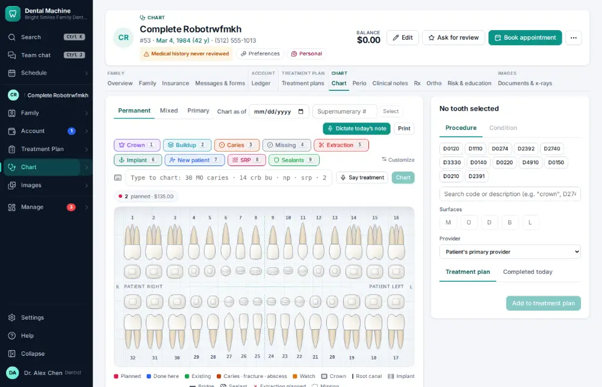
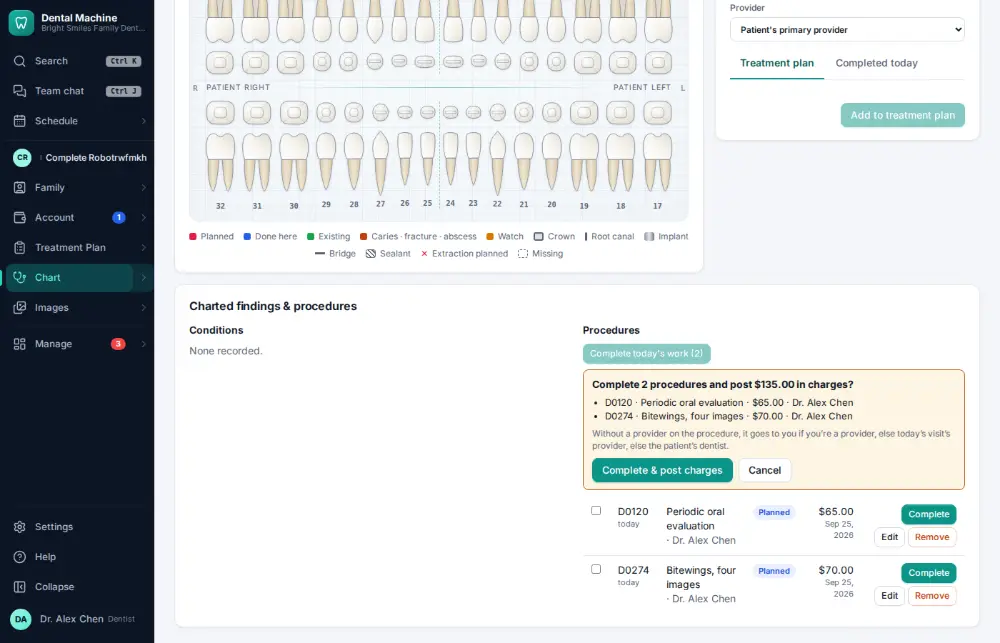
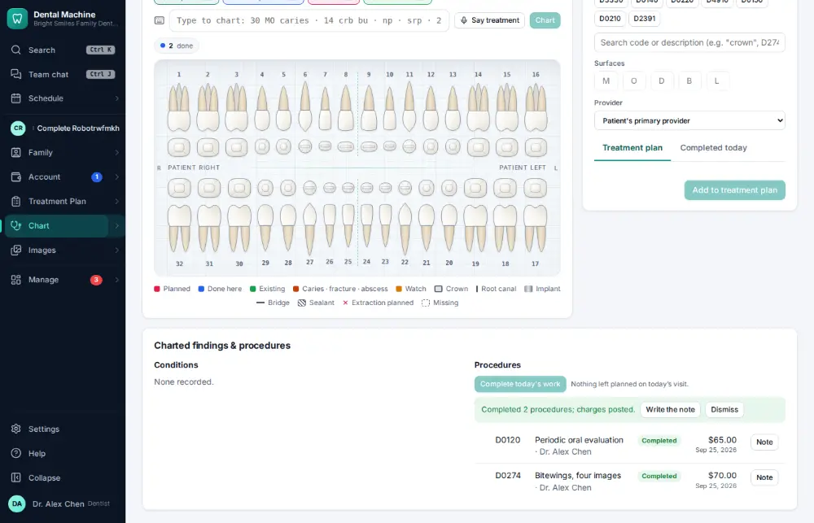

# How do I set today’s procedures complete (post the charges)?

**Who:** dentist, hygienist, assistant · **Where:** Chart tab — Shift+C, Enter · **How often:** Many times a day · ⌨ keyboard only

When the work is done, completing today’s procedures posts their charges to the ledger and counts the production. Shift+C finds today’s planned work and asks once.

## Where to start

Open the patient’s Chart tab.

## Steps

1. Press Shift+C: a line asks to complete the 2 procedures and post the charges  
   Keys: <kbd>Shift C</kbd>

   

2. Press Enter: completed, charges posted  
   Keys: <kbd>Enter</kbd>

   

## With the mouse

Click Complete beside a procedure in the chart’s list, or complete the visit from its panel on the schedule.

## Tips

- Posted charges show on the ledger right away and go on the claim.
- A completed procedure is un-completed (not deleted) if it was a mistake — the ledger keeps both entries.

## If something goes wrong

- **“Only completed procedures can be un-completed”** — The procedure wasn’t complete yet.

## Related

- [How do I check a patient out?](A017-check-a-patient-out.md)
- [How do I create and send an insurance claim?](A022-create-and-send-an-insurance-claim.md)
- [How do I chart planned treatment?](A021-chart-planned-treatment.md)
- [How do I write a clinical note?](A011-write-a-clinical-note.md)
- [How do I review medical history — no changes?](A014-review-medical-history-no-changes.md)

---
[All how-tos](README.md) · Action A015 · screenshots from the robot run of 2026-09-25
