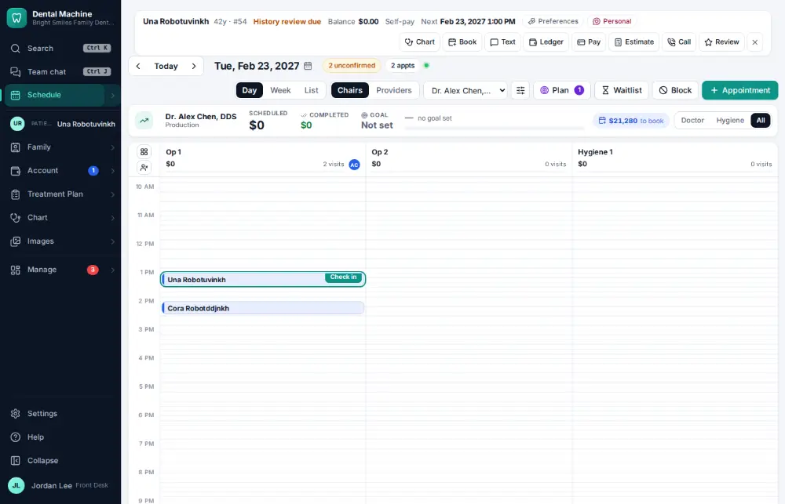
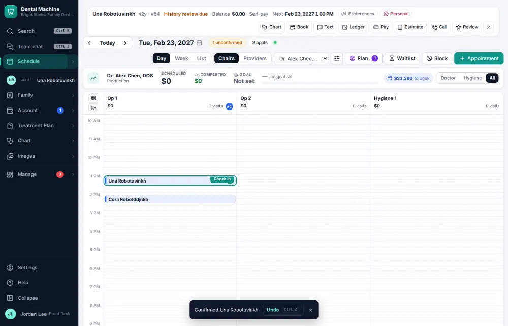

# How do I confirm an appointment?

**Who:** front desk · **Where:** Schedule — C on the focused visit (Undo shows); the day's list: U, then C per row · **How often:** Many times a day · ⌨ keyboard only

Marks a visit as confirmed (by phone). Patients who reply C to a reminder text are confirmed automatically.

## Where to start

Select the visit on the schedule first.

## Steps

1. With the visit selected, press C: confirmed by phone (Undo shows)  
   Keys: <kbd>C</kbd>

   

## With the mouse

Click the visit to open its panel and pick how it was confirmed in the Confirm list.

## Tips

- Undo on the notice takes it back.
- U on the schedule lists the day’s unconfirmed visits; C confirms each one.

## Related

- [How do I text a reminder to everyone unconfirmed?](A094-text-a-reminder-to-everyone-unconfirmed.md)
- [How do I look at today's schedule?](A001-look-at-today-s-schedule.md)
- [How do I seat a patient?](A012-seat-a-patient.md)
- [How do I mark a visit finished?](A013-mark-a-visit-finished.md)
- [How do I check a patient in?](A010-check-a-patient-in.md)

---
[All how-tos](README.md) · Action A016 · screenshots from the robot run of 2026-09-25
