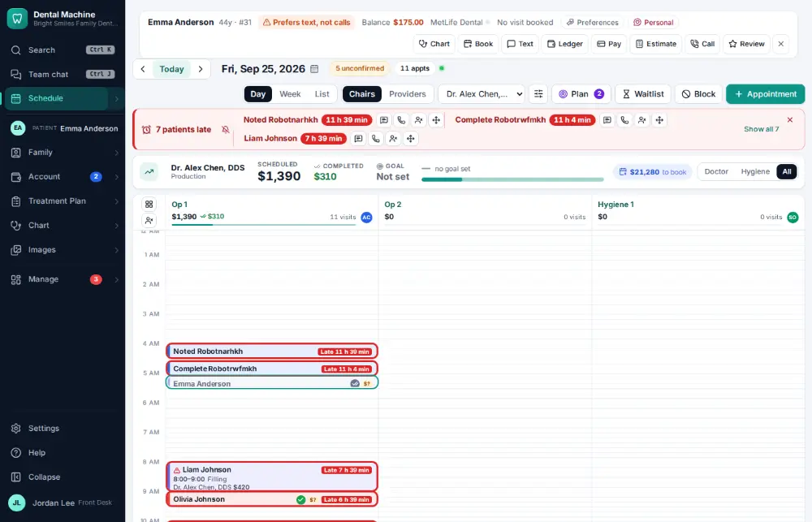
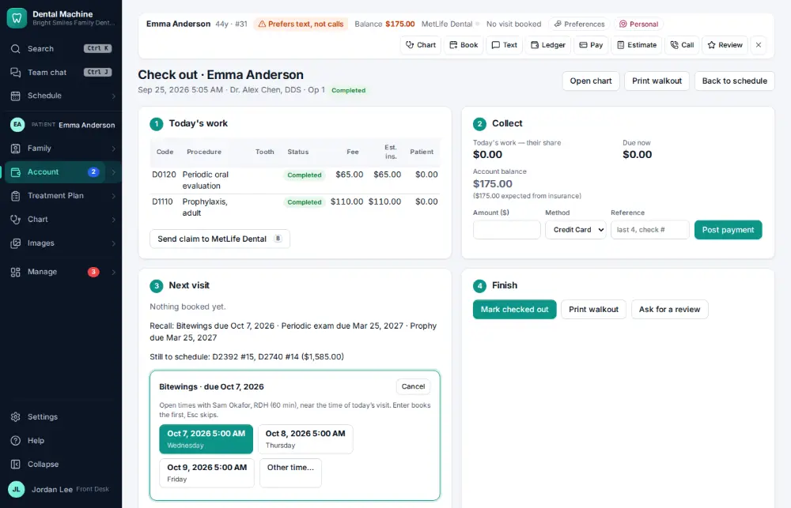
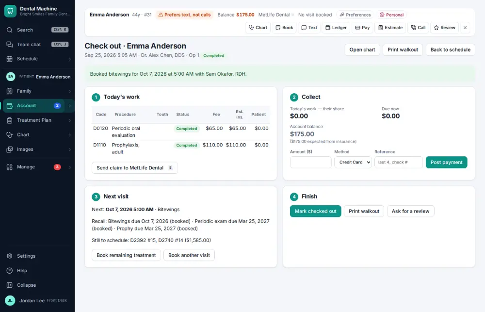
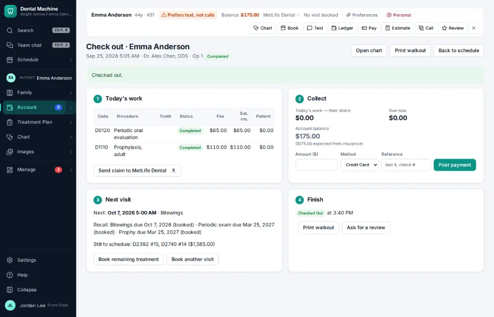

# How do I check a patient out?

**Who:** front desk · **Where:** Schedule — O on the finished visit → Checkout: Enter pays what's due, Enter books the next cleaning, Enter checks out · **How often:** Several times a day

Checkout collects what is due, books the next visit and marks the patient checked out, on one screen. The amount is already filled in with what they owe today plus any earlier balance.

## Where to start

Select the finished visit on the schedule.

## Steps

1. Press O on the finished visit: checkout opens with what’s due now (today’s share + any earlier balance) in the amount, focused  
   Keys: <kbd>O</kbd>

   

2. Press Enter on the first suggestion: next cleaning booked with their hygienist; "Mark checked out" takes the focus  
   Keys: <kbd>Enter</kbd>

   

3. Press Enter: checked out  
   Keys: <kbd>Enter</kbd>

   

## With the mouse

Open the visit and click “Check out…”; click Take payment, pick a suggested time, and click “Mark checked out”.

## Tips

- The payment method is the one this patient used last.
- The walkout (route slip) can be printed from the same screen.

## If something goes wrong

- **“Payment amount must be positive”** — Type an amount above zero, or skip the payment if nothing is due.

## Related

- [How do I take a patient payment?](A019-take-a-patient-payment.md)
- [How do I book the next hygiene visit at checkout?](A027-book-the-next-hygiene-visit-at-checkout.md)
- [How do I print the route slip / walkout for a visit?](A044-print-the-route-slip-walkout-for-a-visit.md)
- [How do I explain a balance (show the ledger)?](A024-explain-a-balance-show-the-ledger.md)
- [How do I estimate what the patient will owe?](A025-estimate-what-the-patient-will-owe.md)

---
[All how-tos](README.md) · Action A017 · screenshots from the robot run of 2026-09-25
