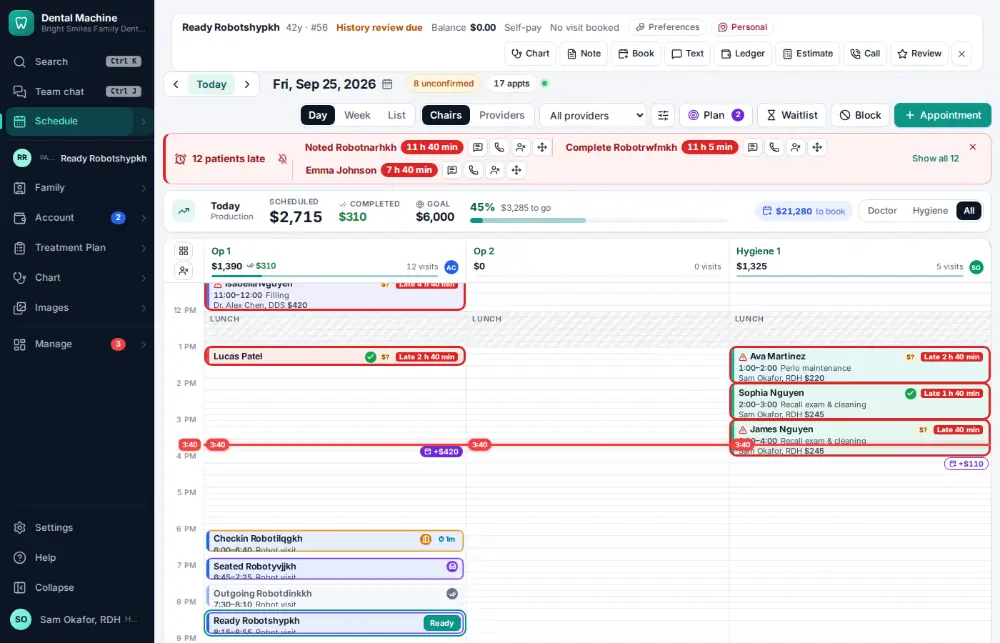
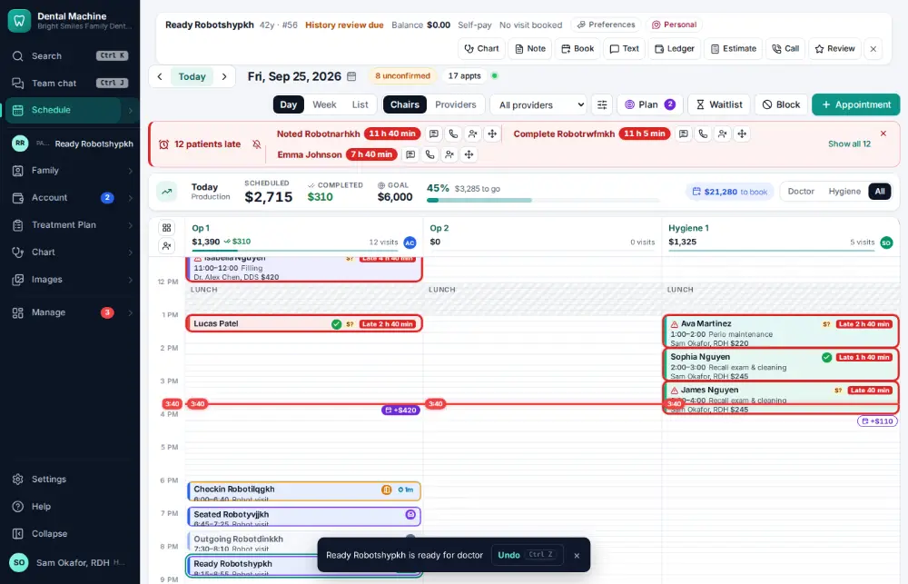

# How do I mark a patient ready for the doctor?

**Who:** hygienist, assistant · **Where:** Schedule — R on the focused visit · **How often:** Several times a day · ⌨ keyboard only

Tells the dentist that the hygiene patient is ready for the exam. The card shows “Ready · Dr” for everyone.

## Where to start

Select the seated patient’s visit on the schedule.

## Steps

1. Press R: the card shows "ready for the doctor"  
   Keys: <kbd>R</kbd>

   

## With the mouse

Open the visit and click “Ready for doctor”.

## Tips

- Press R again to take the flag off.

## If something goes wrong

- **“Seat … first, then mark them ready”** — Only a seated patient can be marked ready. Press S first.

## Related

- [How do I seat a patient?](A012-seat-a-patient.md)
- [How do I mark a visit finished?](A013-mark-a-visit-finished.md)
- [How do I book an appointment for an existing patient?](A020-book-an-appointment-for-an-existing-patient.md)
- [How do I confirm an appointment?](A016-confirm-an-appointment.md)
- [How do I check a patient in?](A010-check-a-patient-in.md)

---
[All how-tos](README.md) · Action A018 · screenshots from the robot run of 2026-09-25
