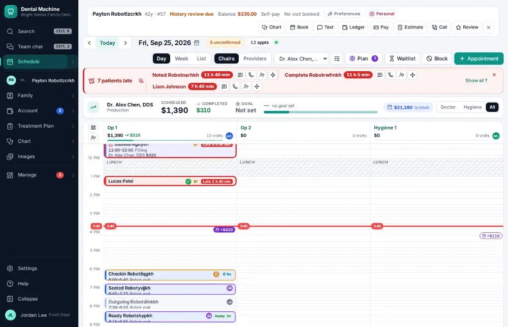
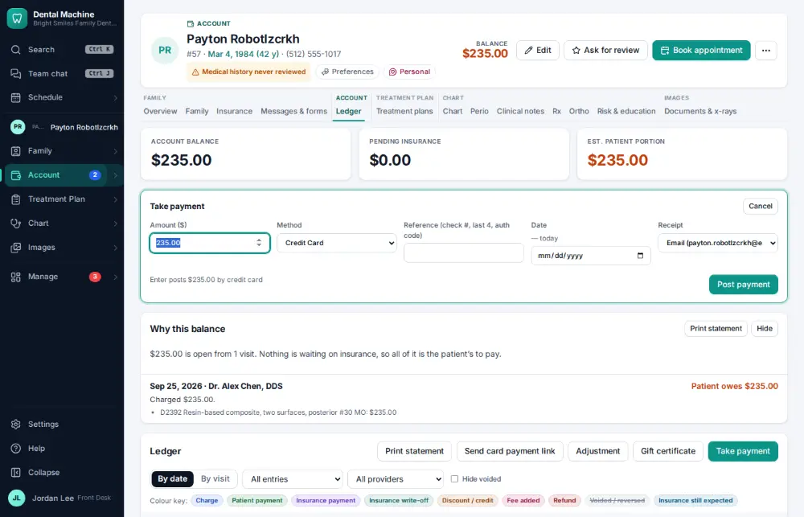
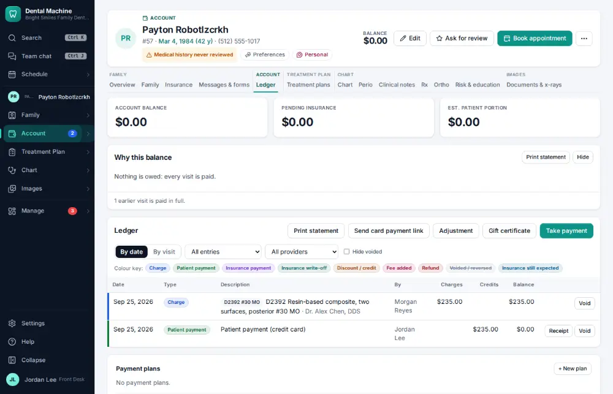

# How do I take a patient payment?

**Who:** front desk · **Where:** Alt+P from any screen → Ledger payment panel · **How often:** Several times a day · ⌨ keyboard only

Alt+P opens the active patient’s ledger with the payment panel, the amount already set to what they owe. Enter posts it.

## Where to start

## Steps

1. Press Alt+P: the ledger opens with the payment panel; the amount is filled in with what they owe  
   Keys: <kbd>Alt P</kbd>

   

2. Press Enter: posted with the method this person used last  
   Keys: <kbd>Enter</kbd>

   

## With the mouse

Click Pay on the patient bar, check the amount and method, and click Post payment.

## Tips

- The method (cash, check, card…) defaults to the one this person used last.
- A payment posted by mistake is voided, not deleted ([A102](A102-void-a-payment-posted-by-mistake.md)): the ledger keeps both lines.

## If something goes wrong

- **“Payment amount must be positive”** — Type an amount above zero.
- **“Missing permission: billing:write”** — Your role can’t take payments — ask the office manager.

## Related

- [How do I check a patient out?](A017-check-a-patient-out.md)
- [How do I void a payment posted by mistake?](A102-void-a-payment-posted-by-mistake.md)
- [How do I explain a balance (show the ledger)?](A024-explain-a-balance-show-the-ledger.md)
- [How do I estimate what the patient will owe?](A025-estimate-what-the-patient-will-owe.md)
- [How do I post an adjustment or write-off?](A064-post-an-adjustment-or-write-off.md)

---
[All how-tos](README.md) · Action A019 · screenshots from the robot run of 2026-09-25
