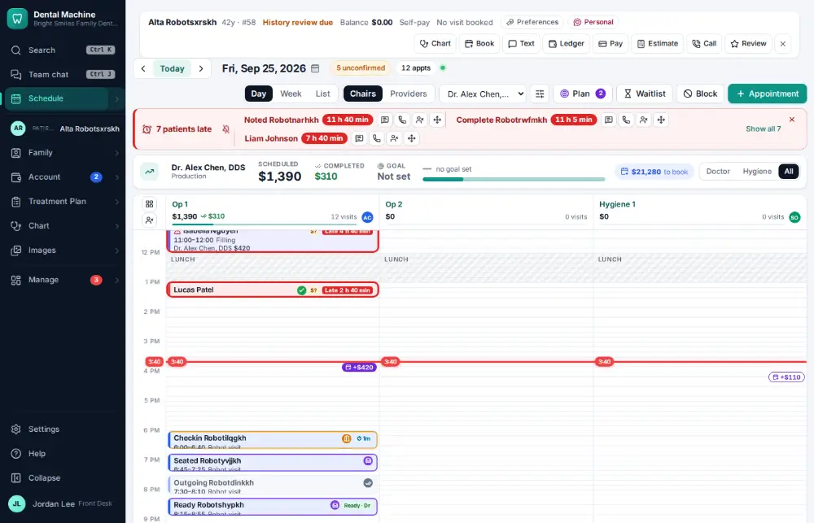
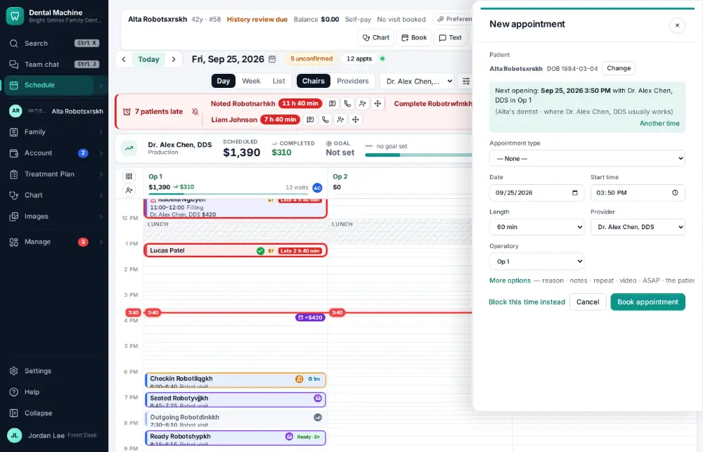
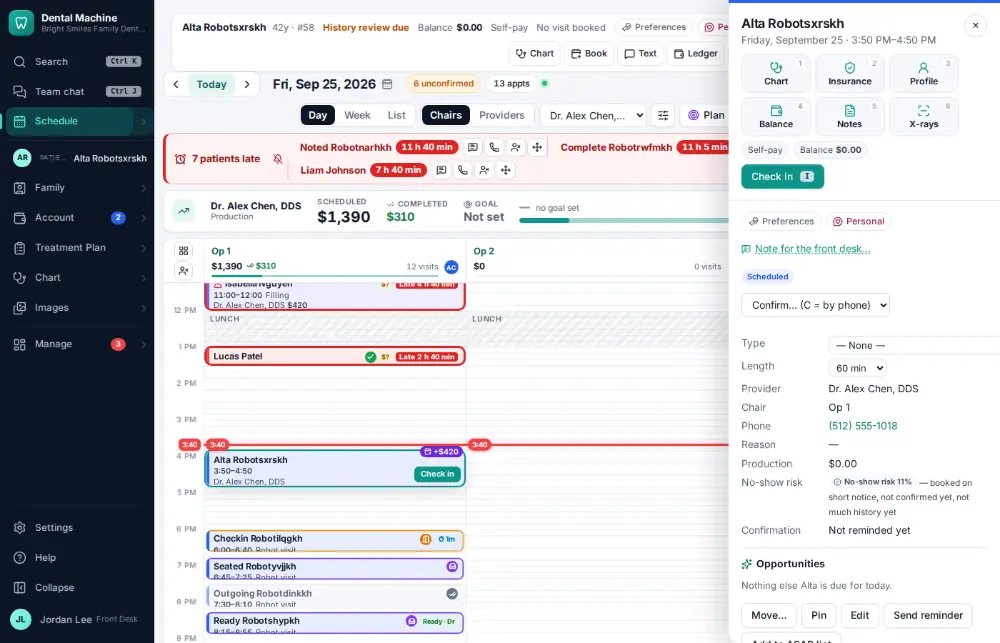

# How do I book an appointment for an existing patient?

**Who:** front desk · **Where:** Alt+B (active patient) or N on the schedule · **How often:** Several times a day · ⌨ keyboard only

Alt+B opens the booking form on the active patient’s next open time with their usual dentist or hygienist. Enter books it.

## Where to start

## Steps

1. Press Alt+B: the booking form opens on the patient’s next open time with their dentist  
   Keys: <kbd>Alt B</kbd>

   

2. Press Enter: booked  
   Keys: <kbd>Enter</kbd>

   

## With the mouse

Click Book on the patient bar, pick the time and click Book appointment.

## Tips

- On the schedule, N starts a booking for anyone.
- Type “book jane” in the command bar to book straight from there.

## Related

- [How do I reschedule an appointment?](A029-reschedule-an-appointment.md)
- [How do I book a same-day emergency visit?](A082-book-a-same-day-emergency-visit.md)
- [How do I book the next hygiene visit at checkout?](A027-book-the-next-hygiene-visit-at-checkout.md)
- [How do I mark a patient ready for the doctor?](A018-mark-a-patient-ready-for-the-doctor.md)
- [How do I seat a patient?](A012-seat-a-patient.md)

---
[All how-tos](README.md) · Action A020 · screenshots from the robot run of 2026-09-25
