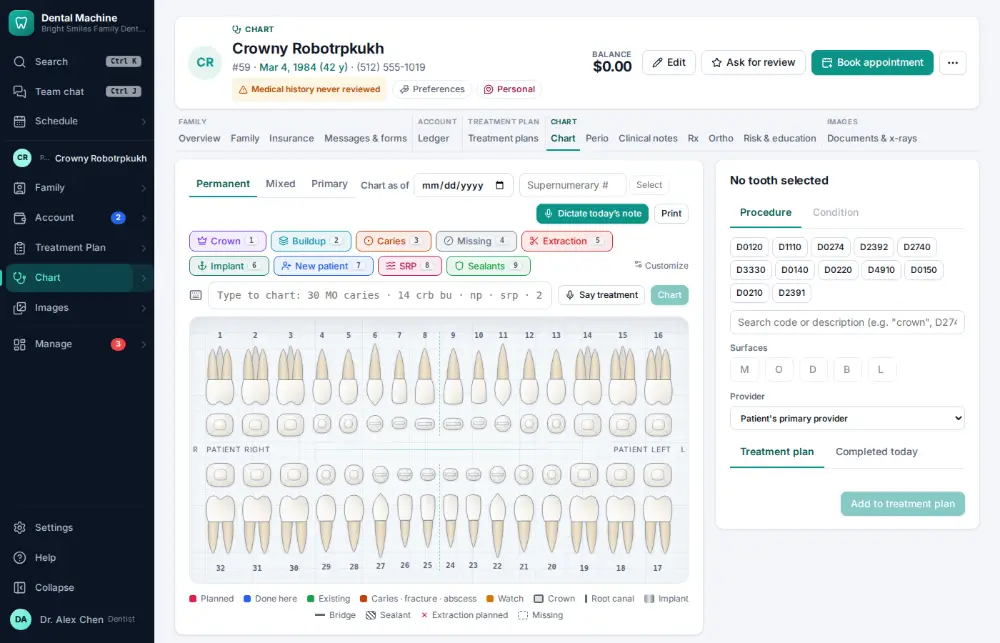
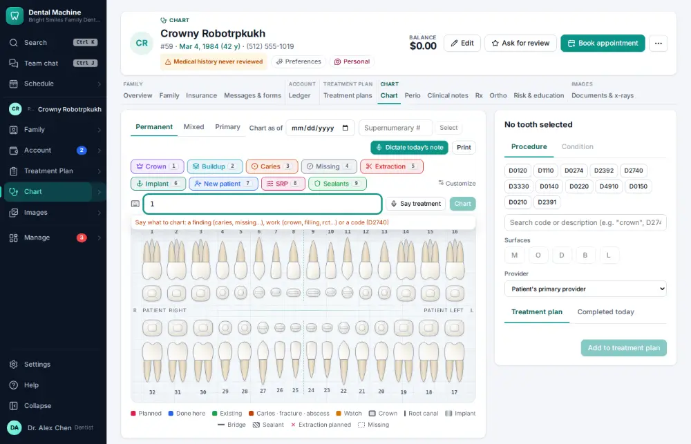
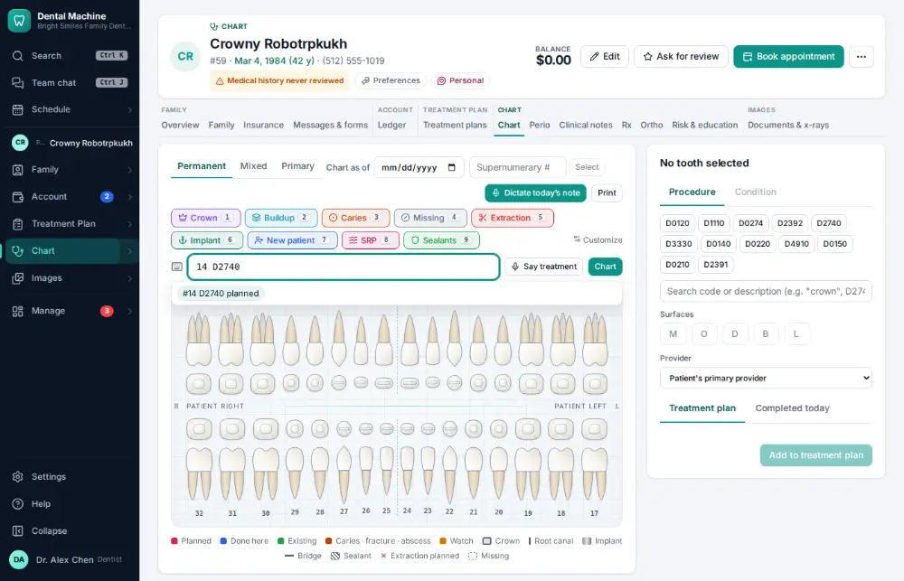
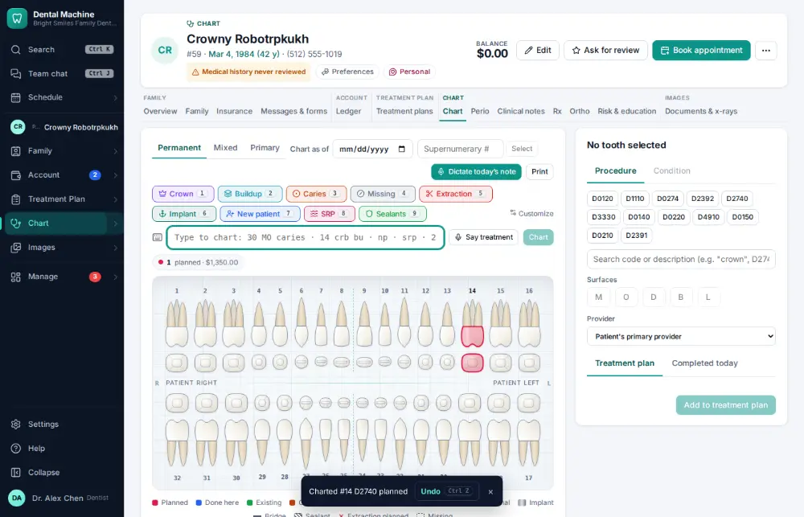

# How do I chart planned treatment?

**Who:** dentist · **Where:** Chart tab — type the code · **How often:** Several times a day

Type a tooth and a procedure code on the Chart tab and the fee and the patient’s estimated share show before you press Enter.

## Where to start

## Steps

1. Type 1 on the chart: the entry box opens  
   Keys: <kbd>1</kbd>

   

2. Type "4 D2740": the crown, its fee and the patient’s estimate show

   

3. Press Enter: planned on #14  
   Keys: <kbd>Enter</kbd>

   

## With the mouse

Click the tooth on the drawing, search for the procedure and click it.

## Tips

- You can type words instead of codes (“crown”, “MO filling”, “rct”).
- Planned work shows on the Treatment Plan module, ready to present.

## If something goes wrong

- **“… requires a tooth”** — That code needs a tooth number first.

## Related

- [How do I build a treatment plan?](A038-build-a-treatment-plan.md)
- [How do I estimate what the patient will owe?](A025-estimate-what-the-patient-will-owe.md)
- [How do I chart a finding on a tooth?](A006-chart-a-finding-on-a-tooth.md)
- [How do I sign a clinical note?](A023-sign-a-clinical-note.md)
- [How do I write a clinical note?](A011-write-a-clinical-note.md)

---
[All how-tos](README.md) · Action A021 · screenshots from the robot run of 2026-09-25
