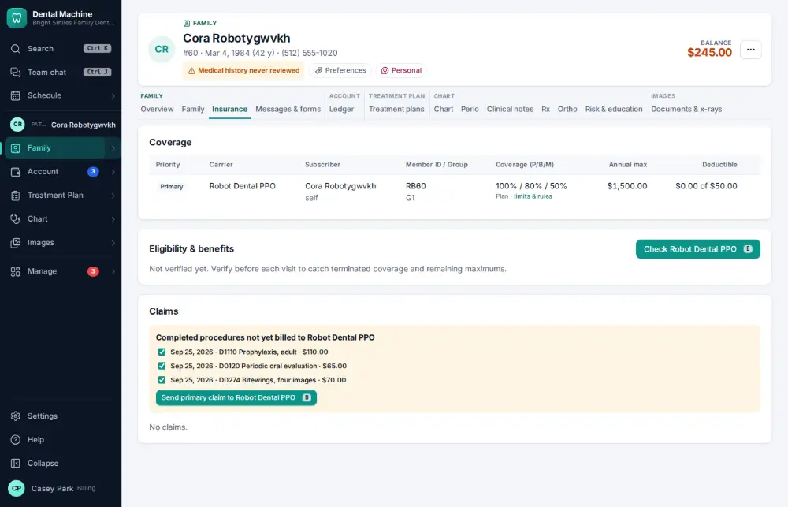
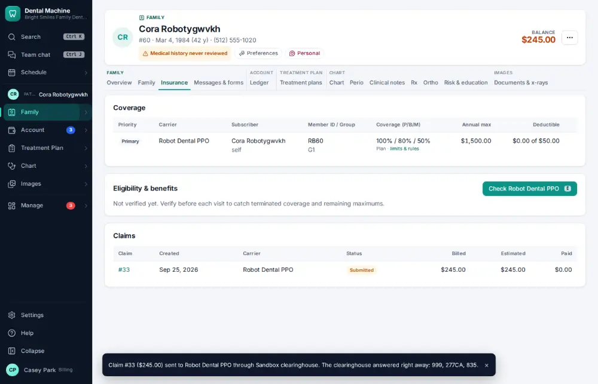

# How do I create and send an insurance claim?

**Who:** billing, front desk · **Where:** Insurance tab or checkout — B · **How often:** Several times a day

The patient’s Insurance tab shows finished work that hasn’t been billed yet. B makes the claim and sends it to the clearinghouse.

## Where to start

## Steps

1. Insurance tab: "Bill … claim" shows the finished work. Press B: the claim is made and sent  
   Keys: <kbd>B</kbd>

   

## With the mouse

Click “Bill … claim” on the Insurance tab.

## Tips

- Before sending, a claim lists what is likely to be denied (frequencies, missing x-rays or narratives).
- Billing staff can also approve claims in bulk ([A048](A048-approve-claims-that-are-ready-to-send.md)).

## If something goes wrong

- **A claim is rejected by the payer** — It shows in Needs attention and on the claim; fix it and send a corrected claim ([A106](A106-resend-or-fix-a-rejected-claim.md)).

## Related

- [How do I approve claims that are ready to send?](A048-approve-claims-that-are-ready-to-send.md)
- [How do I attach x-rays to a claim?](A056-attach-x-rays-to-a-claim.md)
- [How do I look up a claim's status?](A067-look-up-a-claim-s-status.md)
- [How do I verify insurance eligibility?](A026-verify-insurance-eligibility.md)
- [How do I look up how much insurance benefit is left?](A035-look-up-how-much-insurance-benefit-is-left.md)

---
[All how-tos](README.md) · Action A022 · screenshots from the robot run of 2026-09-25
