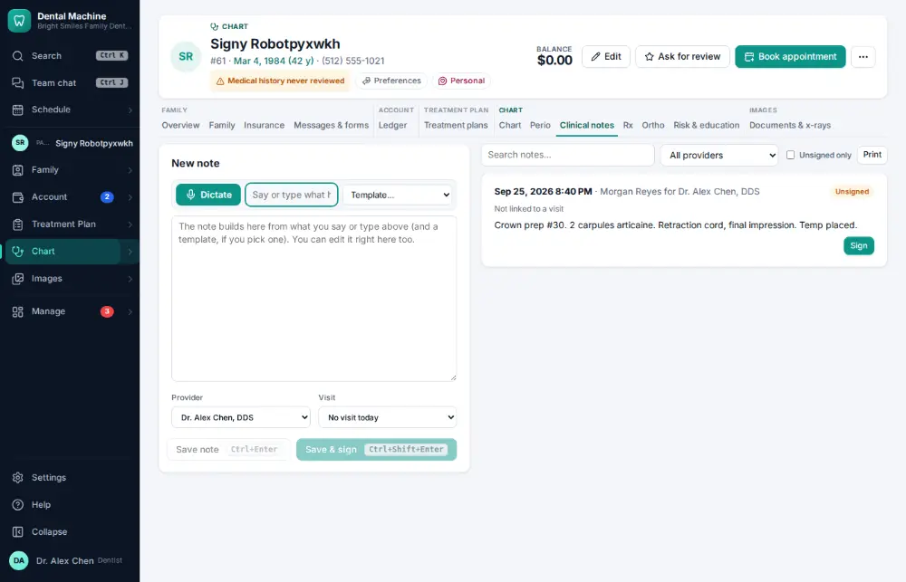
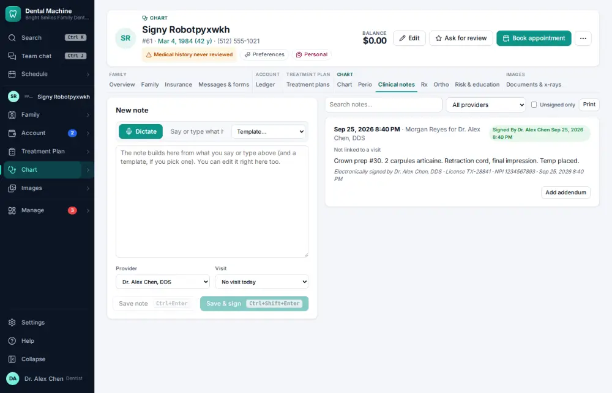

# How do I sign a clinical note?

**Who:** dentist · **Where:** Clinical notes tab — Sign · **How often:** Several times a day

The dentist signs each note. A signed note is locked with the dentist’s name and NPI; later changes are addenda.

## Where to start

## Steps

1. Clinical notes: the unsigned note shows "Sign". Click it: signed with the dentist’s name and NPI

   

## With the mouse

Clinical notes tab → click Sign on the note.

## Tips

- Ctrl/⌘ Shift Enter saves and signs while you are writing.
- Chart audit ([A095](A095-fix-unsigned-or-incomplete-notes.md)) lists every unsigned note.

## If something goes wrong

- **“Note already signed”** — Someone signed it already. Add an addendum if something needs adding.

## Related

- [How do I write a clinical note?](A011-write-a-clinical-note.md)
- [How do I fix unsigned or incomplete notes?](A095-fix-unsigned-or-incomplete-notes.md)
- [How do I chart planned treatment?](A021-chart-planned-treatment.md)
- [How do I update medical history?](A032-update-medical-history.md)
- [How do I record blood pressure and pulse?](A033-record-blood-pressure-and-pulse.md)

---
[All how-tos](README.md) · Action A023 · screenshots from the robot run of 2026-09-25
