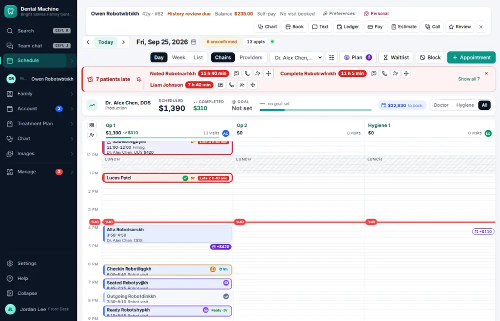
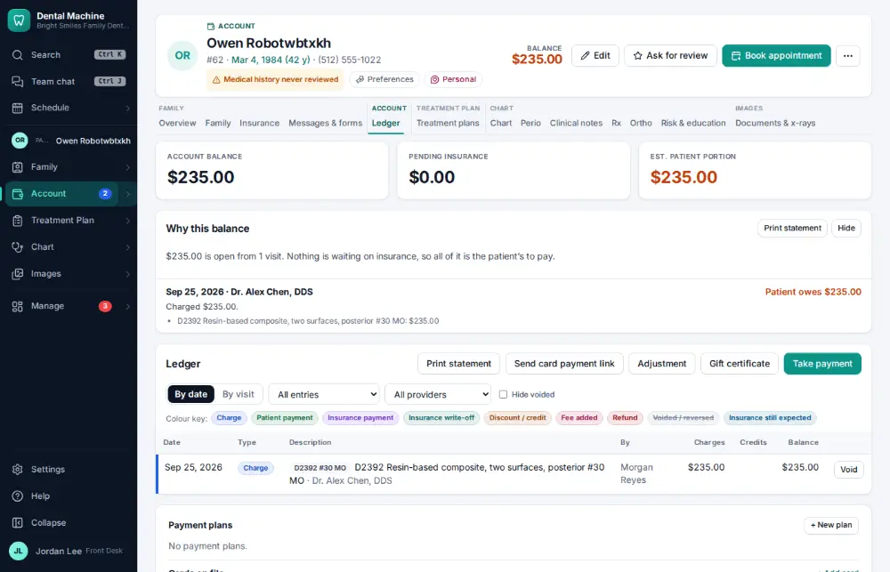

# How do I explain a balance (show the ledger)?

**Who:** front desk, billing · **Where:** Alt+L from any screen → "Why this balance" · **How often:** Several times a day · ⌨ keyboard only

Alt+L opens the active patient’s ledger with “Why this balance”: each visit’s charges, what insurance paid, adjustments and payments, so you can walk the patient through it.

## Where to start

## Steps

1. Press Alt+L: the ledger opens with "Why this balance", visit by visit  
   Keys: <kbd>Alt L</kbd>

   

## With the mouse

Click Ledger on the patient bar (or the Account module).

## Tips

- Balances are always added up from the ledger lines; nothing is typed in by hand.

## Related

- [How do I take a patient payment?](A019-take-a-patient-payment.md)
- [How do I post an adjustment or write-off?](A064-post-an-adjustment-or-write-off.md)
- [How do I send patient statements?](A119-send-patient-statements.md)
- [How do I estimate what the patient will owe?](A025-estimate-what-the-patient-will-owe.md)
- [How do I check a patient out?](A017-check-a-patient-out.md)

---
[All how-tos](README.md) · Action A024 · screenshots from the robot run of 2026-09-25
