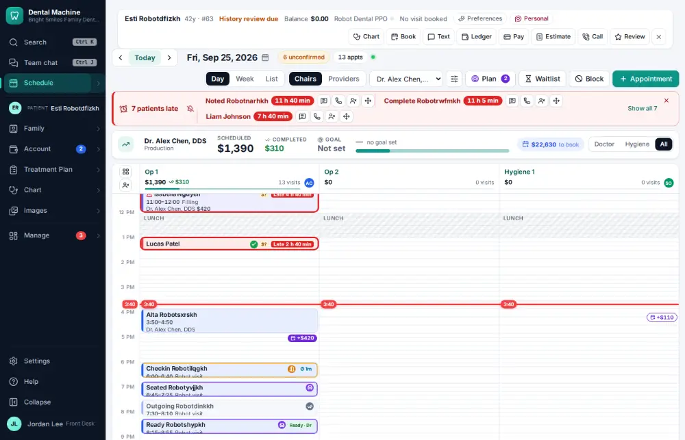
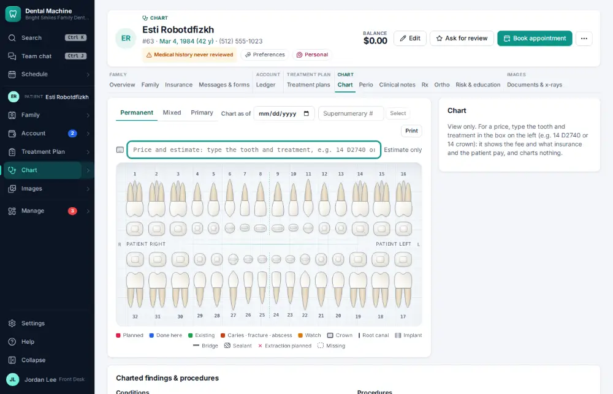
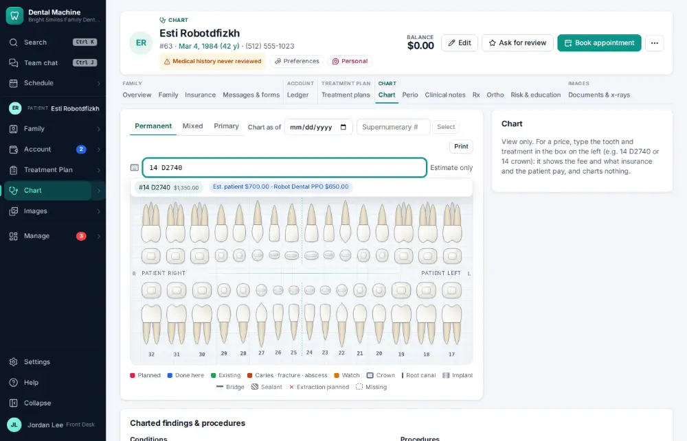

# How do I estimate what the patient will owe?

**Who:** front desk, dentist · **Where:** Alt+E from any screen (the patient bar's Estimate) or the Chart tab — type "14 D2740", the estimate shows · **How often:** Several times a day · ⌨ keyboard only

Shows what a procedure costs, what insurance should pay and what the patient pays — without charting anything.

## Where to start

## Steps

1. Press Alt+E: the chart opens with the cursor in the estimate box  
   Keys: <kbd>Alt E</kbd>

   

2. Type "14 D2740": the fee, the insurance share and the patient’s share show — nothing is charted

   

## With the mouse

Click Estimate on the patient bar and type the procedure.

## Tips

- The estimate uses the patient’s plan, remaining maximum and deductible.

## Related

- [How do I chart planned treatment?](A021-chart-planned-treatment.md)
- [How do I look up how much insurance benefit is left?](A035-look-up-how-much-insurance-benefit-is-left.md)
- [How do I build a treatment plan?](A038-build-a-treatment-plan.md)
- [How do I explain a balance (show the ledger)?](A024-explain-a-balance-show-the-ledger.md)
- [How do I take a patient payment?](A019-take-a-patient-payment.md)

---
[All how-tos](README.md) · Action A025 · screenshots from the robot run of 2026-09-25
