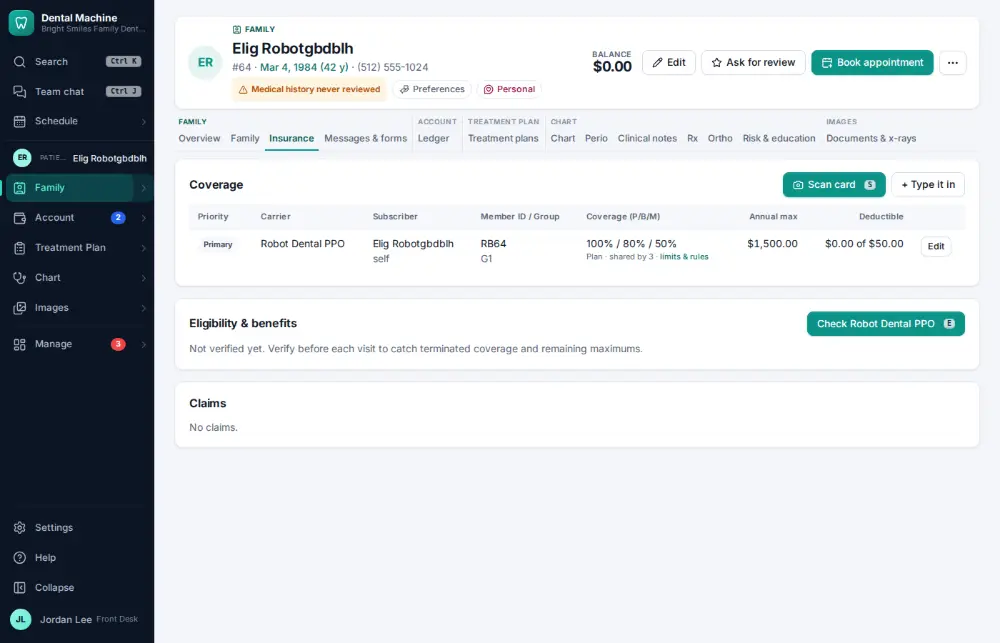
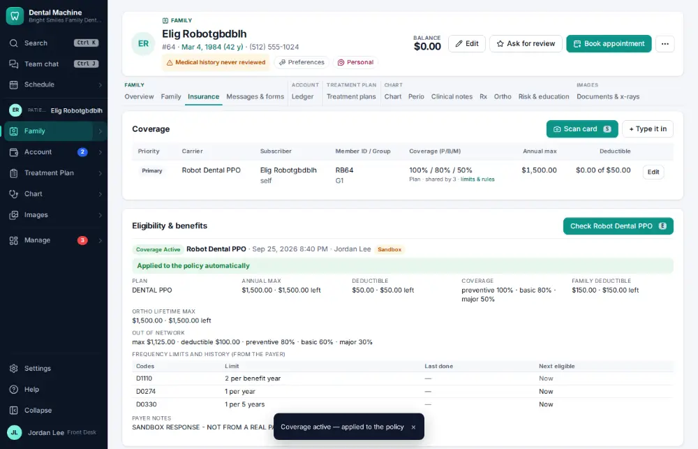

# How do I verify insurance eligibility?

**Who:** front desk, billing · **Where:** Insurance tab — E; overnight batch for tomorrow · **How often:** Several times a day

Checks the patient’s coverage with the payer and updates the policy. Tomorrow’s patients are also checked overnight automatically.

## Where to start

Open the patient’s Insurance tab.

## Steps

1. Press E: eligibility is checked with the payer and applied to the policy  
   Keys: <kbd>E</kbd>

   

## With the mouse

Click “Check <carrier>” under Eligibility & benefits on the Insurance tab.

## If something goes wrong

- **The payer doesn’t answer** — Try again later, or verify by phone from Billing → Verification (P records a phone verification).

## Related

- [How do I review tomorrow's insurance verification list?](A087-review-tomorrow-s-insurance-verification-list.md)
- [How do I look up how much insurance benefit is left?](A035-look-up-how-much-insurance-benefit-is-left.md)
- [How do I scan a new insurance card into a policy?](A047-scan-a-new-insurance-card-into-a-policy.md)
- [How do I create and send an insurance claim?](A022-create-and-send-an-insurance-claim.md)
- [How do I approve claims that are ready to send?](A048-approve-claims-that-are-ready-to-send.md)

---
[All how-tos](README.md) · Action A026 · screenshots from the robot run of 2026-09-25
