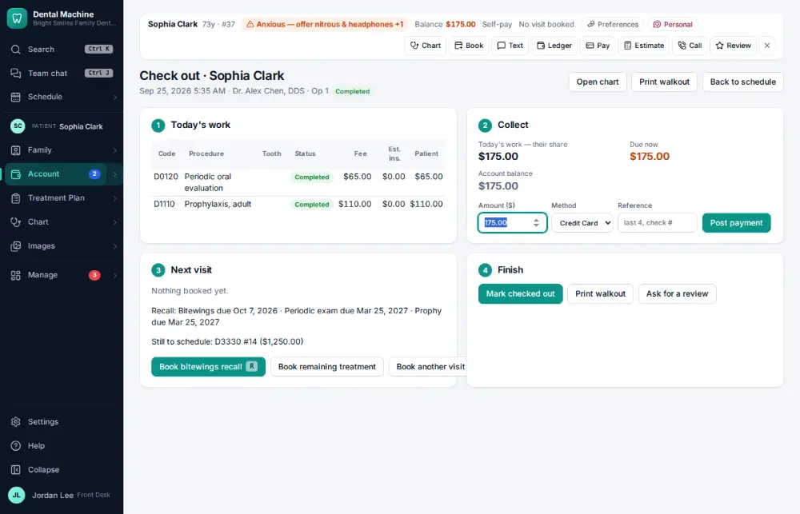
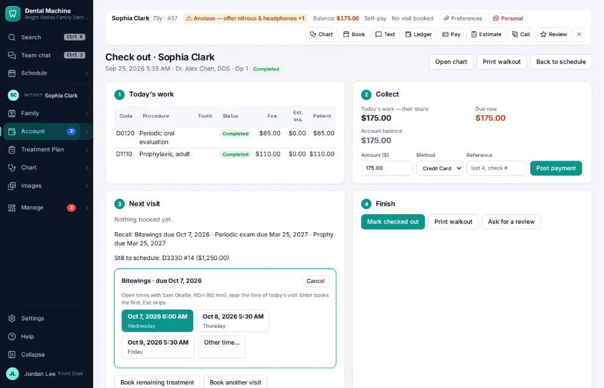
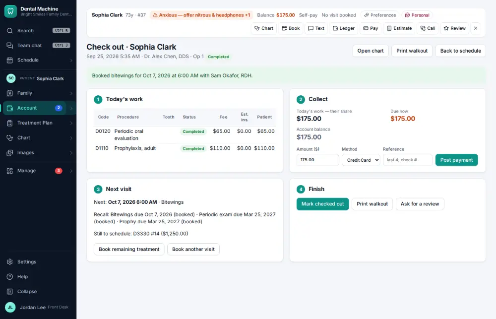

# How do I book the next hygiene visit at checkout?

**Who:** front desk · **Where:** Checkout — R (or it opens by itself when nothing is left to pay), Enter on the first suggestion · **How often:** Several times a day · ⌨ keyboard only

At checkout the next cleaning is suggested with the patient’s hygienist, near the time of today’s visit. Enter books the first suggestion.

## Where to start

## Steps

1. Press R ("Book … recall"): the next open times with their hygienist, near the time of today’s visit, the first one focused

   

2. Press Enter: booked  
   Keys: <kbd>Enter</kbd>

   

## With the mouse

On the checkout screen click “Book … recall” and click one of the suggested times.

## Tips

- When nothing is left to pay, the booking opens by itself.

## Related

- [How do I check a patient out?](A017-check-a-patient-out.md)
- [How do I book an appointment for an existing patient?](A020-book-an-appointment-for-an-existing-patient.md)
- [How do I call a patient who is due for recall?](A037-call-a-patient-who-is-due-for-recall.md)
- [How do I reschedule an appointment?](A029-reschedule-an-appointment.md)
- [How do I change an appointment's type, length or note?](A041-change-an-appointment-s-type-length-or-note.md)

---
[All how-tos](README.md) · Action A027 · screenshots from the robot run of 2026-09-25
