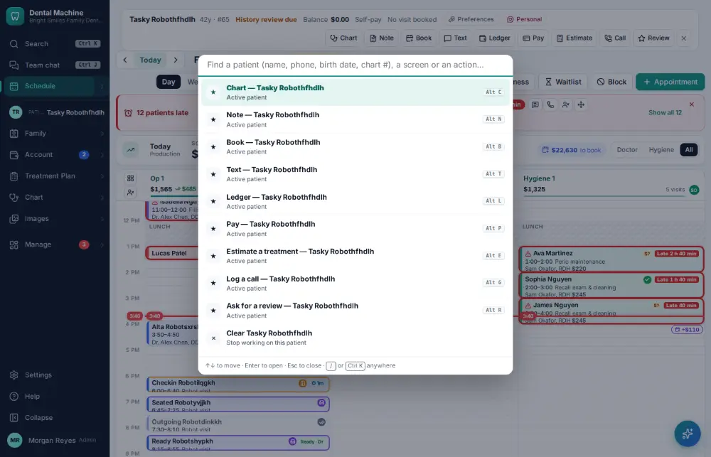
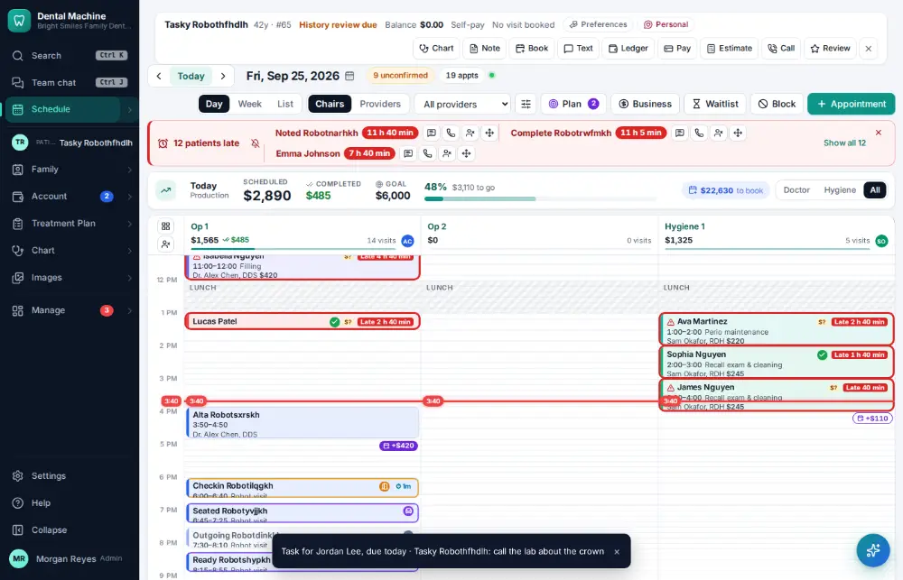

# How do I send a task to a co-worker?

**Who:** everyone · **Where:** Command bar "task … @name" · **How often:** Several times a day

Type “task …” in the command bar with @ and a name to give someone a task. It is about the active patient and due today unless you say otherwise.

## Steps

1. Press Ctrl/⌘K: the command bar opens  
   Keys: <kbd>Ctrl/⌘ K</kbd>

   

2. Type "task call the lab about the crown @jordan" and press Enter: assigned to Jordan, about the active patient, due today  
   Keys: <kbd>Enter</kbd>

   

## With the mouse

Manage ▾ → To-do & labs → New task (or press T there).

## Tips

- The person sees it in To-do & labs and in the menu’s badge.

## Related

- [How do I mark a task done?](A034-mark-a-task-done.md)
- [How do I send a message in staff chat?](A036-send-a-message-in-staff-chat.md)
- [How do I work the Needs attention list?](A049-work-the-needs-attention-list.md)
- [How do I complete the opening or closing checklist?](A079-complete-the-opening-or-closing-checklist.md)
- [How do I run the morning huddle?](A083-run-the-morning-huddle.md)

---
[All how-tos](README.md) · Action A028 · screenshots from the robot run of 2026-09-25
