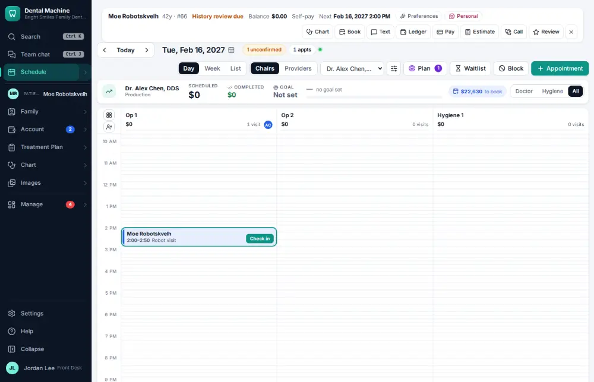
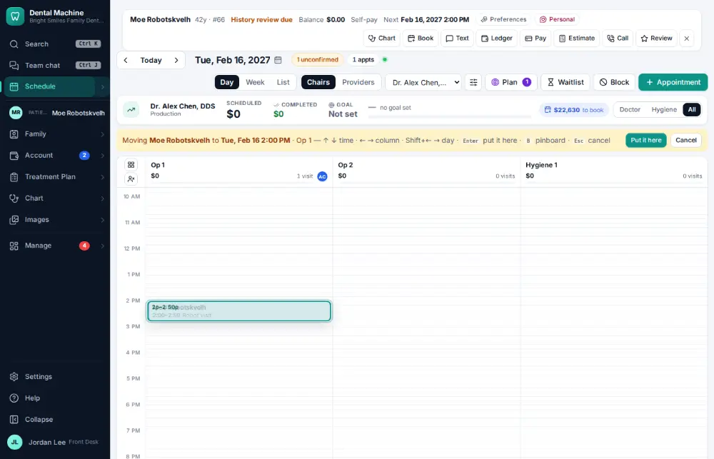
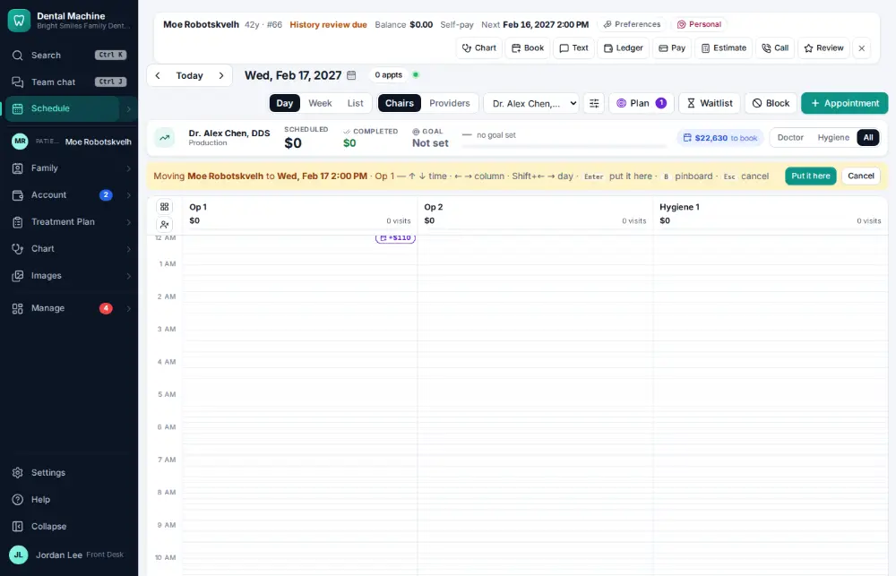
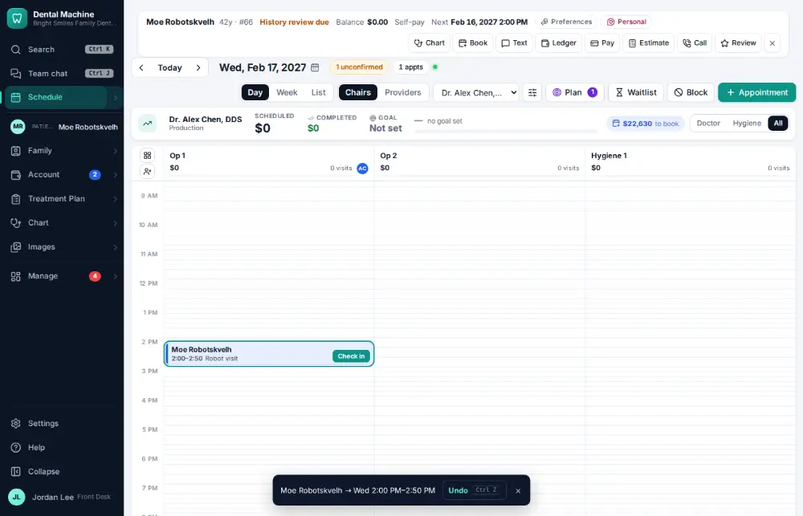

# How do I reschedule an appointment?

**Who:** front desk · **Where:** Schedule — M, arrows, Enter (or drag) · **How often:** Several times a day · ⌨ keyboard only

M picks the selected visit up; the arrow keys move it; Enter puts it down. Shift+→ keeps the same time on the next day.

## Where to start

Select the visit on the schedule first.

## Steps

1. Press M: the visit lifts off the schedule  
   Keys: <kbd>M</kbd>

   

2. Press Shift+→: same time the next day  
   Keys: <kbd>Shift →</kbd>

   

3. Press Enter: moved (Undo shows)  
   Keys: <kbd>Enter</kbd>

   

## With the mouse

Drag the visit to the new time, or open it and click Move….

## Tips

- Undo on the notice puts it back.
- Pin parks a visit on the pinboard while you look for a day.

## If something goes wrong

- **A warning that the new time clashes** — Choose “Move anyway” only if the double-booking is on purpose.

## Related

- [How do I cancel an appointment?](A054-cancel-an-appointment.md)
- [How do I book an appointment for an existing patient?](A020-book-an-appointment-for-an-existing-patient.md)
- [How do I fill an opening from the ASAP list?](A070-fill-an-opening-from-the-asap-list.md)
- [How do I book the next hygiene visit at checkout?](A027-book-the-next-hygiene-visit-at-checkout.md)
- [How do I change an appointment's type, length or note?](A041-change-an-appointment-s-type-length-or-note.md)

---
[All how-tos](README.md) · Action A029 · screenshots from the robot run of 2026-09-25
