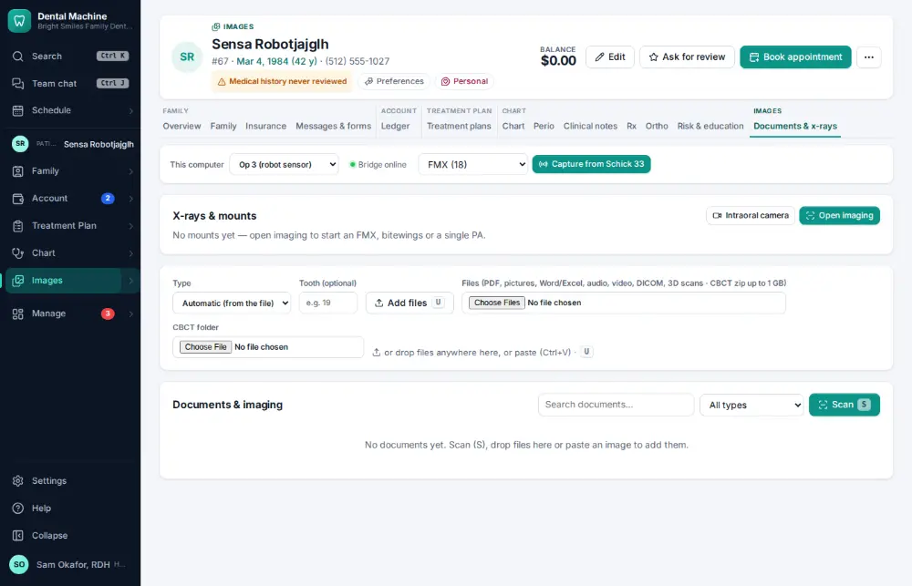
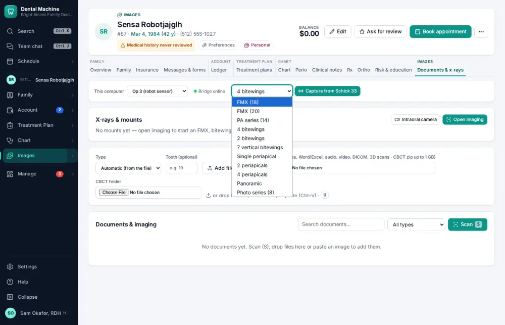
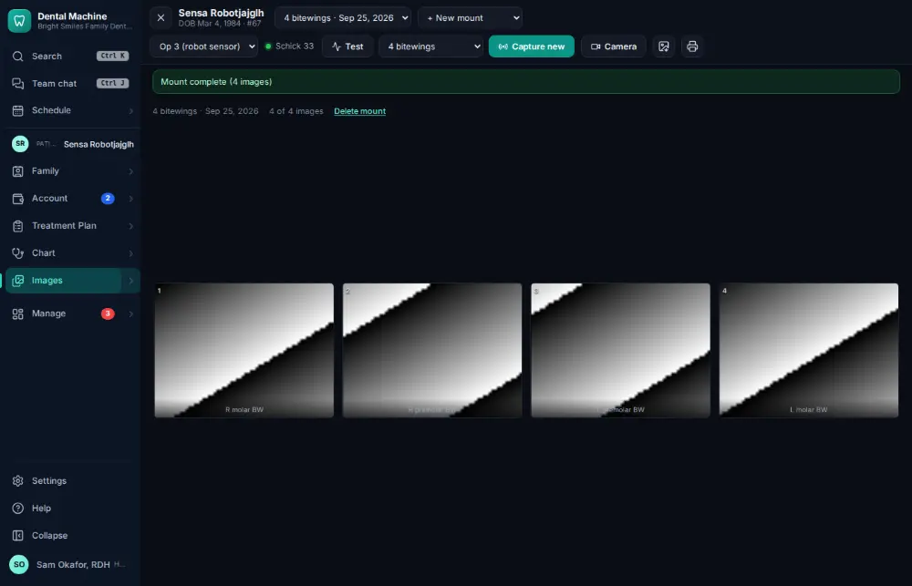

# How do I take x-rays with the sensor?

**Who:** assistant, hygienist · **Where:** Images module (Documents & x-rays tab) → Capture from the sensor · **How often:** Several times a day

With an x-ray sensor on the chair-side computer, x-rays go straight into the chart: the imaging studio shows which spot of the mount is next, and each exposure lands there within seconds.

## Where to start

## Steps

1. Images: pick "4 bitewings" as the series

   

2. Click "Capture from Schick 33": the studio opens; each exposure of the sensor lands in the next spot by itself

   

## Tips

- The sensor needs the imaging bridge on that computer (Settings → Imaging bridges; see docs/imaging-sensors.md).
- Test takes one exposure without a patient, to check the sensor.

## If something goes wrong

- **The workstation shows offline** — The imaging bridge isn’t running on that computer — restart the computer or run the bridge again.
- **The driver opens its own window for each exposure** — Set the TWAIN driver to capture automatically, with no preview.

## Related

- [How do I add x-rays or photos to the chart?](A031-add-x-rays-or-photos-to-the-chart.md)
- [How do I open a patient's x-rays?](A007-open-a-patient-s-x-rays.md)
- [How do I connect an imaging bridge or integration?](A182-connect-an-imaging-bridge-or-integration.md)
- [How do I take intraoral photos with the camera?](A050-take-intraoral-photos-with-the-camera.md)
- [How do I upload a scanned paper document?](A069-upload-a-scanned-paper-document.md)

---
[All how-tos](README.md) · Action A030 · screenshots from the robot run of 2026-09-25
