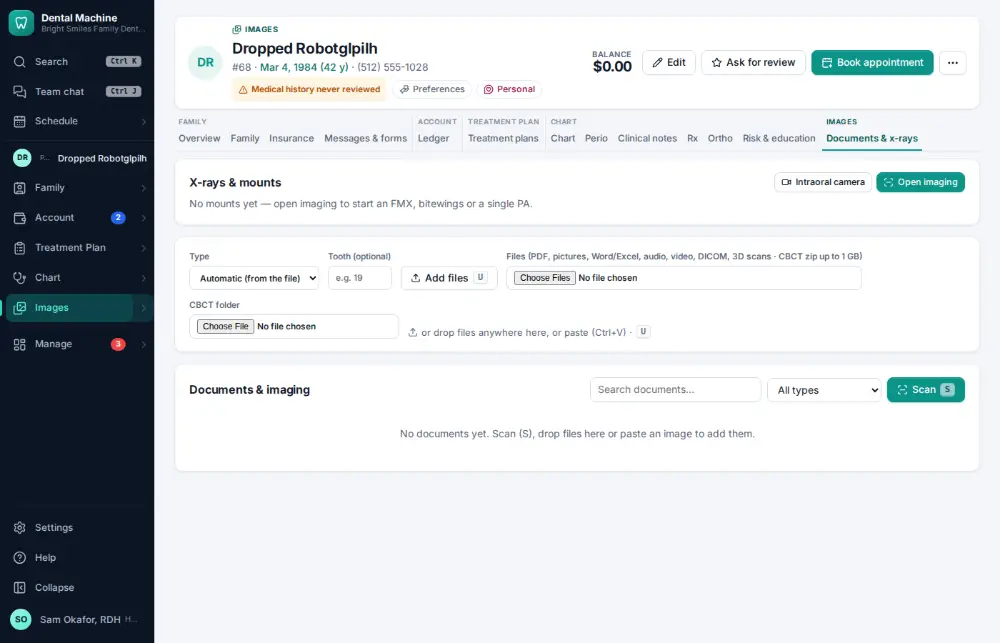
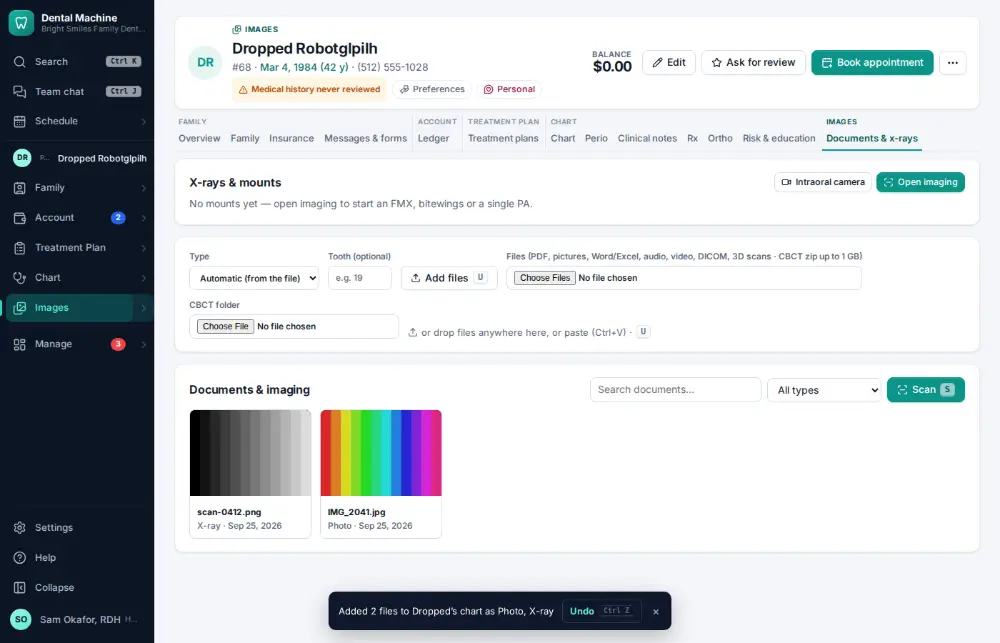

# How do I add x-rays or photos to the chart?

**Who:** assistant, hygienist · **Where:** Documents & x-rays tab — U (file picker) or drop files · **How often:** Several times a day · ⌨ keyboard only

Add pictures from the computer to the chart. Each file is filed as a photo or an x-ray from the file itself.

## Where to start

## Steps

1. Press U and choose the two pictures in the file picker: added, each filed as photo or x-ray from the file itself  
   Keys: <kbd>U</kbd>

   

## With the mouse

Documents & x-rays tab → click “Add files”, or drag the files onto the page.

## Tips

- Set Type and Tooth before adding if you want them filed that way.
- A CBCT folder can be added as one study.

## If something goes wrong

- **“That file is too large”** — Shrink the picture or split the PDF.

## Related

- [How do I open a patient's x-rays?](A007-open-a-patient-s-x-rays.md)
- [How do I upload a scanned paper document?](A069-upload-a-scanned-paper-document.md)
- [How do I take x-rays with the sensor?](A030-take-x-rays-with-the-sensor.md)
- [How do I take intraoral photos with the camera?](A050-take-intraoral-photos-with-the-camera.md)
- [How do I review x-ray AI findings?](A078-review-x-ray-ai-findings.md)

---
[All how-tos](README.md) · Action A031 · screenshots from the robot run of 2026-09-25
