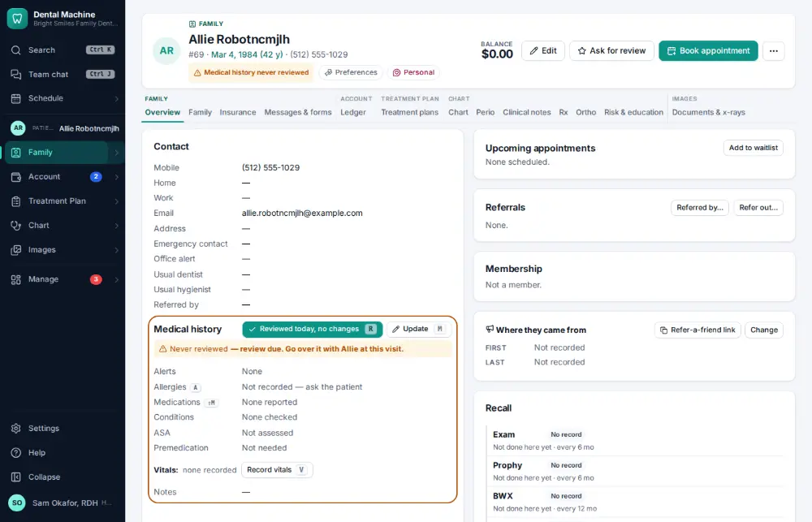
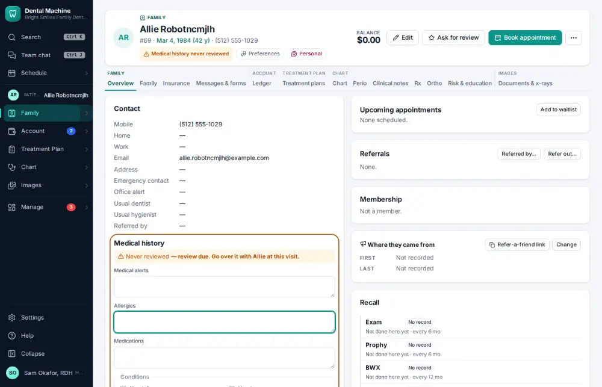
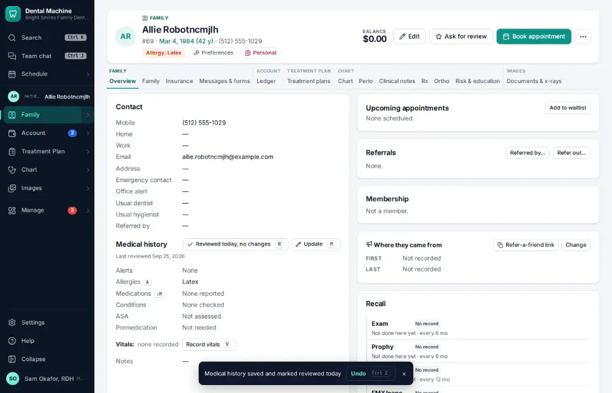

# How do I update medical history?

**Who:** hygienist, assistant · **Where:** Chart overview — A (allergies) or Shift+M (medications), type, Ctrl/⌘+Enter; or click the line · **How often:** Several times a day · ⌨ keyboard only

Opens the medical history on the Allergies line (A) or the Medications line (Shift+M). Saving also counts as today’s review.

## Where to start

Open the patient’s chart overview (the Family module).

## Steps

1. Press A: the medical history editor opens on the Allergies line  
   Keys: <kbd>A</kbd>

   

2. Type the allergy and press Ctrl/⌘+Enter: saved (and counted as today’s review)  
   Keys: <kbd>Ctrl/⌘ Enter</kbd>

   

## With the mouse

Click the Allergies or Medications line in the medical history, type and click Save.

## If something goes wrong

- **“Changing the medical history needs clinical access”** — Front desk can’t change it; ask a clinical team member.

## Related

- [How do I review medical history — no changes?](A014-review-medical-history-no-changes.md)
- [How do I record blood pressure and pulse?](A033-record-blood-pressure-and-pulse.md)
- [How do I review an online intake form?](A046-review-an-online-intake-form.md)
- [How do I build a treatment plan?](A038-build-a-treatment-plan.md)
- [How do I have the patient sign a consent form?](A039-have-the-patient-sign-a-consent-form.md)

---
[All how-tos](README.md) · Action A032 · screenshots from the robot run of 2026-09-25
