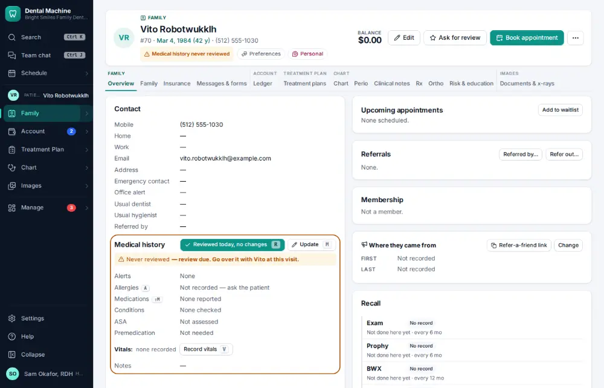
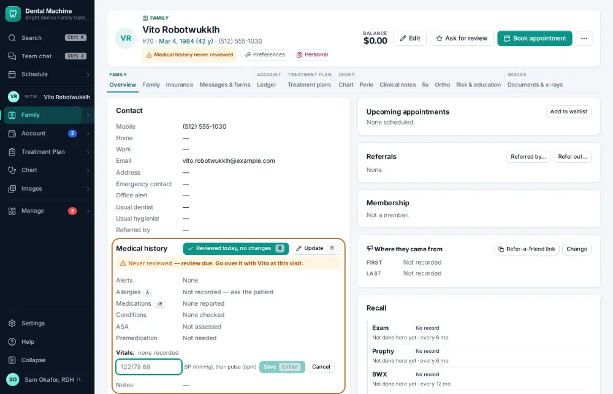
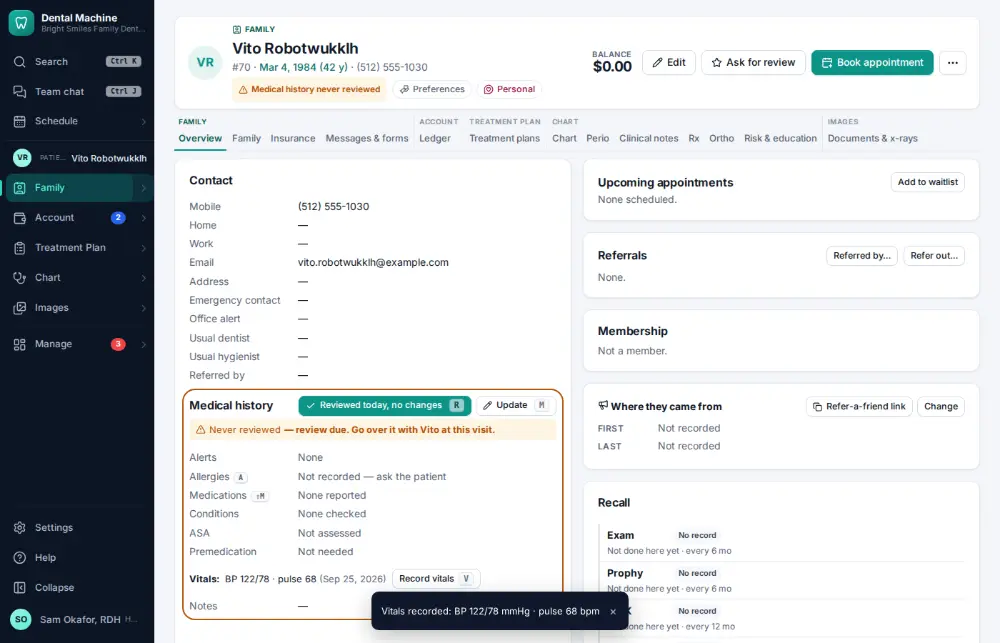

# How do I record blood pressure and pulse?

**Who:** hygienist, assistant · **Where:** Chart overview — V, type "122/78 68", Enter · **How often:** Several times a day

Type the reading as it is said — “122/78 68” — and it is read back as BP and pulse before you save.

## Where to start

Open the patient’s chart overview.

## Steps

1. Press V: one box opens under the medical history with the cursor in it  
   Keys: <kbd>V</kbd>

   

2. Type the reading as it’s said, "122/78 68" (it reads back BP 122/78 mmHg · pulse 68 bpm), and press Enter  
   Keys: <kbd>Enter</kbd>

   

## With the mouse

Click “Record vitals” under the medical history, type the reading and click Save.

## If something goes wrong

- **“Enter both blood pressure numbers”** — Type it as top/bottom, e.g. 122/78.

## Related

- [How do I update medical history?](A032-update-medical-history.md)
- [How do I review medical history — no changes?](A014-review-medical-history-no-changes.md)
- [How do I build a treatment plan?](A038-build-a-treatment-plan.md)
- [How do I have the patient sign a consent form?](A039-have-the-patient-sign-a-consent-form.md)
- [How do I sign a clinical note?](A023-sign-a-clinical-note.md)

---
[All how-tos](README.md) · Action A033 · screenshots from the robot run of 2026-09-25
