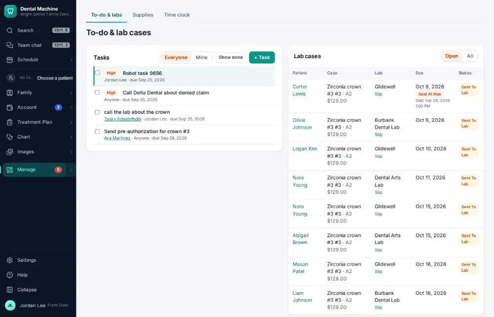
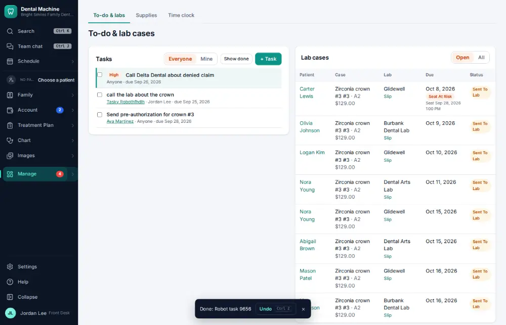

# How do I mark a task done?

**Who:** everyone · **Where:** To-do & labs — J, X · **How often:** Several times a day

To-do & labs lists your tasks; X marks the highlighted one done.

## Where to start

## Steps

1. To-do & labs: the task is highlighted at the top

   

2. Press X: done (Undo shows)  
   Keys: <kbd>X</kbd>

   

## With the mouse

Manage ▾ → To-do & labs, then tick the task’s box.

## Tips

- J and K move between tasks. Undo (or Ctrl/⌘ Z) reopens it.

## Related

- [How do I send a task to a co-worker?](A028-send-a-task-to-a-co-worker.md)
- [How do I work the Needs attention list?](A049-work-the-needs-attention-list.md)
- [How do I send a message in staff chat?](A036-send-a-message-in-staff-chat.md)
- [How do I complete the opening or closing checklist?](A079-complete-the-opening-or-closing-checklist.md)
- [How do I run the morning huddle?](A083-run-the-morning-huddle.md)

---
[All how-tos](README.md) · Action A034 · screenshots from the robot run of 2026-09-25
