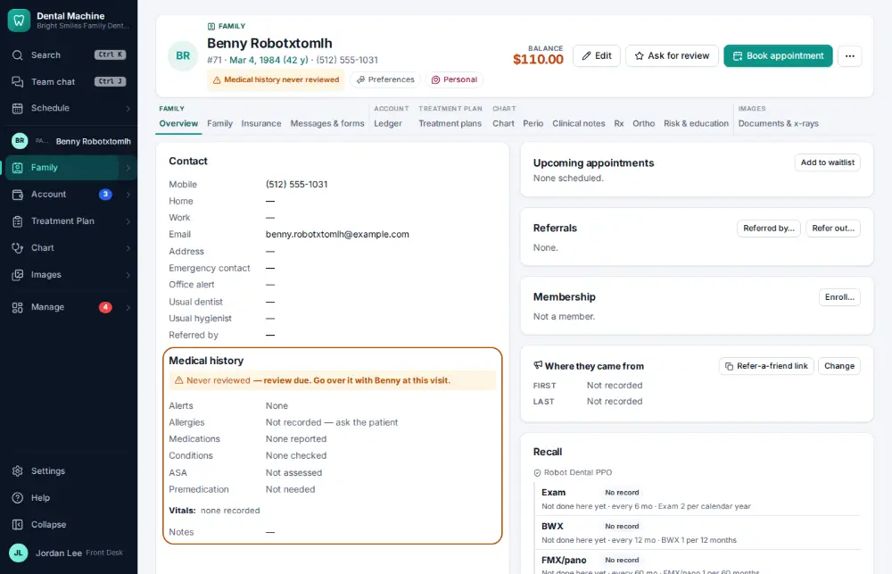
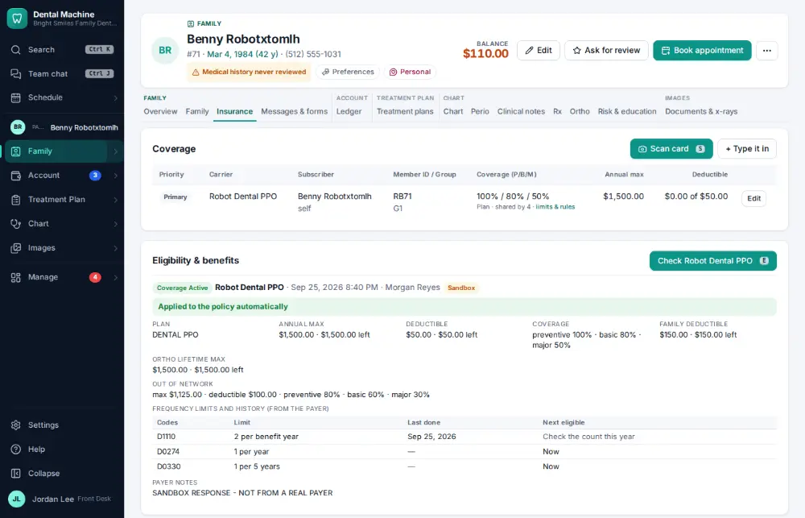

# How do I look up how much insurance benefit is left?

**Who:** front desk, billing · **Where:** Insurance tab · **How often:** Several times a day

The Insurance tab shows the annual maximum, what has been used and what is left, and the deductible.

## Where to start

## Steps

1. Click the Insurance tab: annual maximum, used and remaining are shown

   

## With the mouse

Open the patient (Family module) and click the Insurance tab.

## Related

- [How do I estimate what the patient will owe?](A025-estimate-what-the-patient-will-owe.md)
- [How do I verify insurance eligibility?](A026-verify-insurance-eligibility.md)
- [How do I create and send an insurance claim?](A022-create-and-send-an-insurance-claim.md)
- [How do I scan a new insurance card into a policy?](A047-scan-a-new-insurance-card-into-a-policy.md)
- [How do I approve claims that are ready to send?](A048-approve-claims-that-are-ready-to-send.md)

---
[All how-tos](README.md) · Action A035 · screenshots from the robot run of 2026-09-25
