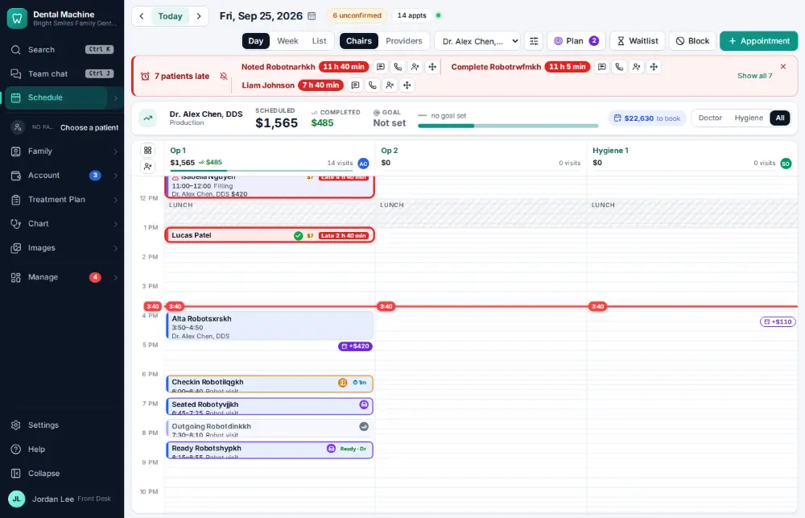
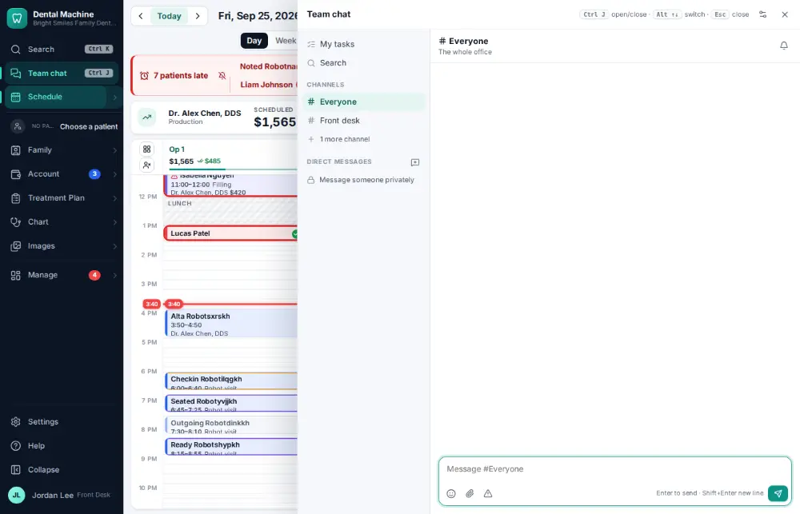
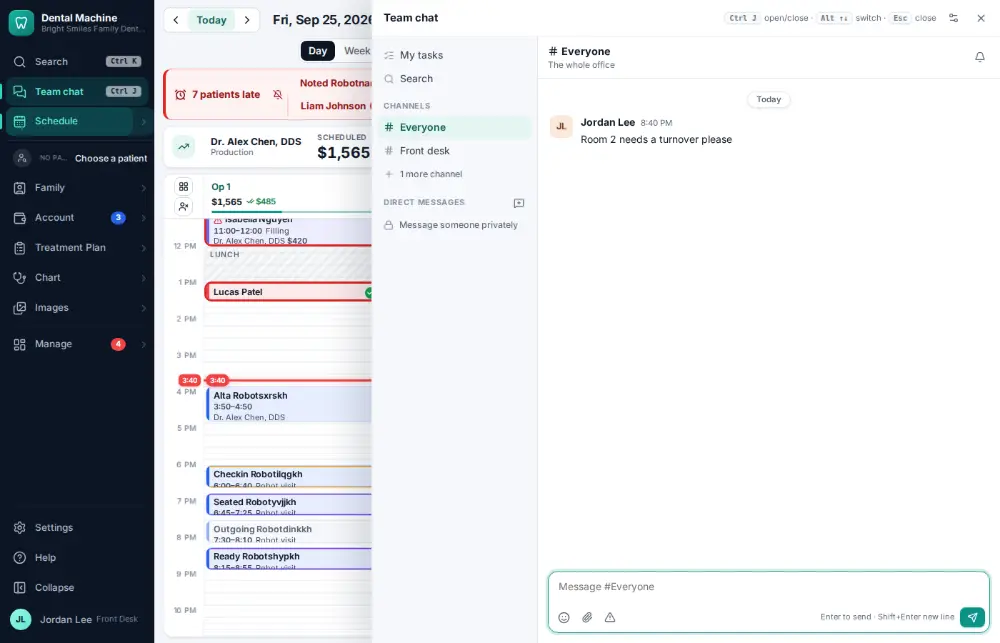

# How do I send a message in staff chat?

**Who:** everyone · **Where:** Chat panel (header) · **How often:** Several times a day

Team chat is the office’s own chat. Ctrl/⌘ J opens it on #Everyone with the cursor in the message box.

## Where to start

## Steps

1. Press Ctrl/⌘J: Team chat opens on #Everyone with the cursor in the message box  
   Keys: <kbd>Ctrl/⌘ J</kbd>

   

2. Type the message and press Enter: sent  
   Keys: <kbd>Enter</kbd>

   

## With the mouse

Click Team chat at the top of the menu.

## Tips

- Ctrl/⌘ Shift J starts a message about the active patient.

## Related

- [How do I send a task to a co-worker?](A028-send-a-task-to-a-co-worker.md)
- [How do I post an announcement for the team?](A135-post-an-announcement-for-the-team.md)
- [How do I mark a task done?](A034-mark-a-task-done.md)
- [How do I work the Needs attention list?](A049-work-the-needs-attention-list.md)
- [How do I complete the opening or closing checklist?](A079-complete-the-opening-or-closing-checklist.md)

---
[All how-tos](README.md) · Action A036 · screenshots from the robot run of 2026-09-25
