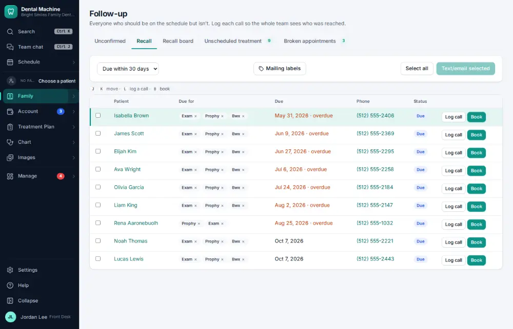
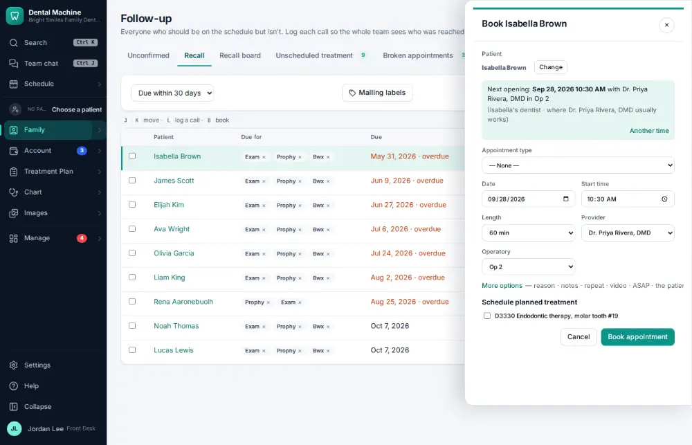

# How do I call a patient who is due for recall?

**Who:** front desk · **Where:** Follow-up lists → Recall · **How often:** Several times a day

Follow-up lists → Recall lists patients who are due or overdue, with their phone number. Book them from their row while you are on the phone.

## Where to start

## Steps

1. Follow-up → Recall: the most overdue patient is highlighted. Call them; they want to book. Press B: the booking panel opens on the first free time  
   Keys: <kbd>B</kbd>

   

2. Press Enter: booked (J / K move between patients, L logs a call instead)  
   Keys: <kbd>Enter</kbd>

   

## With the mouse

Family ▾ → Follow-up lists → Recall, then click Book on the row.

## Tips

- On the list, J/K move between patients, B books, L logs a call.
- The recall autopilot texts and emails most patients before anyone has to call ([A125](A125-check-what-the-recall-autopilot-did.md)).

## Related

- [How do I mark a recall call as “left a message”?](A051-mark-a-recall-call-as-left-a-message.md)
- [How do I check what the recall autopilot did?](A125-check-what-the-recall-autopilot-did.md)
- [How do I print mailing labels?](A177-print-mailing-labels.md)
- [How do I call a patient about unscheduled treatment?](A057-call-a-patient-about-unscheduled-treatment.md)
- [How do I work the broken-appointments list?](A093-work-the-broken-appointments-list.md)

---
[All how-tos](README.md) · Action A037 · screenshots from the robot run of 2026-09-25
