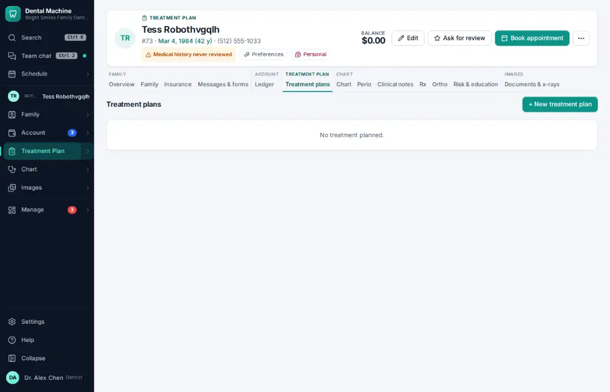
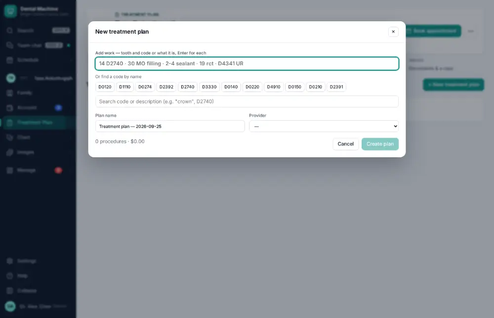
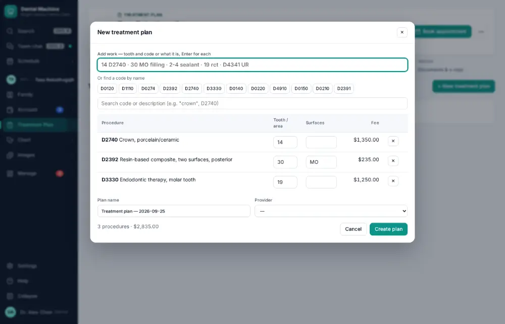
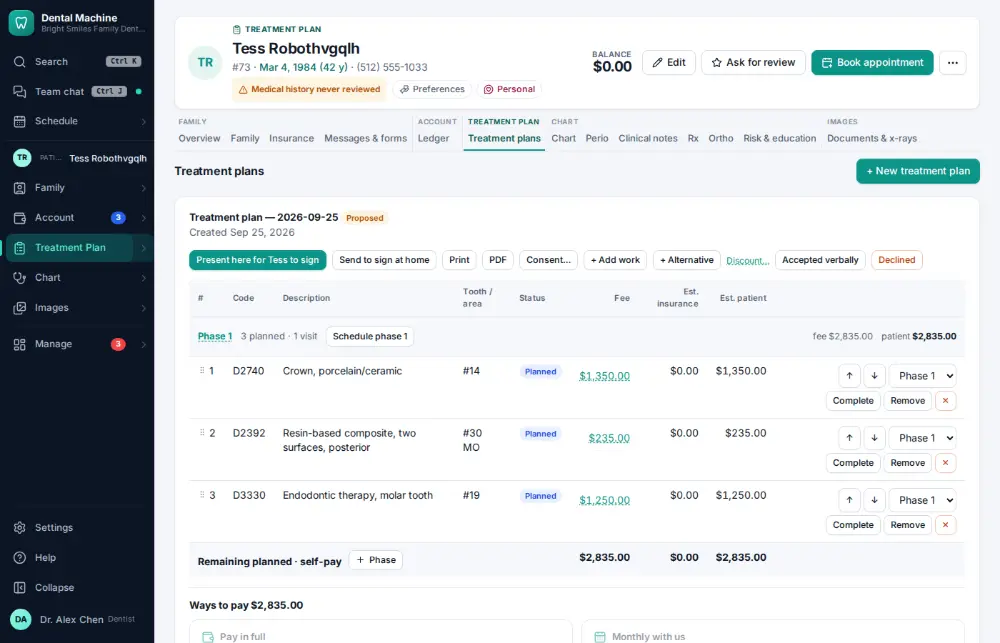

# How do I build a treatment plan?

**Who:** dentist · **Where:** Treatment plans tab — N, "14 D2740" Enter per procedure, Ctrl/⌘+Enter · **How often:** Every day

N on the Treatment plans tab opens the plan builder. Type each piece of work and press Enter; Ctrl/⌘ Enter saves the plan and names it for you.

## Where to start

## Steps

1. Press N: the plan builder opens with the cursor in "Add work to the plan"  
   Keys: <kbd>N</kbd>

   

2. Type "14 D2740", Enter; "30 MO filling", Enter; "19 rct", Enter  
   Keys: <kbd>Enter</kbd> ×3

   

3. Press Ctrl/⌘+Enter: the plan is saved and named for you  
   Keys: <kbd>Ctrl/⌘ Enter</kbd>

   

## With the mouse

Treatment Plan module → New plan, add each procedure, click Save.

## Tips

- Plans can have phases and alternatives; the patient’s share is estimated per line.

## Related

- [How do I present a treatment plan and get it signed?](A042-present-a-treatment-plan-and-get-it-signed.md)
- [How do I chart planned treatment?](A021-chart-planned-treatment.md)
- [How do I print a treatment plan?](A096-print-a-treatment-plan.md)
- [How do I have the patient sign a consent form?](A039-have-the-patient-sign-a-consent-form.md)
- [How do I update medical history?](A032-update-medical-history.md)

---
[All how-tos](README.md) · Action A038 · screenshots from the robot run of 2026-09-25
