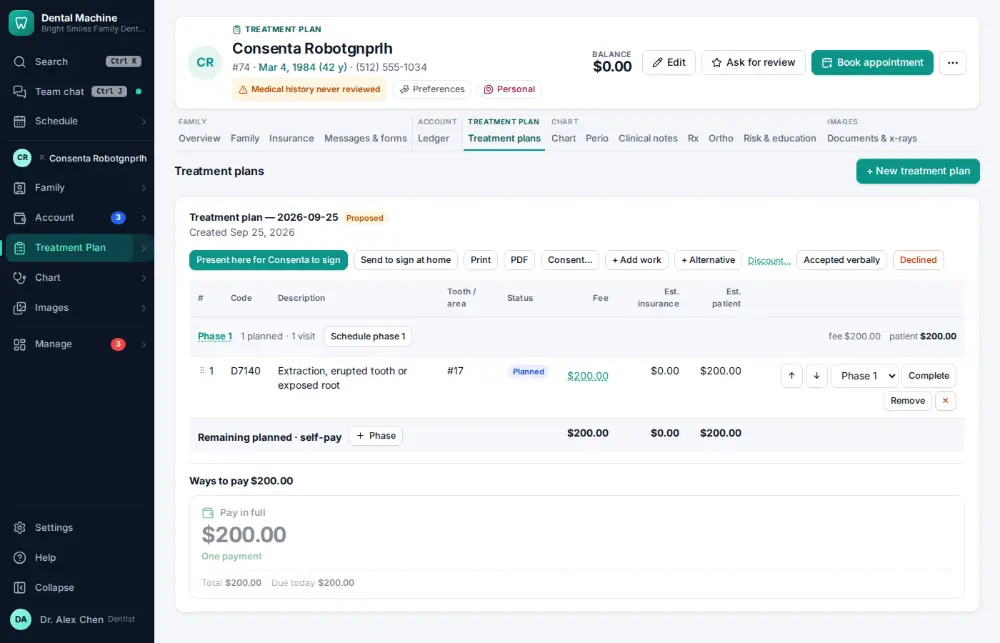
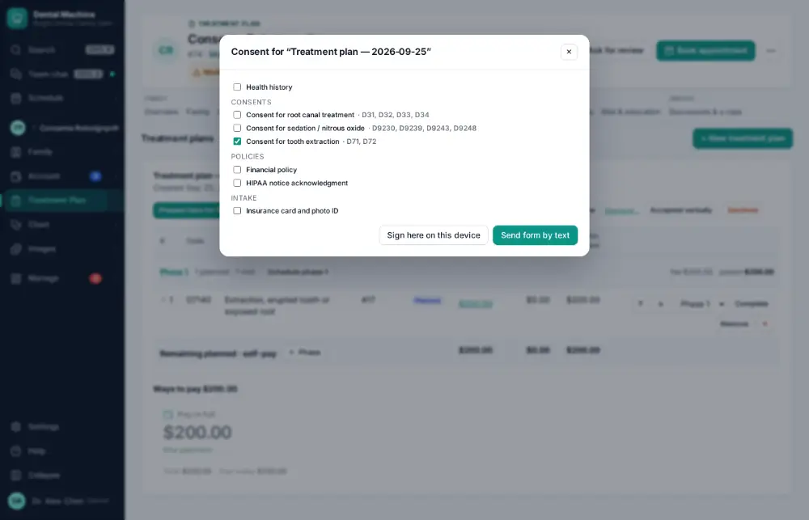
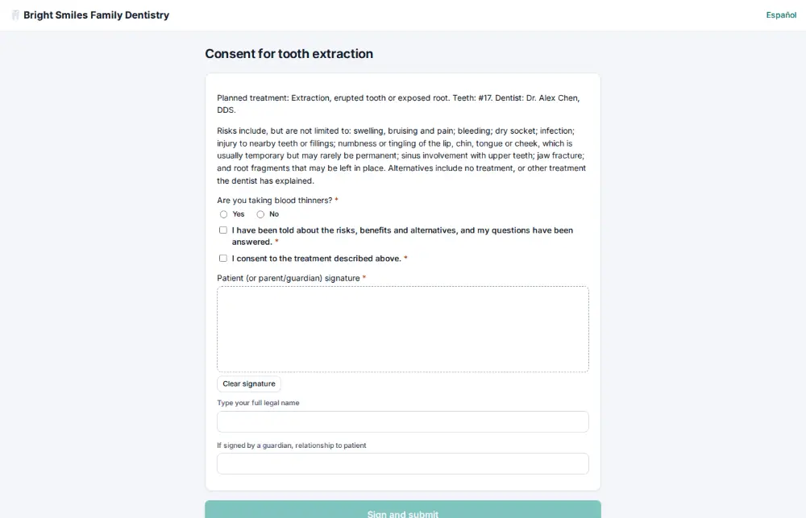

# How do I have the patient sign a consent form?

**Who:** assistant, front desk · **Where:** Treatment plans tab — Consent → sign on this device · **How often:** Every day

The right consent for the plan is chosen for you; the patient signs it on this screen (or on the iPad).

## Where to start

## Steps

1. Click "Consent" on the plan: the right consent is chosen, "Sign here on this device" has focus

   

2. Press Enter: the consent opens for the patient to sign (no birth-date check)  
   Keys: <kbd>Enter</kbd>

   

## With the mouse

Treatment plans tab → click Consent… on the plan → Sign here on this device.

## Tips

- Alt+F opens forms & consents for the active patient from anywhere: I hands the iPad over, T texts them, Q shows a QR code, H signs here.

## Related

- [How do I present a treatment plan and get it signed?](A042-present-a-treatment-plan-and-get-it-signed.md)
- [How do I send forms to a patient before the visit?](A040-send-forms-to-a-patient-before-the-visit.md)
- [How do I build a treatment plan?](A038-build-a-treatment-plan.md)
- [How do I update medical history?](A032-update-medical-history.md)
- [How do I record blood pressure and pulse?](A033-record-blood-pressure-and-pulse.md)

---
[All how-tos](README.md) · Action A039 · screenshots from the robot run of 2026-09-25
