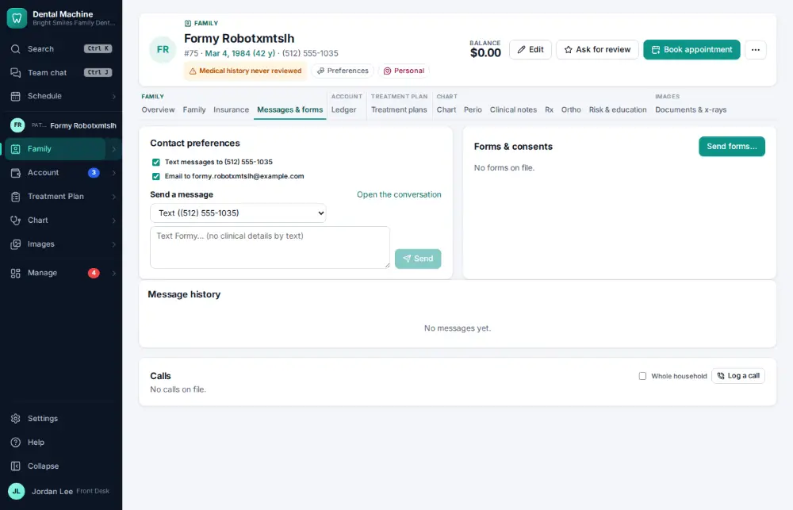
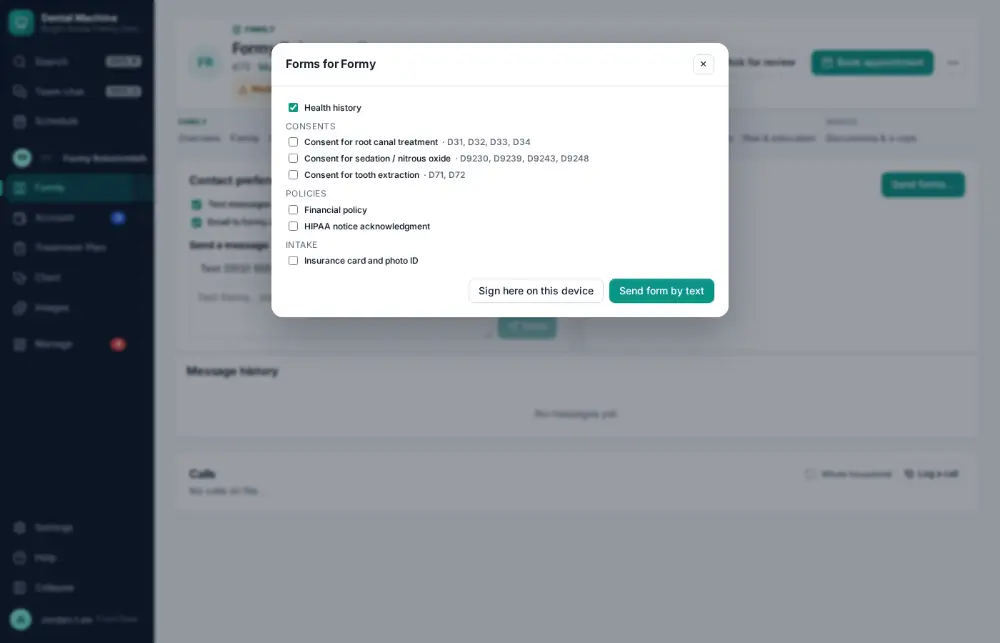
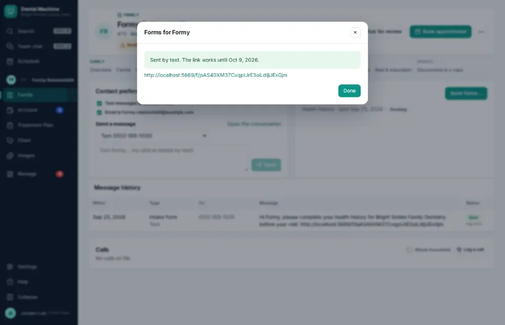

# How do I send forms to a patient before the visit?

**Who:** front desk · **Where:** Messages & forms tab — Send forms · **How often:** Every day

Sends the patient the forms they still need, by text or email, to fill in before they come.

## Where to start

## Steps

1. Messages & forms: click "Send forms…": the forms they still need are ticked

   

2. Click "Text/email to patient": sent

   

## With the mouse

Messages & forms tab → Send forms… → Text/email to patient.

## Tips

- The forms they still need are already ticked.
- Answers come back to Sent in online ([A046](A046-review-an-online-intake-form.md)).

## Related

- [How do I review an online intake form?](A046-review-an-online-intake-form.md)
- [How do I have the patient sign a consent form?](A039-have-the-patient-sign-a-consent-form.md)
- [How do I update a phone number or email?](A043-update-a-phone-number-or-email.md)
- [How do I print the route slip / walkout for a visit?](A044-print-the-route-slip-walkout-for-a-visit.md)
- [How do I set up a new patient?](A055-set-up-a-new-patient.md)

---
[All how-tos](README.md) · Action A040 · screenshots from the robot run of 2026-09-25
