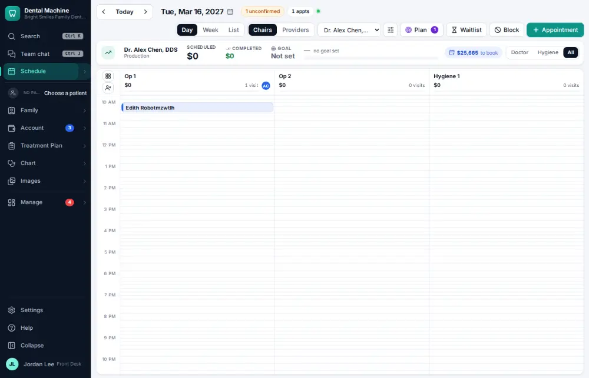
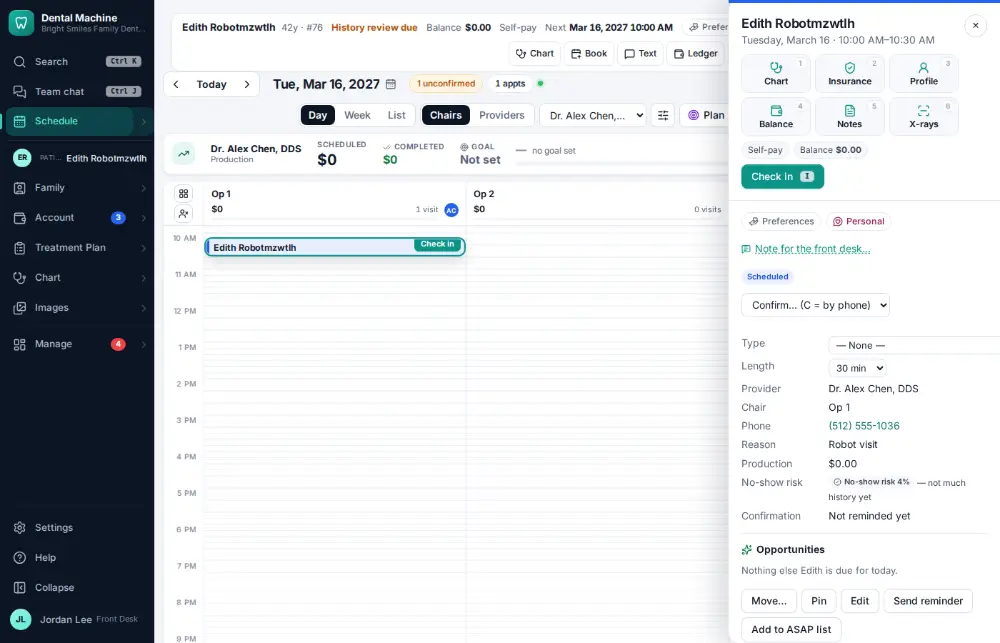
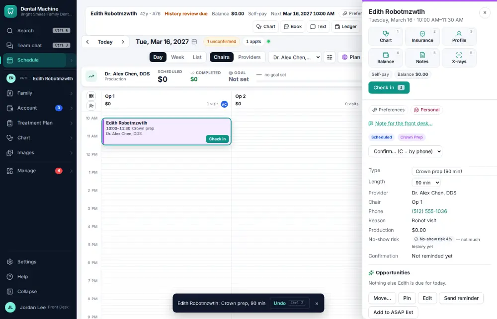

# How do I change an appointment's type, length or note?

**Who:** front desk · **Where:** Schedule — appointment drawer · **How often:** Every day

Click a visit to open its panel beside the schedule. Changes there save at once.

## Where to start

## Steps

1. Click the visit: its panel opens beside the schedule

   

2. Pick the new visit type in the panel: saved at once, its usual length follows (Undo shows)

   

## Tips

- Picking a new visit type also sets its usual length.
- Undo on the notice takes the change back.

## Related

- [How do I reschedule an appointment?](A029-reschedule-an-appointment.md)
- [How do I print the route slip / walkout for a visit?](A044-print-the-route-slip-walkout-for-a-visit.md)
- [How do I book the next hygiene visit at checkout?](A027-book-the-next-hygiene-visit-at-checkout.md)
- [How do I cancel an appointment?](A054-cancel-an-appointment.md)
- [How do I accept an online booking request?](A058-accept-an-online-booking-request.md)

---
[All how-tos](README.md) · Action A041 · screenshots from the robot run of 2026-09-25
