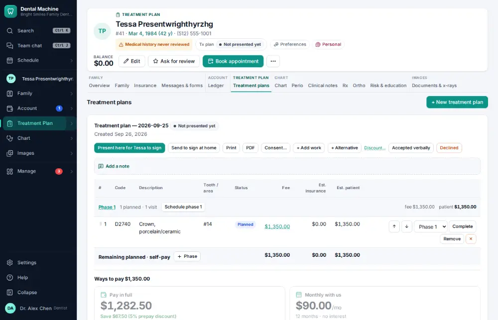
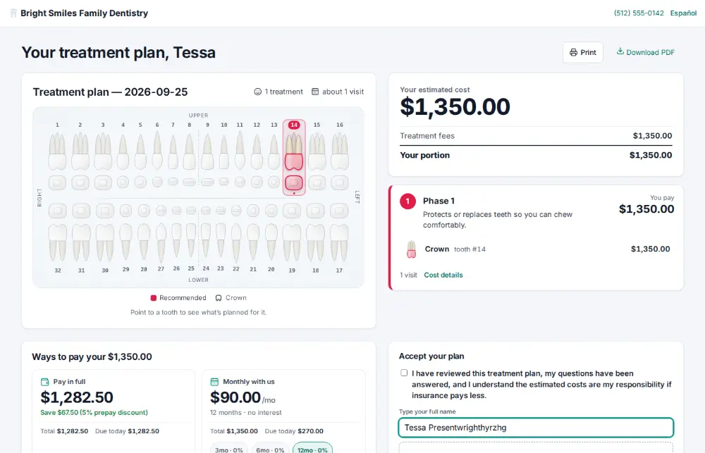
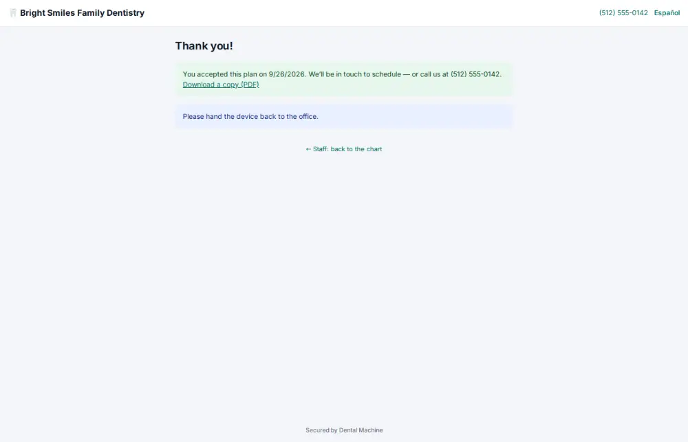

# How do I present a treatment plan and get it signed?

**Who:** dentist, front desk · **Where:** Treatment plans tab — Present & e-sign · **How often:** Every day

Shows the plan to the patient on this screen for them to accept and sign — no birth-date check when you are with them.

## Where to start

## Steps

1. Click "Present here for Tessa to sign" on the plan: it opens on this screen for the patient (same tab, no birth date)

   

2. The patient sees their name on the signing line, ticks “I agree” and taps Accept & sign

   

## With the mouse

Treatment plans tab → “Present here for … to sign”. The patient ticks “I agree” and taps Accept & sign.

## Tips

- You can also text them a link to review and sign at home.

## Related

- [How do I build a treatment plan?](A038-build-a-treatment-plan.md)
- [How do I have the patient sign a consent form?](A039-have-the-patient-sign-a-consent-form.md)
- [How do I print a treatment plan?](A096-print-a-treatment-plan.md)
- [How do I chart perio?](A045-chart-perio.md)
- [How do I dictate a note by voice?](A052-dictate-a-note-by-voice.md)

---
[All how-tos](README.md) · Action A042 · screenshots from the robot run of 2026-09-26
