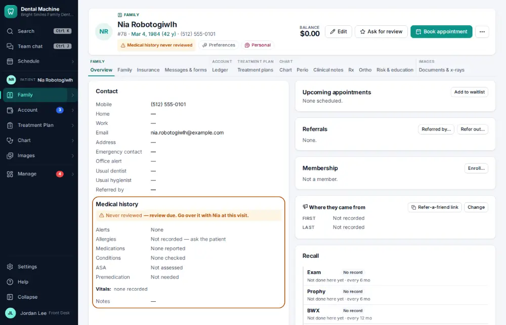
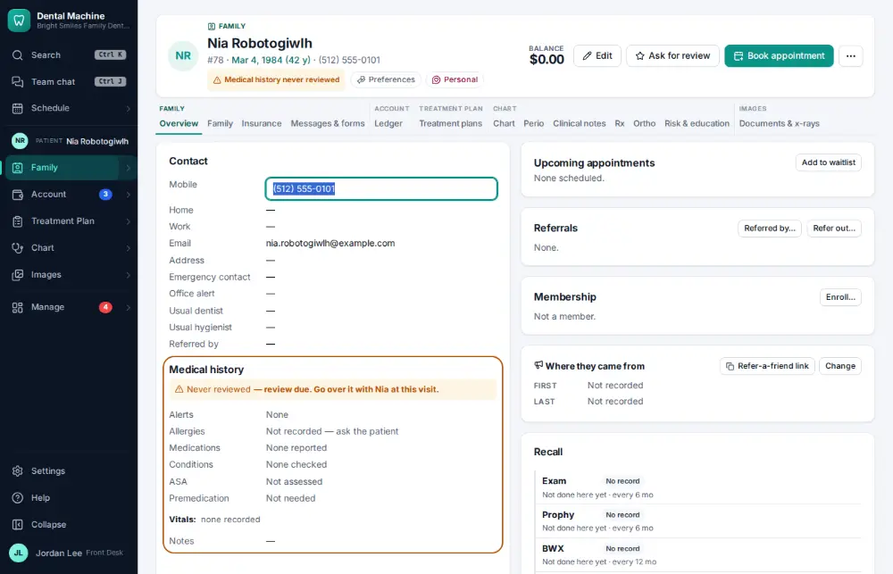
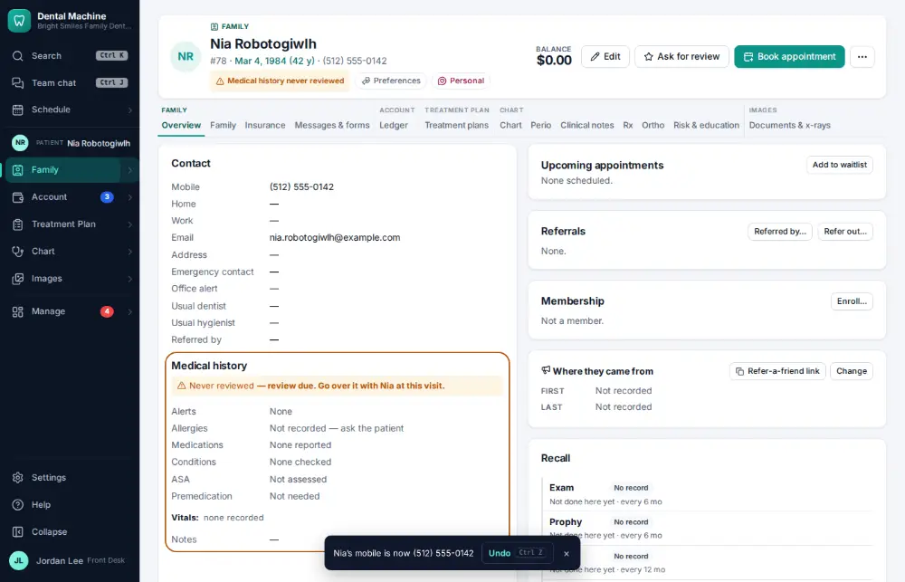

# How do I update a phone number or email?

**Who:** front desk · **Where:** Chart overview — E (or Ctrl/⌘K "phone …") · **How often:** Every day

E on the chart overview turns the mobile number into a box; type and press Enter.

## Where to start

## Steps

1. Press E: the mobile number becomes a box with the cursor in it  
   Keys: <kbd>E</kbd>

   

2. Type the new number and press Enter: saved (Undo shows)  
   Keys: <kbd>Enter</kbd>

   

## With the mouse

Click the number or email on the contact card, type the new one and press Enter.

## Tips

- Undo on the notice puts the old one back; the chart history keeps both.

## If something goes wrong

- **“Invalid email”** — Check the address for typos.

## Related

- [How do I correct a patient's name or date of birth?](A143-correct-a-patient-s-name-or-date-of-birth.md)
- [How do I add an office alert to a patient?](A099-add-an-office-alert-to-a-patient.md)
- [How do I print the route slip / walkout for a visit?](A044-print-the-route-slip-walkout-for-a-visit.md)
- [How do I review an online intake form?](A046-review-an-online-intake-form.md)
- [How do I send forms to a patient before the visit?](A040-send-forms-to-a-patient-before-the-visit.md)

---
[All how-tos](README.md) · Action A043 · screenshots from the robot run of 2026-09-25
