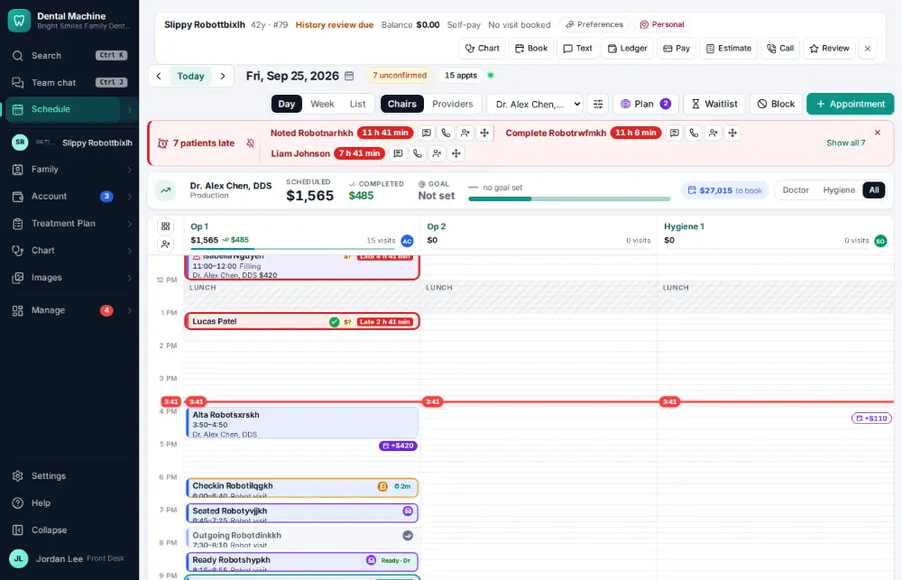
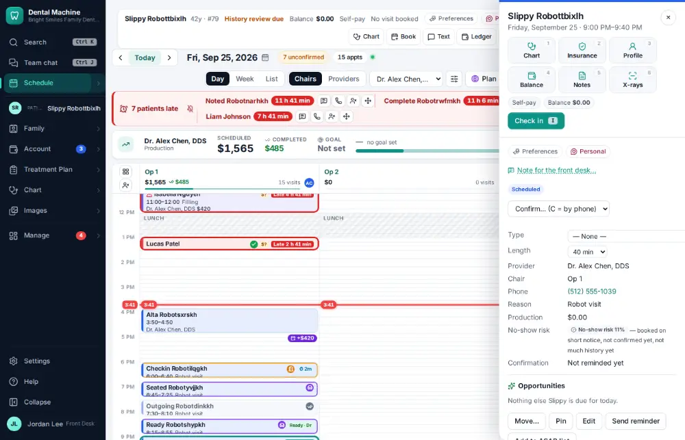
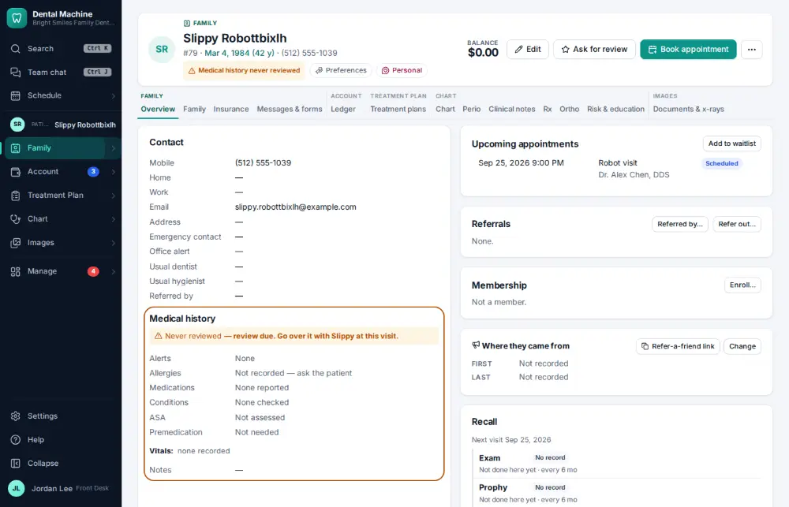

# How do I print the route slip / walkout for a visit?

**Who:** front desk, assistant · **Where:** Schedule → the visit’s panel → Route slip · **How often:** Every day

The route slip lists the visit, what is planned and what is next, ready to print.

## Where to start

## Steps

1. Press Enter on the visit: its panel opens  
   Keys: <kbd>Enter</kbd>

   

2. Click "Route slip": the slip opens ready to print

   

## With the mouse

Click the visit on the schedule, then click “Route slip” in its panel; print with “Print route slip”.

## Tips

- Today’s dashboard also has a Route slip button on every visit.
- At checkout, “Print walkout” prints what was done today for the patient to take home.

## Related

- [How do I run the morning huddle?](A083-run-the-morning-huddle.md)
- [How do I check a patient out?](A017-check-a-patient-out.md)
- [How do I change an appointment's type, length or note?](A041-change-an-appointment-s-type-length-or-note.md)
- [How do I update a phone number or email?](A043-update-a-phone-number-or-email.md)
- [How do I review an online intake form?](A046-review-an-online-intake-form.md)

---
[All how-tos](README.md) · Action A044 · screenshots from the robot run of 2026-09-25
