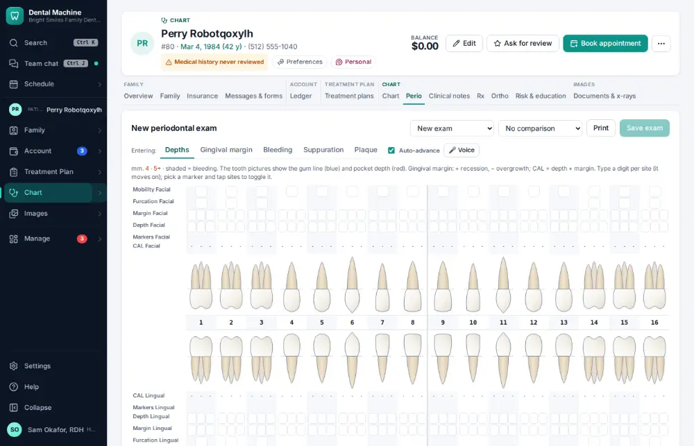
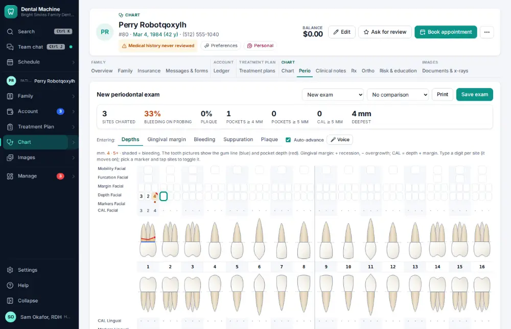
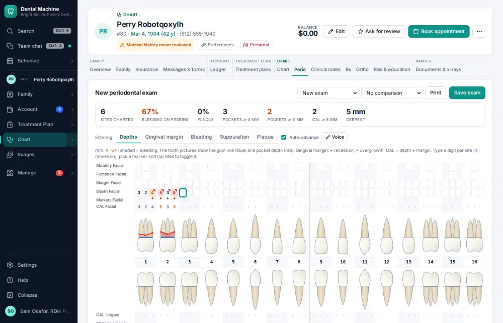
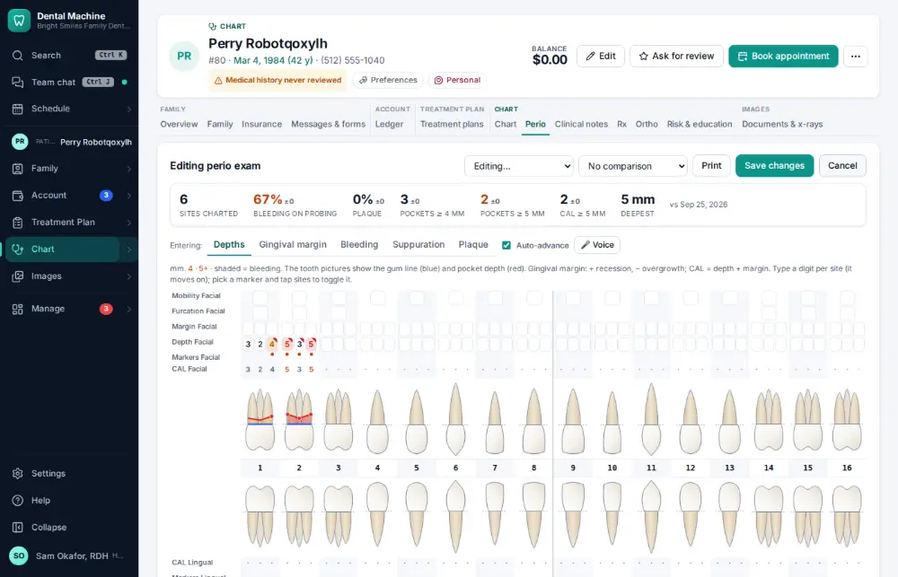

# How do I chart perio?

**Who:** hygienist · **Where:** Perio tab — digits per site, B/U/P markers · **How often:** Every day

Type the depths site by site; the cursor moves on by itself. B, U and P mark bleeding, pus or plaque on the site just probed.

## Where to start

## Steps

1. Click "Depths": the first site (#1 DB) is ready

   

2. Type 3 2 4, then B (bleeding on the last site)

   

3. Type 5 3 5, then Shift+B (bleeding on that whole side)

   

4. Click "Save exam"

   

## With the mouse

Chart ▾ → Perio, click Depths and type into each box.

## Tips

- Shift+B marks bleeding on the whole side.
- Type 1 then 0–5 quickly for 10–15 mm.
- Space or Enter moves on without a depth.

## If something goes wrong

- **A depth goes into the wrong site** — Click the site and type it again before saving.

## Related

- [How do I chart a finding on a tooth?](A006-chart-a-finding-on-a-tooth.md)
- [How do I change a patient's recall interval?](A097-change-a-patient-s-recall-interval.md)
- [How do I dictate a note by voice?](A052-dictate-a-note-by-voice.md)
- [How do I present a treatment plan and get it signed?](A042-present-a-treatment-plan-and-get-it-signed.md)
- [How do I build a treatment plan?](A038-build-a-treatment-plan.md)

---
[All how-tos](README.md) · Action A045 · screenshots from the robot run of 2026-09-25
