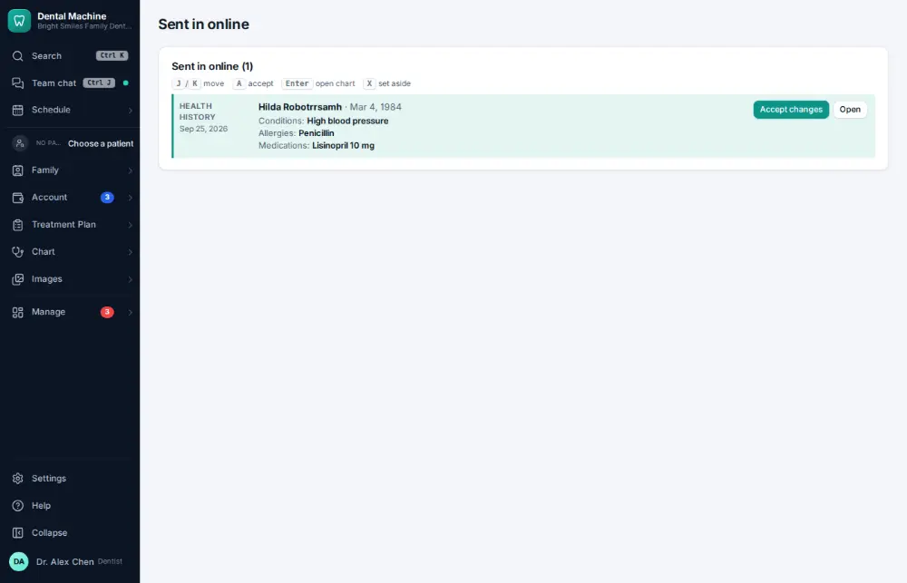
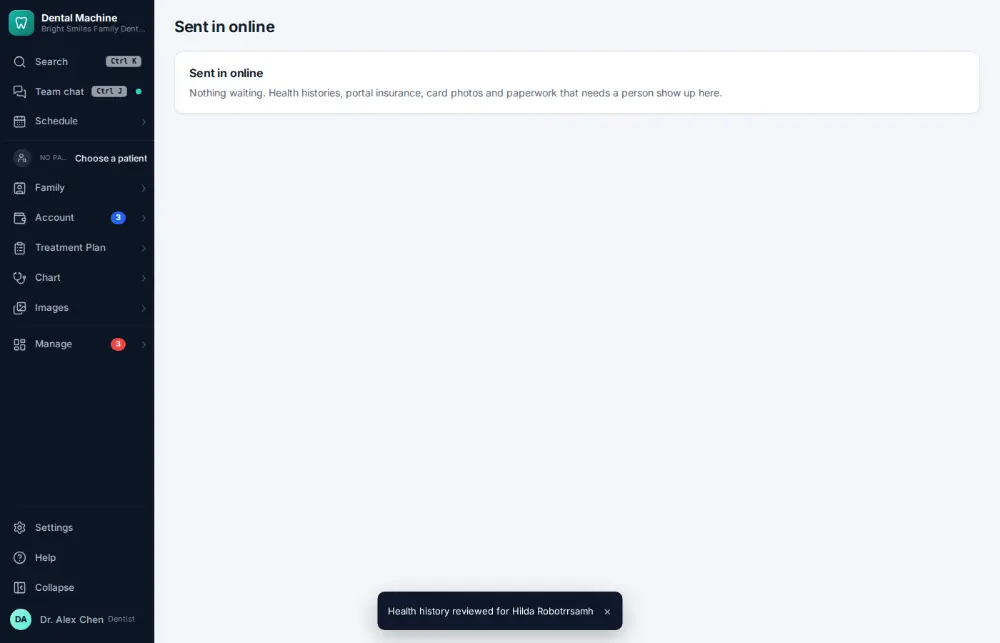

# How do I review an online intake form?

**Who:** front desk · **Where:** Sent in online — command bar “Sent in online” · **How often:** Every day

Forms patients fill in online wait in “Sent in online” for someone to check. A merges what is new (allergies, medications, blood pressure) into the chart; nothing already on the chart is erased.

## Where to start

## Steps

1. Read what’s new (allergy, medication, blood pressure) and press A: merged into Hilda’s chart (nothing on the chart is erased)  
   Keys: <kbd>A</kbd>

   

## With the mouse

Open it from the command bar (“intake”) and click the green accept button on the item.

## Tips

- J and K move between items; Enter opens the patient; X sets a card photo or paperwork aside.

## Related

- [How do I send forms to a patient before the visit?](A040-send-forms-to-a-patient-before-the-visit.md)
- [How do I update medical history?](A032-update-medical-history.md)
- [How do I scan a new insurance card into a policy?](A047-scan-a-new-insurance-card-into-a-policy.md)
- [How do I update a phone number or email?](A043-update-a-phone-number-or-email.md)
- [How do I print the route slip / walkout for a visit?](A044-print-the-route-slip-walkout-for-a-visit.md)

---
[All how-tos](README.md) · Action A046 · screenshots from the robot run of 2026-09-25
