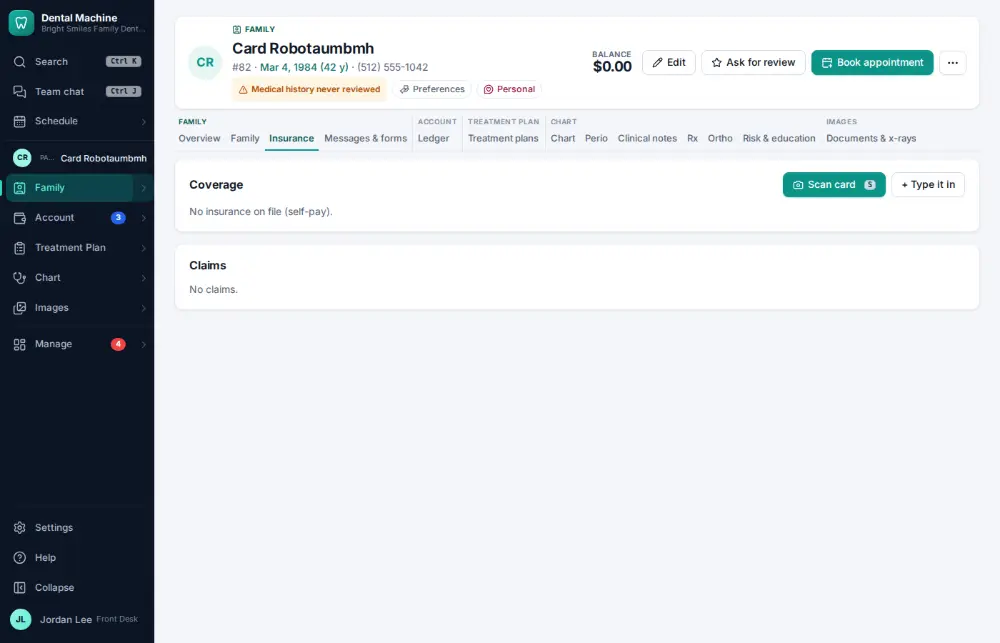
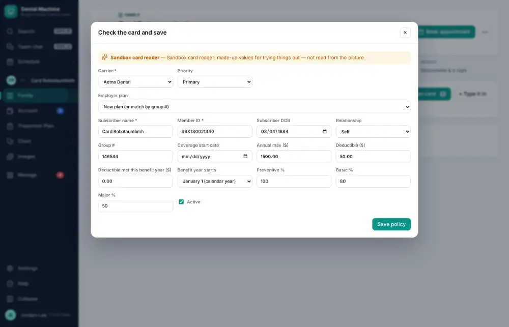
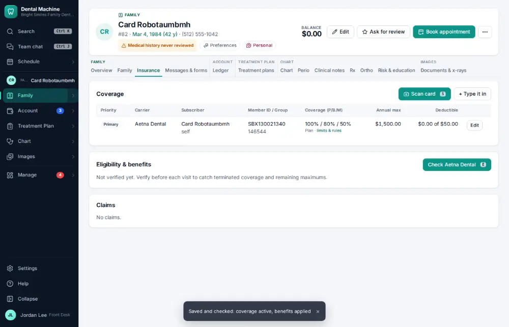

# How do I scan a new insurance card into a policy?

**Who:** front desk · **Where:** Insurance tab — S, photo, Enter · **How often:** Every day

Take or choose a photo of the insurance card: it is read into the policy form for you to check, then saved and checked with the payer.

## Where to start

Open the patient’s Insurance tab.

## Steps

1. Press S and choose the photo of the card: it is read into the policy form  
   Keys: <kbd>S</kbd>

   

2. Check what was read; press Enter: policy saved (and checked with the payer)  
   Keys: <kbd>Enter</kbd>

   

## With the mouse

On the Insurance tab click “Scan card”, choose the photo, check the form and save it.

## Tips

- Always compare the member ID and group number with the card before saving.

## If something goes wrong

- **A field was read wrong** — Correct it in the form before you press Enter.

## Related

- [How do I add a secondary insurance policy?](A091-add-a-secondary-insurance-policy.md)
- [How do I verify insurance eligibility?](A026-verify-insurance-eligibility.md)
- [How do I approve claims that are ready to send?](A048-approve-claims-that-are-ready-to-send.md)
- [How do I attach x-rays to a claim?](A056-attach-x-rays-to-a-claim.md)
- [How do I post an insurance payment from an ERA?](A063-post-an-insurance-payment-from-an-era.md)

---
[All how-tos](README.md) · Action A047 · screenshots from the robot run of 2026-09-25
