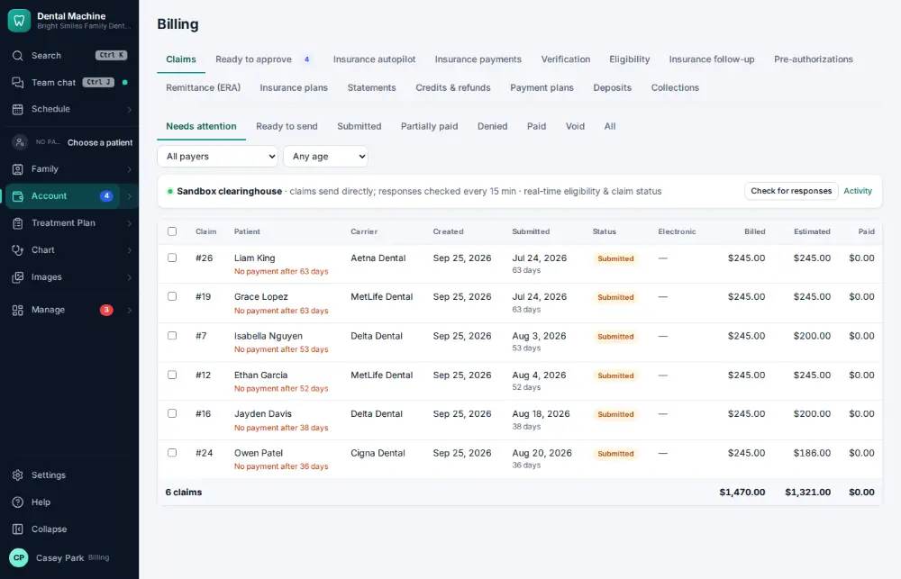
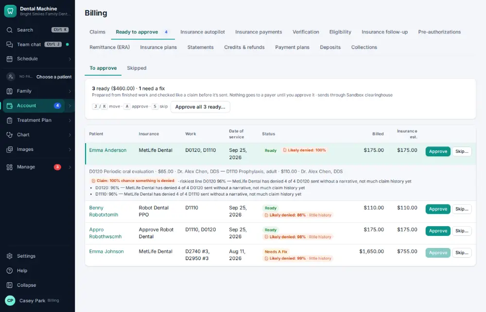
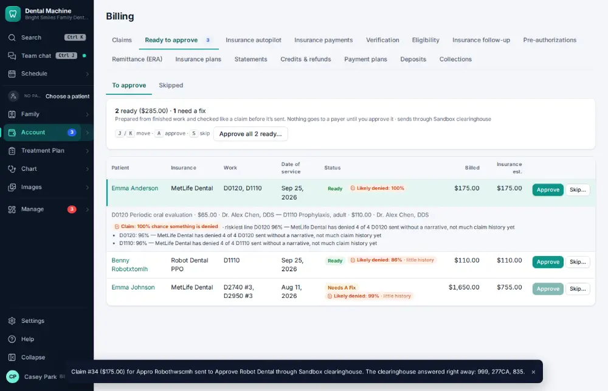

# How do I approve claims that are ready to send?

**Who:** billing · **Where:** Account ▾ → Ready to approve · **How often:** Every day

Claims prepared from finished work wait under Ready to approve, one row per patient. Approving one makes and sends the claim.

## Where to start

## Steps

1. Click "Ready to approve": claims prepared from finished work, one row per patient

   

2. Click "Approve" on the row: the claim is made and sent

   

## Tips

- J/K move between claims, A (or Enter) approves and sends, S skips one for now with a reason.
- The badge on Account shows how many are waiting.

## Related

- [How do I create and send an insurance claim?](A022-create-and-send-an-insurance-claim.md)
- [How do I attach x-rays to a claim?](A056-attach-x-rays-to-a-claim.md)
- [How do I look up a claim's status?](A067-look-up-a-claim-s-status.md)
- [How do I scan a new insurance card into a policy?](A047-scan-a-new-insurance-card-into-a-policy.md)
- [How do I post an insurance payment from an ERA?](A063-post-an-insurance-payment-from-an-era.md)

---
[All how-tos](README.md) · Action A048 · screenshots from the robot run of 2026-09-25
