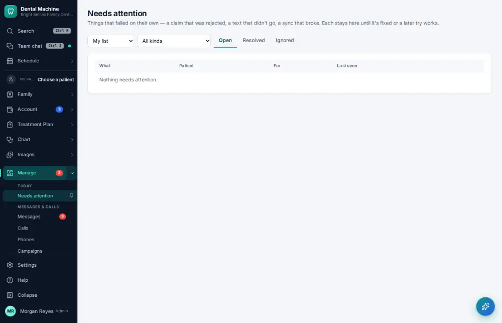

# How do I work the Needs attention list?

**Who:** office manager, billing · **Where:** Manage ▾ → Needs attention · **How often:** Every day

Needs attention collects everything that went wrong in the background — a claim the payer rejected, a text that didn’t send, a payment that failed — so a person can fix it. Items clear themselves when a later attempt works.

## Steps

1. In the menu open Manage ▾ and click "Needs attention"

   

## Tips

- The red badge on Manage is the count waiting.
- Nothing fails silently: if something didn’t go through, it is listed here.

## Related

- [How do I mark a task done?](A034-mark-a-task-done.md)
- [How do I run the morning huddle?](A083-run-the-morning-huddle.md)
- [How do I send a message in staff chat?](A036-send-a-message-in-staff-chat.md)
- [How do I send a task to a co-worker?](A028-send-a-task-to-a-co-worker.md)
- [How do I complete the opening or closing checklist?](A079-complete-the-opening-or-closing-checklist.md)

---
[All how-tos](README.md) · Action A049 · screenshots from the robot run of 2026-09-25
