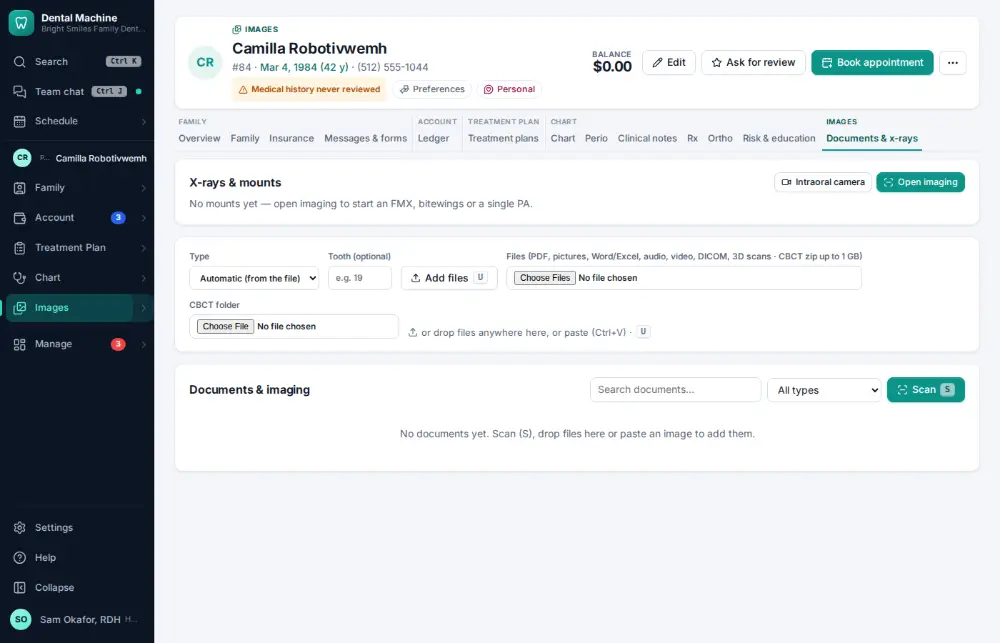
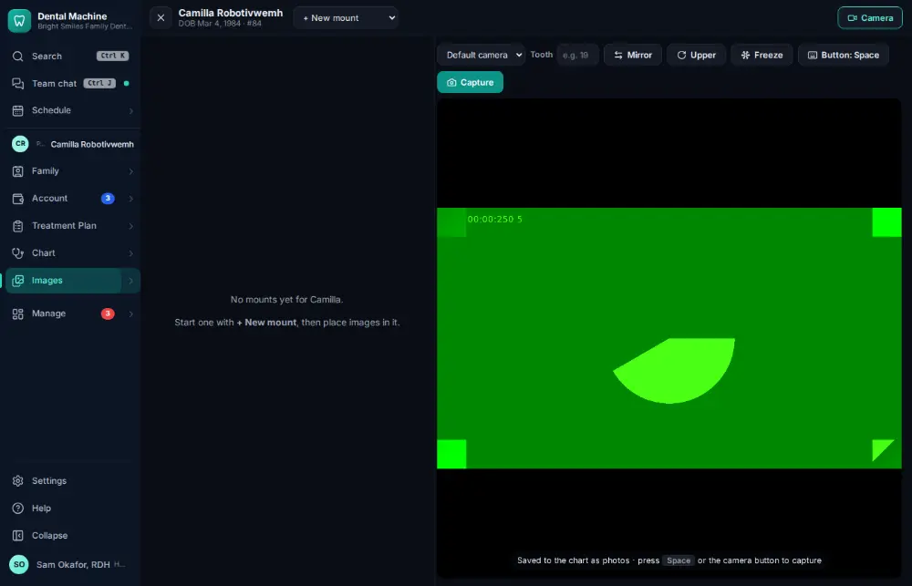
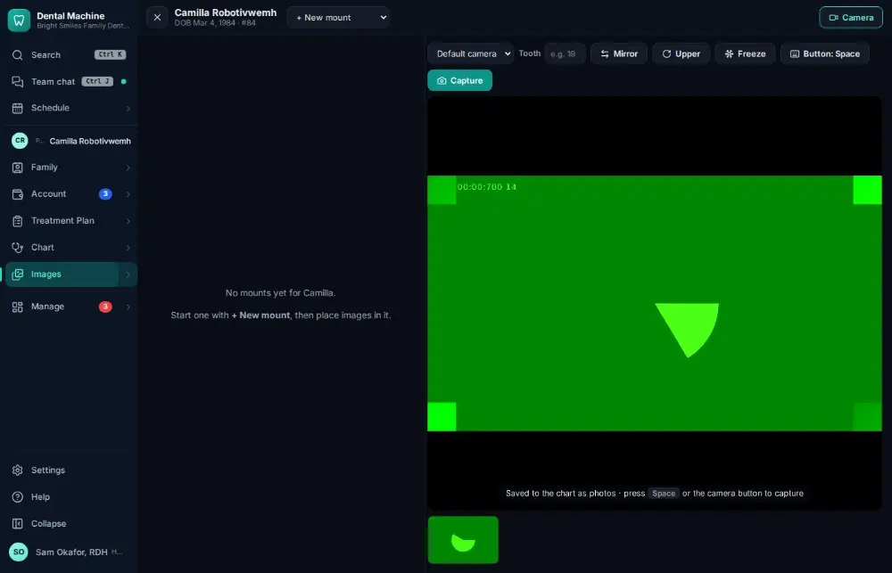
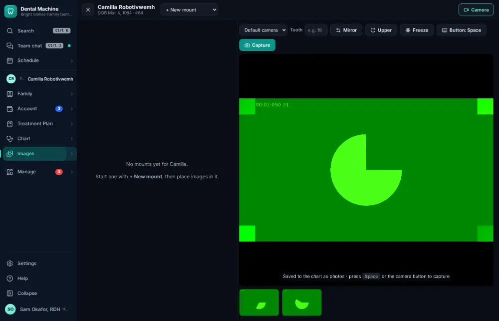

# How do I take intraoral photos with the camera?

**Who:** assistant, hygienist · **Where:** Images module (Documents & x-rays tab) → Intraoral camera · **How often:** Every day

Most intraoral cameras work as an ordinary USB camera, so the imaging studio shows them live in the browser — no extra software. Each shot is filed in the chart as a photo.

## Where to start

## Steps

1. Images: click "Intraoral camera": the camera is live in the studio

   

2. Press the camera’s button (Space) for the first photo: filed on the chart

   

3. And again for the second

   

## Tips

- “Learn button” teaches the studio which key the camera’s handpiece button sends.

## If something goes wrong

- **It says it can’t start the camera** — Another program may be using it, or the browser was not allowed to use it — check the camera permission in the browser’s address bar.

## Related

- [How do I add x-rays or photos to the chart?](A031-add-x-rays-or-photos-to-the-chart.md)
- [How do I take x-rays with the sensor?](A030-take-x-rays-with-the-sensor.md)
- [How do I open a patient's x-rays?](A007-open-a-patient-s-x-rays.md)
- [How do I upload a scanned paper document?](A069-upload-a-scanned-paper-document.md)
- [How do I review x-ray AI findings?](A078-review-x-ray-ai-findings.md)

---
[All how-tos](README.md) · Action A050 · screenshots from the robot run of 2026-09-25
